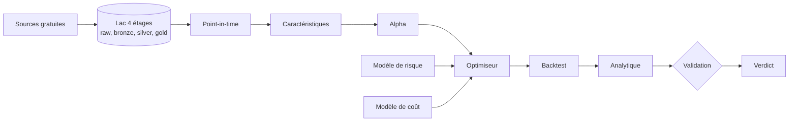

# quant-research-platform

Un laboratoire de recherche quantitative en source ouverte, construit autour
d'une seule idée : **un backtest flatteur ne prouve rien, et le travail
intéressant consiste à savoir lequel ne prouve rien.**

Prenez mille stratégies tirées au hasard, et testez-les sur trente ans de
données. La meilleure affichera un ratio de Sharpe supérieur à 2 sans porter le
moindre signal, le ratio de Sharpe étant le rendement gagné par unité de risque
pris. Ce n'est pas une possibilité
théorique. C'est la conséquence arithmétique du maximum de mille tirages d'une
loi centrée sur zéro. Tout ce que porte ce dépôt sert à distinguer un rendement
d'un tirage chanceux.

> **English summary.** An open source quantitative research platform. It
> replicates documented academic strategies, measures what survives out of
> sample after costs, and rejects what does not. The foundation carries a
> provenance tracked data lake, point-in-time fundamentals, a tested analytics
> engine, and a validation engine that handles backtest overfitting explicitly.
> Documentation is in French; code, APIs and identifiers are in English.

---

## La question posée

Une anomalie de marché semble fonctionner. La question qui compte n'est pas
« combien rapporte-t-elle ? » mais :

> Est-ce réellement de l'alpha robuste, l'alpha étant la part du rendement
> qu'un modèle de facteurs connus n'explique pas, économiquement plausible,
> investissable après coûts, et suffisamment indépendant de nos autres sources
> de rendement pour mériter du capital ?

En mots simples : est-ce que ce rendement existe pour une raison, ou parce que
nous avons beaucoup cherché ?

Répondre exige une infrastructure, pas un script. Il faut des données qui savent
ce qu'elles étaient à une date passée, un décompte honnête du nombre d'essais
menés, des coûts de transaction modélisés, et une seconde implémentation
indépendante pour vérifier la première.

## D'où vient le projet, et ce qu'il apporte

La littérature financière empirique souffre d'un problème documenté. Harvey, Liu
et Zhu (2016) montrent que des centaines de facteurs ont été publiés, que le
seuil usuel de significativité de 2,0 en valeur de \(t\) est très insuffisant
dans ce contexte, et qu'une part importante des découvertes publiées ne survit
pas à la correction pour tests multiples.

Ce dépôt part de ce constat plutôt que de l'ignorer. Il apporte quatre choses.

- **Un socle de données à provenance tracée.** Chaque jeu porte vingt-trois
  champs de métadonnées, dont l'horodatage de téléchargement, la licence,
  l'empreinte SHA-256 et la lignée jusqu'au fichier brut. La question « quelle
  donnée exacte a produit ce résultat ? » a une réponse ou le résultat n'est pas
  publié.
- **Des fondamentaux point-in-time.** Un rapport financier accepté par la SEC le
  15 mai 2015 n'est pas connaissable le 31 mars 2015, quelle que soit la période
  qu'il décrit. La règle est structurelle, pas affaire de vigilance : une
  violation lève une exception et arrête le pipeline.
- **Un moteur d'analytique testé, sans doublon.** Le ratio de Sharpe vit à un
  seul endroit du dépôt. Quand il existe en quatre exemplaires, il finit par
  exister en quatre versions, et personne ne sait laquelle a produit le chiffre
  publié.
- **Un moteur de validation qui traite le surapprentissage.** Découpage
  chronologique, walk-forward ancré et glissant, purge, embargo, validation
  croisée combinatoire purgée, bootstrap par blocs, ratio de Sharpe dégonflé,
  probabilité de surapprentissage, corrections pour tests multiples.

## Le modèle mental

La performance d'un fonds systématique ne vient pas d'un indicateur secret. Elle
se décompose en un produit :

\[
\text{Performance} \approx
\text{Edge} \times \text{Breadth} \times \text{Diversification}
\times \text{Execution} \times \text{RiskManagement}
\]

Chaque terme est un facteur, donc un zéro sur un seul annule tout. Un signal
excellent exécuté trop cher rend zéro. Mille paris parfaitement corrélés valent
un pari.

Pour illustrer ce dernier point avec des nombres. La loi fondamentale de la
gestion active de Grinold (1989) écrit \(IR \approx IC\sqrt{BR}\), où \(IC\) est
la qualité de prédiction et \(BR\) le nombre de paris. Avec un coefficient
d'information de 0,05 et cent paris **indépendants**, le ratio d'information
attendu vaut \(0{,}05 \times \sqrt{100} = 0{,}5\). Avec les mêmes cent paris
mais corrélés en moyenne à 0,3, la largeur effective tombe autour de trois selon
la formule d'équicorrélation, et le ratio d'information attendu tombe à
\(0{,}05 \times \sqrt{3} \approx 0{,}09\). Le nombre de positions n'a pas
changé ; la valeur de la stratégie a été divisée par près de six.

## L'architecture



Aucune flèche ne remonte. Une étape ne consulte jamais une étape ultérieure, et
c'est ce qui interdit structurellement l'information future.

Les briques se parlent par **protocoles structurels**, pas par imports concrets.
Une stratégie dépend de l'interface `DataProvider`, jamais de `yfinance`. Le
jour où un fournisseur professionnel remplace Yahoo, aucune stratégie ne change.
Un test mécanique vérifie cette règle plutôt que de compter sur la relecture.

Le détail vit dans [`docs/architecture/`](docs/architecture/index.md), et les
dix décisions structurantes sont écrites une par une dans
[`docs/architecture/adr/`](docs/architecture/adr/index.md).

## Les données, et ce qu'elles ne donnent pas

Toutes les vérifications ci-dessous sont **mesurées le 2026-09-01**, avec un
en-tête d'identification HTTP.

| Source | Ce qu'elle donne | État | Point-in-time |
|---|---|---|---|
| Yahoo (`yfinance` 1.7.0) | OHLCV quotidien, fonds négociés en bourse | disponible | non |
| SEC EDGAR | dépôts, XBRL, dates d'acceptation | 200 | **oui** |
| FRED | séries macroéconomiques | 200, CSV sans clé | non |
| ALFRED | millésimes des séries macroéconomiques | 200 | **oui** |
| Ken French | facteurs MKT, SMB, HML, RMW, CMA, MOM | 200 | non |
| AQR | jeux BAB, QMJ, valeur et momentum | 200 | non |
| Open Source Asset Pricing | plusieurs centaines de caractéristiques | accessible | variable |

Comment lire ce tableau, en trois constats. Le premier est que deux sources
seulement sont point-in-time, ALFRED et la SEC, et qu'elles sont donc les seules
qui autorisent un backtest fondamental ou macroéconomique propre. Le deuxième
concerne la SEC. Elle répondait 403 « Request Rate Threshold Exceeded » depuis
cet environnement le 2026-08-29, sur sept relances en vingt minutes, et 200 le
2026-09-01. Le blocage était un débit, pas une politique. Le troisième est
qu'aucune de ces sources ne donne les titres radiés, ce qui plafonne la qualité
de tout backtest sur actions individuelles.

Les limites sont écrites une par une dans
[`docs/data/free_data_limitations.md`](docs/data/free_data_limitations.md).
Elles ne sont jamais contournées par une approximation. Une étude dont une
donnée manquante affecte le résultat ne peut pas dépasser le verdict
`REPLICATED`.

## Le parcours d'une stratégie

Une idée devient candidate au capital après vingt étapes, et pas avant. Le
parcours est le même pour toutes : une stratégie tirée d'un article de 1993 et
une stratégie découverte par un algorithme passent exactement les mêmes
contrôles.

```
Hypothèse économique → Littérature → Réplication indépendante → Contrôles de bon sens
→ Coûts → Robustesse des paramètres → Walk-forward → Purge et embargo → CPCV
→ Tests multiples → DSR et PBO → Sous-périodes → Régimes → Attribution factorielle
→ Risque de queue → Tension → Capacité → Backtest indépendant
→ Bénéfice marginal au portefeuille → ACCEPTÉ ou REJETÉ
```

La première question posée n'est jamais « est-ce que ça marche dans les
données ? ». Elle est « pourquoi ce rendement devrait-il exister
économiquement ? ». Trois réponses sont recevables, et chacune se teste.
Une prime de risque doit faire mal au mauvais moment. Un biais comportemental
doit s'affaiblir après publication. Une contrainte institutionnelle doit
survivre tant que la contrainte survit.

Le détail des vingt étapes vit dans
[`docs/methodology/gauntlet.md`](docs/methodology/gauntlet.md).

## Le verdict

Cinq verdicts, et aucun ne se choisit à la main : ils se déduisent des contrôles
qui ont réellement tourné.

| Verdict | Ce qu'il signifie |
|---|---|
| `REJECTED` | l'hypothèse ne survit pas aux données |
| `EXPERIMENTAL` | un résultat existe, les contrôles ne sont pas tous passés |
| `REPLICATED` | les chiffres de l'article sont retrouvés dans nos tolérances |
| `ROBUST` | le résultat survit aux coûts, aux sous-périodes et au hors échantillon |
| `PORTFOLIO_CANDIDATE` | il est robuste **et** apporte au portefeuille existant |

Un ratio de Sharpe supérieur à 1 ne suffit à aucun de ces verdicts. Le
laboratoire ne connaît pas de seuil de Sharpe qui suffirait seul.

## Ce qui est fait, et ce qui ne l'est pas

| Phase | Contenu | État |
|---|---|---|
| 0 | architecture, configuration, journal, intégration continue, documentation | **fait** |
| 1 | fournisseurs, lac, provenance, point-in-time, qualité | **fait** |
| 2 | analytique : rendements, risque, ratios, régression, IC, rotation, contributions | **fait** |
| 3 | validation : découpages, purge, embargo, CPCV, bootstrap, DSR, PBO, tests multiples | **fait** |
| 4 | réplications académiques, de TSMOM à l'arbitrage statistique | **fait**, huit études |
| 5 | moteur de portefeuille et de risque | **fait**, six estimateurs de covariance, sept optimiseurs |
| 6 | moteur de coûts et de capacité | **fait**, impact à l'échelle du capital, étude 010 |
| 7 | portefeuille multi-stratégies | **fait**, étude 009 |
| 8 | apprentissage automatique transversal | non commencé |
| 9 | validation indépendante sous LEAN | non commencé |
| 10 | tableau de bord et rapport institutionnel | non commencé |
| 11 | recherche propre | non commencé |

## Ce que les huit réplications ont trouvé

**Aucune des huit stratégies ne mérite du capital en l'état.** Aucune n'atteint
`ROBUST` ni `PORTFOLIO_CANDIDATE`, et c'est le résultat de la phase 4.

| Étude | Article | Essais | Verdict | Ce qui décide |
|---|---|---:|---|---|
| 001 Momentum de série temporelle | Moskowitz, Ooi et Pedersen (2012) | 73 | `EXPERIMENTAL` | Sharpe 1,411 puis 0,337 après publication, z = 3,239 |
| 002 Momentum transversal | Jegadeesh et Titman (1993) | 53 | `EXPERIMENTAL` | t de 5,12 puis 1,746 |
| 003 Valeur et momentum | Asness, Moskowitz et Pedersen (2013) | 207 | `EXPERIMENTAL` | corrélation -0,577, mélange à 1,096 |
| 004 Qualité moins camelote | Asness, Frazzini et Pedersen (2019) | 67 | `EXPERIMENTAL` | notre construction corrèle 0,106 avec le facteur publié |
| 005 Parier contre le bêta | Frazzini et Pedersen (2014) | 144 | `REJECTED` | le rétrécissement de 0,6 fait passer le Sharpe de 0,394 à -0,001 |
| 006 Gestion de la volatilité | Moreira et Muir (2017) | 89 | `REJECTED` | version négociable à -1,30 %/an net |
| 007 Arbitrage statistique | Avellaneda et Lee (2010) | 49 | `REJECTED` | seuil de rentabilité à 3,92 points de base |
| 008 Portage | Koijen, Moskowitz, Pedersen et Vrugt (2018) | 33 | `REPLICATED` | coefficient 1,084 contre 1,09, puis 0,303 hors échantillon |
| 009 Huit sources, un portefeuille | Grinold (1989), DeMiguel et coauteurs (2009) | 20 | `REJECTED` | 5,4 paris indépendants ; la référence déclarée rend 0,652 contre 0,693 seule |
| 010 Capacité des deux stratégies chiffrables | Almgren et coauteurs (2005), Gatheral (2010) | 8 | `REJECTED` | momentum borné par la participation à 84 940 $, arbitrage statistique à capacité nulle, son brut ne couvrant pas 5 pb |

Comment lire ce tableau, en trois constats. Le premier est que sept articles sur
huit se répliquent correctement dans leur propre fenêtre : ce n'est pas la
réplication qui échoue, c'est la survie. Le deuxième est que la colonne des
essais entre dans le ratio de Sharpe dégonflé, et que les 207 essais de l'étude
003 le ramènent à 0,000012. Le troisième est que le seul verdict `REPLICATED`
est aussi celui dont trois classes d'actifs sur quatre n'ont pas pu être testées
faute de données, ce qui est écrit dans son README plutôt que contourné.

**Quatre trouvailles que les articles ne donnent pas.**

L'échantillon de Moreira et Muir s'arrête en **avril 2015** et non en décembre,
ce qui explique l'écart de huit mois entre leur compte d'observations et le
nôtre. Avec cette borne, six comptes sur six tombent exactement.

Le biais de survie **retire** 2,04 à 4,34 points de pourcentage par an au
momentum au lieu d'en ajouter, parce qu'un décile perdant reconstitué sur un
indice actuel se remplit de titres tombés puis remontés.

Frazzini et Pedersen présentent le rétrécissement du bêta de 0,6 vers un comme
un détail d'estimation. Il fait passer le ratio de Sharpe du facteur reconstruit
de 0,394 à -0,001, alors que le classement des titres ne change pas.

Les colonnes hors actions du classeur public d'AQR s'arrêtent au 2025-01-31
alors que sa colonne agrégée court jusqu'au 2026-06-30, sans que le fichier le
signale. Le ratio de Sharpe hors échantillon passe de 0,604 à 0,246 selon la
colonne lue.

Les trois rejets sont documentés un par un dans
[`docs/research_journal/rejected_ideas.md`](docs/research_journal/rejected_ideas.md),
avec leur hypothèse économique, ce qui a été mesuré, et pourquoi cela ne suffit
pas. **743 essais** ont été menés au total, et aucun n'a produit une stratégie
retenue.

## Ce que porte le dépôt, mesuré le 2026-09-01

| | |
|---|---:|
| Modules de code | 54 fichiers, 31 385 lignes |
| Tests | 31 fichiers, 21 805 lignes, **1 700 tests verts** hors réseau |
| Tests réseau, contre les sources vivantes | 9, tous verts |
| Documentation | 57 pages, 11 529 lignes |
| Fiches de littérature | 21, chaque chiffre sourcé ou marqué « non trouvé » |
| Décisions d'architecture écrites | 10 |

Les huit modules d'analytique sont `returns`, `risk`, `drawdown`, `ratios`,
`regression`, `ic`, `turnover` et `contributions`. Les huit modules de
validation sont `splits`, `purging`, `cpcv`, `bootstrap`, `dsr`, `pbo`,
`multiple_testing` et `robustness`. Cinq fournisseurs de données sont
implémentés : Yahoo, Ken French, FRED, ALFRED et SEC EDGAR.

## Comment ce code a été vérifié

Chaque module a été écrit, puis **contredit** par un second passage dont la
consigne était de trouver ses erreurs, pas de le valider. Le bilan est mesuré.

| Contrôle | Résultat |
|---|---:|
| Modules soumis à la contradiction | 25 |
| Constats rendus sur les formules | 69, dont **46 défauts réels** |
| Constats rendus sur les tests | 53, dont **37 défauts réels** |
| Bogues injectés puis retirés pour prouver que les tests les attrapent | 64 recensés |

Les deux lignes du milieu se lisent en deux temps, et c'est voulu. Un contrôle
qui ne trouve rien rend quand même un constat, du type « aucune erreur de
formule, recalcul indépendant sur 200 tirages, écart maximal 8,9e-16 ». Ces
constats-là comptent autant que les autres, parce qu'ils disent ce qui a été
cherché sans être trouvé. Les 64 injections sont celles de la phase 3, la seule
à les avoir comptées séparément. Les phases 1 et 2 en ont fait davantage sans
les dénombrer, l'une des vérifications en rapportant dix-huit à elle seule.

Trois exemples de ce que ce second passage a trouvé, et qu'aucun test de forme
n'aurait vu.

`normalize_cik(320193.0)` rendait `'0003201930'`, c'est-à-dire **un autre
déposant**, en silence. La cause était la récolte de tous les groupes de
chiffres de la représentation textuelle du flottant.

`cagr()` rendait **-100 % par an** sur une série entièrement manquante, parce
que le test « le capital survit-il ? » rend faux sur un `NaN`. Le défaut
confondait deux états opposés, capital détruit et capital non observé.

Quatre mutations plausibles du module de perte depuis le sommet passaient ses
quarante-sept tests, dont le remplacement du pire épisode par le moins profond.
Après correction, treize mutations sur treize sont attrapées.

La règle qui rend ce travail possible est écrite dans le `CLAUDE.md` : **aucune
valeur attendue d'un test ne vient de la sortie du code**. Elle vient d'un calcul
à la main écrit en commentaire, d'une identité mathématique, d'une valeur
publiée et citée, ou d'une bibliothèque indépendante.

## Reproduire

```bash
git clone https://github.com/Guilou001/quant-research-platform
cd quant-research-platform
make install                 # uv sync --all-extras --dev

cp .env.example .env         # poser QUANTLAB_USER_AGENT, exigé par la SEC

make lint                    # ruff format --check puis ruff check
make test                    # pytest, tests réseau exclus
make docs                    # mkdocs build --strict

uv run quant info            # versions, chemins, état du lac
```

`make test` n'a besoin d'aucun accès réseau : chaque fournisseur de données est
testé contre une réponse enregistrée dans le fichier de test. Les tests qui
sortent réellement sur Internet portent le marqueur `network` et s'appellent
séparément par `uv run pytest -m network`.

## Les quinze règles

Le fichier [`CLAUDE.md`](CLAUDE.md) porte les règles du laboratoire. Trois
d'entre elles gouvernent le reste.

**Règle 1.** Aucune information future dans une donnée historique. Toute donnée
fondamentale porte quatre dates, et seule `available_from` gouverne l'accès.

**Règle 5.** Tout chiffre de performance porte cinq mentions : l'échantillon
(`IS`, `VALIDATION`, `OOS`, `FINAL_HOLDOUT`), brut ou net, les hypothèses de
coût, la période et l'univers. Un ratio de Sharpe sans elles ne se publie pas.

**Règle 8.** Aucune expérience ratée n'est cachée. Ce n'est pas de la modestie :
le nombre d'essais est l'intrant du ratio de Sharpe dégonflé, et en cacher
fausse précisément le test qui sert à détecter le surapprentissage.

## Limites, avec leur statut

| Limite | Statut |
|---|---|
| Aucune stratégie testée à ce jour | reconnu, c'est l'objet des phases suivantes |
| Pas d'univers sans biais de survie sur actions individuelles | mesuré, les sources gratuites ne le donnent pas |
| Pas de carnet d'ordres, donc écart acheteur-vendeur supposé | reconnu, hypothèse déclarée dans chaque étude |
| Impact de marché modélisé en racine carrée, sans microstructure | modélisé, marqué comme tel partout |
| Coût d'emprunt de titre supposé, disponibilité supposée acquise | reconnu, hypothèse **optimiste**, testée à un, deux et cinq fois |
| Plotly borné sous la version 7 | mesuré le 2026-09-01, cause et condition de levée dans ADR-006 |
| Second moteur de backtest sous LEAN non encore écrit | reconnu, phase 9 |

## Avertissement

Rien ici n'est un conseil en investissement. Les résultats qui seront publiés
sont des mesures faites sur des données historiques, sous des hypothèses
déclarées. Un résultat historique ne dit rien de l'avenir, et le vocabulaire du
dépôt suit cette règle : « mesuré sur telle période », jamais « la stratégie
rapporte ».

## Crédits et licence

Code sous licence MIT, documentation sous CC BY 4.0. Voir [`LICENSE`](LICENSE)
et [`CITATION.cff`](CITATION.cff).

Le paquet `gvf` ([gv-fintools](https://github.com/Guilou001/gv-fintools)) fournit
la feuille de style des figures, commune au reste du portefeuille.
