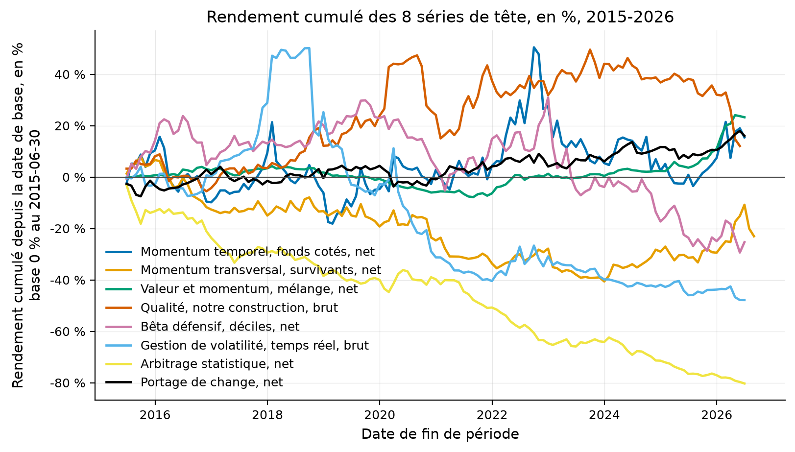
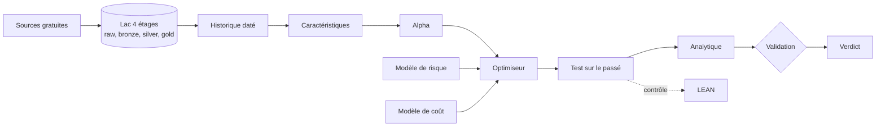
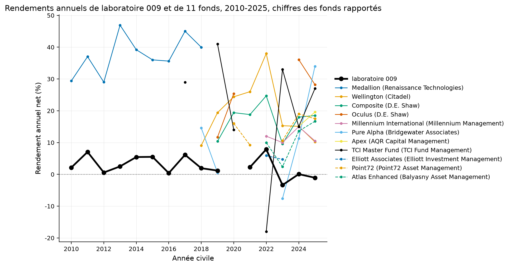

# Une plateforme pour vérifier les stratégies quantitatives

Une stratégie de placement peut sembler rentable lorsqu'on la teste sur les données qui ont servi à la construire. Toutefois, ce résultat peut disparaître lorsqu'on change de période, que l'on tient compte des coûts ou que l'on corrige les biais présents dans les données. Le présent projet construit une plateforme de recherche afin de soumettre chaque stratégie aux mêmes vérifications.

Le résultat général est négatif. Le tableau de bord intègre actuellement vingt études et compte 853 essais dans les dernières exécutions enregistrées. Aucune des huit stratégies principales n'atteint le statut nécessaire pour recevoir du capital. En effet, les résultats diminuent lorsque l'on quitte la période de l'article, puis les coûts de transaction réduisent encore ce qui subsiste. Parmi 212 portefeuilles sans biais de survie, la comparaison est calculable pour 208. Ceux-ci conservent 42 % de leur rendement en médiane après publication, soit une baisse de 58 %.

Afin d'expliquer ce constat, nous procéderons en quatre étapes. Dans un premier temps, nous présenterons les données et la façon dont nous conservons l'information disponible à chaque date. Dans un deuxième temps, nous expliquerons les vérifications imposées à chaque stratégie et la manière dont les 853 essais sont comptés. Ensuite, nous comparerons les résultats publiés à ceux mesurés après publication et après les coûts. Enfin, nous présenterons les limites qui empêchent actuellement une stratégie d'être retenue, ainsi que les études qui restent expérimentales.

[](https://github.com/Guilou001/quant-research-platform/actions/workflows/ci.yml)
[](https://guilou001.github.io/quant-research-platform/)
[](pyproject.toml)
[](LICENSE)
[](rapport/rapport.pdf)

<details>
<summary>Résumé en anglais</summary>

> **English summary.** An open source quantitative research platform. It
> replicates documented academic strategies, measures what survives out of
> sample after costs, and rejects what does not. Twenty studies, 853 counted
> trials in the latest registered runs, and no core strategy that earns
> capital. In a survivorship-bias-free set of 212 portfolios, the comparison is
> available for 208. They retain 42% of their return at the median after
> publication, a 58% decline before transaction costs. The foundation carries a provenance tracked data lake,
> point-in-time fundamentals, a tested analytics engine, and a validation
> engine that handles backtest overfitting explicitly. An independent
> re-implementation under LEAN matches the lab engine to 4e-6 per month.
> Documentation is in French; code, APIs and identifiers are in English.

</details>



Comment lire cette figure : chaque courbe est ce qu'a gagné ou perdu, en
pourcentage, un dollar placé le 30 juin 2015 dans la série de tête d'une
étude. La série est nette de coûts quand une version nette existe. La ligne grise
est le point de départ. Quatre séries sur huit finissent au-dessus, dont le
portage de change en noir et la valeur et le momentum en vert. L'arbitrage statistique, en jaune, perd quatre cinquièmes de sa mise. La figure vient du
[tableau de bord](docs/dashboard/index.md), engendré depuis les fichiers du
dépôt, qui porte aussi la même trajectoire en richesse sur échelle
logarithmique et les rendements annuels de chaque série en pourcentage.
## Par où commencer, en trente secondes

| Vous voulez | Allez à |
|---|---|
| voir d'un seul écran ce que le laboratoire a établi | le [tableau de bord](docs/dashboard/index.md), ou le même en [PDF](rapport/rapport.pdf) |
| lire une étude complète, de l'hypothèse au verdict | [l'étude 013](studies/013_cross_sectional_ml_long/), où un panneau de survivants fait passer tous les contrôles à une stratégie qui n'existait pas |
| voir comment un moteur se contrôle par un autre | [la réconciliation avec LEAN](lean/README.md), 234 mois retrouvés à 4e-6 près |
| lire la recherche propre | [l'étude 016](studies/016_publication_decay_212/), ce que la publication laisse à 212 portefeuilles sans biais de survie |
| suivre les décisions dans l'ordre où elles ont été prises | le [journal de recherche](docs/research_journal/index.md) et les [quinze décisions d'architecture](docs/architecture/adr/index.md) |
| savoir ce qui manque, et dans quel ordre le construire | la [feuille de route](docs/roadmap.md), six chantiers sourcés, et la [spécification](docs/specs/001-univers-sans-biais-de-survie.md) du premier |
| faire tourner le tout | la section [Reproduire](#reproduire), trois commandes |

## La question posée

Une anomalie de marché semble fonctionner. La question qui compte n'est pas
« combien rapporte-t-elle ? » mais :

> Est-ce réellement de l'alpha robuste, l'alpha étant la part du rendement
> qu'un modèle de facteurs connus n'explique pas, économiquement plausible,
> investissable après coûts, et suffisamment indépendant de nos autres sources
> de rendement pour mériter du capital ?

En mots simples : est-ce que ce rendement existe pour une raison, ou parce que
nous avons beaucoup cherché ?

Prenez mille stratégies tirées au hasard, et testez-les sur trente ans de
données. La meilleure affichera un ratio de Sharpe supérieur à 2 sans porter
le moindre signal, le ratio de Sharpe étant le rendement gagné par unité de
risque pris. Ce n'est pas une possibilité théorique. C'est la conséquence
arithmétique du maximum de mille tirages d'une loi centrée sur zéro. Répondre
exige donc une infrastructure, pas un script. Il faut des données qui savent
ce qu'elles étaient à une date passée, un décompte honnête du nombre d'essais
menés, des coûts de transaction modélisés, et une seconde implémentation
indépendante pour vérifier la première.

## D'où vient le projet, et ce qu'il apporte

La littérature financière empirique souffre d'un problème documenté. Harvey,
Liu et Zhu (2016) montrent que des centaines de facteurs ont été publiés, et
que le seuil usuel de significativité de 2,0 en valeur de $t$ est très
insuffisant dans ce contexte. Une part importante des découvertes publiées ne
survit pas à la correction pour tests multiples. McLean et Pontiff (2016) mesurent
qu'après publication, 97 anomalies d'actions perdent 58 % de leur rendement.

Ce dépôt part de ce constat plutôt que de l'ignorer. Il apporte cinq choses.

- **Un socle de données à provenance tracée.** Chaque jeu porte vingt-trois
  champs de métadonnées, dont l'horodatage de téléchargement, la licence,
  l'empreinte SHA-256 et la lignée jusqu'au fichier brut. La question « quelle
  donnée exacte a produit ce résultat ? » a une réponse ou le résultat n'est pas
  publié.
- **Des données financières datées**, c'est-à-dire lues telles qu'elles étaient
  connus à chaque date. Un rapport financier accepté par la SEC le 15 mai 2015
  n'est pas connaissable le 31 mars 2015, quelle que soit la période qu'il
  décrit. La règle est structurelle, pas affaire de vigilance : une violation
  lève une exception et arrête le pipeline.
- **Un moteur d'analytique testé, sans doublon.** Le ratio de Sharpe vit à un
  seul endroit du dépôt. Quand il existe en quatre exemplaires, il finit par
  exister en quatre versions, et personne ne sait laquelle a produit le chiffre
  publié.
- **Un moteur de validation qui traite le surapprentissage.** Découpage
  chronologique, walk-forward ancré et glissant, purge, embargo, validation
  croisée combinatoire purgée, bootstrap par blocs, ratio de Sharpe dégonflé,
  probabilité de surapprentissage, corrections pour tests multiples.
- **Un second moteur, écrit par d'autres**. La stratégie de l'étude 001 est
  refaite sous LEAN, le moteur événementiel de QuantConnect, sans une ligne du
  laboratoire. Les deux moteurs rendent la même série au millionième.

## Le modèle mental

La performance d'un fonds systématique ne vient pas d'un indicateur secret. Elle
se décompose en un produit :

$$
\text{Performance} \approx
\text{Edge} \times \text{Breadth} \times \text{Diversification}
\times \text{Execution} \times \text{RiskManagement}
$$

Chaque terme est un facteur, donc un zéro sur un seul annule tout. Un signal
excellent exécuté trop cher rend zéro. Mille paris parfaitement corrélés valent
un pari.

Pour illustrer ce dernier point avec des nombres. La loi fondamentale de la
gestion active de Grinold (1989) écrit $IR \approx IC\sqrt{BR}$, où $IC$ est
la qualité de prédiction et $BR$ le nombre de paris. Avec un coefficient
d'information de 0,05 et cent paris **indépendants**, le ratio d'information
attendu vaut $0{,}05 \times \sqrt{100} = 0{,}5$. Avec les mêmes cent paris
mais corrélés en moyenne à 0,3, la largeur effective tombe autour de trois selon
la formule d'équicorrélation, et le ratio d'information attendu tombe à
$0{,}05 \times \sqrt{3} \approx 0{,}09$. Le nombre de positions n'a pas
changé ; la valeur de la stratégie a été divisée par près de six. L'étude 009
l'a mesuré sur les huit stratégies du dépôt : huit séries valent 5,4 paris
indépendants.

## L'architecture



Aucune flèche ne remonte. Une étape ne consulte jamais une étape ultérieure, et
c'est ce qui interdit structurellement l'information future.

Les briques se parlent par **protocoles structurels**, pas par imports concrets.
Une stratégie dépend de l'interface `DataProvider`, jamais de `yfinance`. Le
jour où un fournisseur professionnel remplace Yahoo, aucune stratégie ne change.
Un test mécanique vérifie cette règle plutôt que de compter sur la relecture.

Le détail vit dans [`docs/architecture/`](docs/architecture/index.md), et les
quinze décisions structurantes sont écrites une par une dans
[`docs/architecture/adr/`](docs/architecture/adr/index.md).

## Les données, et ce qu'elles ne donnent pas

Toutes les vérifications ci-dessous sont **mesurées le 2026-09-01**, avec un
en-tête d'identification HTTP.

| Source | Ce qu'elle donne | État | Historique daté |
|---|---|---|---|
| Yahoo (`yfinance` 1.7.0) | OHLCV quotidien, fonds négociés en bourse | disponible | non |
| SEC EDGAR | dépôts, XBRL, dates d'acceptation | 200 | **oui** |
| FRED | séries macroéconomiques | 200, CSV sans clé | non |
| ALFRED | millésimes des séries macroéconomiques | 200 | **oui** |
| Ken French | facteurs MKT, SMB, HML, RMW, CMA, MOM, déciles | 200 | non |
| AQR | jeux BAB, QMJ, TSMOM, valeur et momentum | 200 | non |
| Open Source Asset Pricing | plusieurs centaines de caractéristiques | accessible | variable |

Comment lire ce tableau, en trois constats. Le premier est que deux sources
seules conservent les publications historiques, ALFRED et la SEC, et qu'elles sont donc les seules
qui autorisent un test historique fondamental ou macroéconomique sans information future. Le deuxième
concerne la SEC. Elle répondait 403 « Request Rate Threshold Exceeded » depuis
cet environnement le 2026-08-29, sur sept relances en vingt minutes, et 200 le
2026-09-01. Le blocage était un débit, pas une politique. Le troisième est
qu'aucune de ces sources ne donne les titres radiés, ce qui plafonne la qualité
de toute évaluation historique sur des actions individuelles, et l'étude 013 mesure ce que ce
plafond coûte.

Les limites sont écrites une par une dans
[`docs/data/free_data_limitations.md`](docs/data/free_data_limitations.md).
Elles ne sont jamais contournées par une approximation. Une étude dont une
donnée manquante affecte le résultat ne peut pas dépasser le verdict
`REPLICATED`.

## Le parcours d'une stratégie

Une idée devient candidate au capital après vingt étapes, et pas avant. Le
parcours est le même pour toutes : une stratégie tirée d'un article de 1993 et
une stratégie découverte par un algorithme passent exactement les mêmes
contrôles.

```
Hypothèse économique → Littérature → Réplication indépendante → Contrôles de bon sens
→ Coûts → Robustesse des paramètres → Walk-forward → Purge et embargo → CPCV
→ Tests multiples → DSR et PBO → Sous-périodes → Régimes → Attribution factorielle
→ Risque de queue → Tension → Capacité → Contrôle indépendant
→ Bénéfice marginal au portefeuille → ACCEPTÉ ou REJETÉ
```

La première question posée n'est jamais « est-ce que ça marche dans les
données ? ». Elle est « pourquoi ce rendement devrait-il exister
économiquement ? ». Trois réponses sont recevables, et chacune se teste.
Une prime de risque doit faire mal au mauvais moment. Un biais comportemental
doit s'affaiblir après publication. Une contrainte institutionnelle doit
survivre tant que la contrainte survit.

Le détail des vingt étapes vit dans
[`docs/methodology/gauntlet.md`](docs/methodology/gauntlet.md).

## Le verdict

Cinq verdicts, et aucun ne se choisit à la main : ils se déduisent des contrôles
qui ont réellement tourné, et les seuils sont écrits dans la configuration de
chaque étude avant le premier chiffre.

| Verdict | Ce qu'il signifie |
|---|---|
| `REJECTED` | l'hypothèse ne survit pas aux données |
| `EXPERIMENTAL` | un résultat existe, les contrôles ne sont pas tous passés |
| `REPLICATED` | les chiffres de l'article sont retrouvés dans nos tolérances |
| `ROBUST` | le résultat survit aux coûts, aux sous-périodes et au hors échantillon |
| `PORTFOLIO_CANDIDATE` | il est robuste **et** apporte au portefeuille existant |

Un ratio de Sharpe supérieur à 1 ne suffit à aucun de ces verdicts. Le
laboratoire ne connaît pas de seuil de Sharpe qui suffirait seul.

## Les douze phases

Le [tableau de bord](docs/dashboard/index.md) et le [rapport PDF](rapport/rapport.pdf)
sont engendrés depuis les fichiers du dépôt par `quant report`, jamais écrits à la
main (ADR-014).

| Phase | Contenu | État |
|---|---|---|
| 0 | architecture, configuration, journal, intégration continue, documentation | **fait** |
| 1 | fournisseurs, lac, provenance, historique daté, qualité | **fait** |
| 2 | analytique : rendements, risque, ratios, régression, IC, rotation, contributions | **fait** |
| 3 | validation : découpages, purge, embargo, CPCV, bootstrap, DSR, PBO, tests multiples | **fait** |
| 4 | réplications académiques, de TSMOM à l'arbitrage statistique | **fait**, huit études |
| 5 | moteur de portefeuille et de risque | **fait**, six estimateurs de covariance, sept optimiseurs |
| 6 | moteur de coûts et de capacité | **fait**, impact à l'échelle du capital, étude 010 |
| 7 | portefeuille multi-stratégies | **fait**, études 009 et 012 |
| 8 | apprentissage automatique transversal | **fait**, panneau daté sans information future, six méthodes, études 011 et 013 |
| 9 | validation indépendante sous LEAN | **fait**, l'étude 001 retrouvée à 5e-6 par mois ; l'ouverture réelle coûte 25 pb/an, une séance de retard 71 |
| 10 | tableau de bord et rapport institutionnel | **fait**, `quant dashboard build` et `quant report` |
| 11 | recherche propre | **ouverte**, études 014 à 020 : la publication laisse la moitié du rendement, le momentum gagne la nuit, les facteurs des cryptomonnaies ont perdu les cinq sixièmes, les meilleures idées des gestionnaires 13F sont l'indice |

## Ce que les vingt études ont trouvé

**Aucune des huit stratégies ne mérite du capital en l'état.** Aucune n'atteint
`ROBUST` ni `PORTFOLIO_CANDIDATE`, et c'est le résultat des phases 4 à 8.

| Étude | Article | Essais | Verdict | Ce qui décide |
|---|---|---:|---|---|
| 001 Momentum de série temporelle | Moskowitz, Ooi et Pedersen (2012) | 73 | `EXPERIMENTAL` | Sharpe 1,411 puis 0,337 après publication, z = 3,239 |
| 002 Momentum transversal | Jegadeesh et Titman (1993) | 53 | `EXPERIMENTAL` | t de 5,12 puis 1,746 |
| 003 Valeur et momentum | Asness, Moskowitz et Pedersen (2013) | 207 | `EXPERIMENTAL` | corrélation -0,577, mélange à 1,096 |
| 004 Qualité moins camelote | Asness, Frazzini et Pedersen (2019) | 67 | `EXPERIMENTAL` | notre construction corrèle 0,106 avec le facteur publié |
| 005 Parier contre le bêta | Frazzini et Pedersen (2014) | 144 | `REJECTED` | le rétrécissement de 0,6 fait passer le Sharpe de 0,394 à -0,001 |
| 006 Gestion de la volatilité | Moreira et Muir (2017) | 89 | `REJECTED` | version négociable à -1,30 %/an net |
| 007 Arbitrage statistique | Avellaneda et Lee (2010) | 49 | `REJECTED` | seuil de rentabilité à 3,92 points de base |
| 008 Portage | Koijen, Moskowitz, Pedersen et Vrugt (2018) | 33 | `REPLICATED` | coefficient 1,084 contre 1,09, puis 0,303 hors échantillon |
| 009 Huit sources, un portefeuille | Grinold (1989), DeMiguel et coauteurs (2009) | 20 | `REJECTED` | 5,4 paris indépendants ; la référence déclarée rend 0,646 contre 0,721 seule |
| 010 Capacité des deux stratégies chiffrables | Almgren et coauteurs (2005), Gatheral (2010) | 8 | `REJECTED` | momentum borné par la participation à 84 940 $, arbitrage statistique à capacité nulle |
| 011 Apprentissage transversal, six méthodes | Gu, Kelly et Xiu (2020) | 17 | `REJECTED` | R² dans la plage publiée, corrélation de rang négative ; les arbres ne battent pas la régression, p 0,65 |
| 012 Le même portefeuille sur séries nettes | Grinold (1989), DeMiguel et coauteurs (2009) | 20 | `REJECTED` | parité de risque à -0,128 net contre 0,535 pour la meilleure jambe |
| 013 Arbres contre régression sur quarante ans de survivants | Gu, Kelly et Xiu (2020) | 17 | `REJECTED` | R² quatre fois l'article, déciles nets 0,60 à 0,85 : le biais de survie, pas un mérite |
| 014 Ce que la publication laisse, huit stratégies ensemble | McLean et Pontiff (2016) | 12 | `EXPERIMENTAL` | 67 à 73 % de baisse après publication contre 58 % publié, et presque rien avant |
| 015 Ce que le forfait gratuit de Polygon donne | spécification 001 | 3 | `REJECTED` | deux ans de prix et 403 sur 2008 ; le référentiel chiffre le biais : la moitié des actions de 2014 ont disparu |
| 016 Ce que la publication laisse, 212 portefeuilles sans biais de survie | McLean et Pontiff (2016), Chen et Zimmermann (2022) | 9 | `EXPERIMENTAL` | médiane 58 % de baisse, 83 % des prédicteurs baissent, la part perdue ne dépend pas de la force ; 94 % pour les publiés depuis 2010 |
| 017 Viser devant la cible, forme simple | Gârleanu et Pedersen (2013) | 10 | `REJECTED` | rotation divisée par 1,6, Sharpe net 0,162 contre 0,176 : le signal est le levier, pas la rotation |
| 018 La nuit contre la journée | Lou, Polk et Skouras (2019) | 6 | `EXPERIMENTAL` | le momentum temporel gagne 10,2 %/an la nuit, t 3,8, et perd 3,0 % le jour ; MTUM à 99 % la nuit |
| 019 Marché, taille et momentum sur les cryptomonnaies | Liu, Tsyvinski et Wu (2022) | 10 | `REJECTED` | les trois facteurs se retrouvent avant 2020 et perdent les cinq sixièmes après ; le momentum tourne deux fois le capital par semaine |
| 020 Les meilleures idées des gestionnaires concentrés, à leur date de dépôt | Cohen, Polk et Silli (2010) | 6 | `REJECTED` | +0,27 %/an sur SPY, t 0,26, bêta 1,08 : l'indice des survivants ; 28,9 % des idées sans prix, 50 % en 2013 |

Comment lire ce tableau, en trois constats. Le premier est que sept articles sur
huit se répliquent correctement dans leur propre fenêtre : ce n'est pas la
réplication qui échoue, c'est la survie. Le deuxième est que la colonne des
essais entre dans le ratio de Sharpe dégonflé, et que les 207 essais de l'étude
003 le ramènent à 0,000012. Le troisième est que la contrainte fatale change
d'une étude à l'autre. La publication pour le momentum, les coûts pour
l'arbitrage statistique, l'investissabilité pour la gestion de volatilité, une
hypothèse de construction pour le bêta défensif, le biais de survie pour
l'apprentissage.

**Cinq trouvailles que les articles ne donnent pas.**

L'échantillon de Moreira et Muir s'arrête en **avril 2015** et non en décembre,
ce qui explique l'écart de huit mois entre leur compte d'observations et le
nôtre. Avec cette borne, six comptes sur six tombent exactement.

Le biais de survie **retire** 2,04 à 4,34 points de pourcentage par an au
momentum au lieu d'en ajouter, parce qu'un décile perdant reconstitué sur un
indice actuel se remplit de titres tombés puis remontés. Mais il **fabrique**
deux renversements : acheter les perdants de long terme rapporte 7,1 % par an
chez les survivants et coûte 1,7 % sur les déciles de Kenneth French, qui
incluent les sociétés radiées.

Frazzini et Pedersen présentent le rétrécissement du bêta de 0,6 vers un comme
un détail d'estimation. Il fait passer le ratio de Sharpe du facteur reconstruit
de 0,394 à -0,001, alors que le classement des titres ne change pas.

Les colonnes hors actions du classeur public d'AQR s'arrêtent au 2025-01-31
alors que sa colonne agrégée court jusqu'au 2026-06-30, sans que le fichier le
signale. Le ratio de Sharpe hors échantillon passe de 0,604 à 0,246 selon la
colonne lue.

Exécuter à l'ouverture réelle du lendemain plutôt qu'à la clôture de décision
coûte **25 points de base par an** au momentum de série temporelle, et une
séance entière de retard en coûte 71. Seul le moteur événementiel de la phase
9 pouvait faire ces deux mesures.

Les rejets sont documentés un par un dans
[`docs/research_journal/rejected_ideas.md`](docs/research_journal/rejected_ideas.md),
avec leur hypothèse économique, ce qui a été mesuré, et pourquoi cela ne suffit
pas. **853 essais** ont été menés au total, et aucun n'a produit une stratégie
retenue.

## Se comparer aux fonds réels

Un laboratoire qui ne se compare à personne ne sait pas où il en est. Le dépôt
compare donc ses séries à des fonds cotés qui négocient les mêmes facteurs. Il
compare aussi le portefeuille de l'étude 009 aux rendements annuels rapportés
de onze grands fonds fermés, Medallion, Wellington, Pure Alpha et les autres.



Comment lire cette figure : la ligne noire épaisse est le portefeuille de
l'étude 009, net, à sa volatilité naturelle de 3,6 % par an. Chaque autre
ligne est un fonds dont les rendements annuels sont **rapportés** par la presse
ou par une source citée dans `benchmarks/hedge_funds.yaml`, jamais mesurés.
Les fonds ne partagent que quelques années avec le laboratoire, sept ou huit
au mieux, et aucun co-mouvement n'est établi : l'intervalle de Fisher de chaque
corrélation contient zéro. La réponse à « pourquoi notre Sharpe n'est pas celui
de Medallion » est écrite dans [`benchmarks/README.md`](benchmarks/README.md).
Ce sont des facteurs académiques mensuels, quelques paris, un alpha qui décroît
après publication ; ce n'est pas le même jeu.

## Ce que porte le dépôt, mesuré le 2026-09-03

| | |
|---|---:|
| Modules de code | 81 fichiers, 57 912 lignes |
| Tests | 56 fichiers, 38 886 lignes, **2 948 tests verts** hors réseau, en 31 secondes |
| Tests réseau, contre les sources vivantes | 16, marqués `network`, appelés séparément |
| Documentation | 75 pages, 13 191 lignes, construite en mode strict |
| Fiches de littérature | 22, chaque chiffre sourcé ou marqué « non trouvé » |
| Décisions d'architecture écrites | 15 |
| Études | 14, chacune avec configuration, résultats, README et notes |
| Essais déclarés | 809 |

Les huit modules d'analytique sont `returns`, `risk`, `drawdown`, `ratios`,
`regression`, `ic`, `turnover` et `contributions`. Les huit modules de
validation sont `splits`, `purging`, `cpcv`, `bootstrap`, `dsr`, `pbo`,
`multiple_testing` et `robustness`. Cinq fournisseurs de données sont
implémentés : Yahoo, Ken French, AQR, FRED avec ALFRED, et SEC EDGAR.

## Comment ce code a été vérifié

Chaque module a été écrit, puis **contredit** par un second passage dont la
consigne était de trouver ses erreurs, pas de le valider. Le bilan est mesuré
au 2026-09-01, sur les phases 1 à 3.

| Contrôle | Résultat |
|---|---:|
| Modules soumis à la contradiction | 25 |
| Constats rendus sur les formules | 69, dont **46 défauts réels** |
| Constats rendus sur les tests | 53, dont **37 défauts réels** |
| Bogues injectés puis retirés pour prouver que les tests les attrapent | 64 recensés |

Les deux lignes du milieu se lisent en deux temps, et c'est voulu. Un contrôle
qui ne trouve rien rend quand même un constat, du type « aucune erreur de
formule, recalcul indépendant sur 200 tirages, écart maximal 8,9e-16 ». Ces
constats-là comptent autant que les autres, parce qu'ils disent ce qui a été
cherché sans être trouvé.

Trois exemples de ce que ce second passage a trouvé, et qu'aucun test de forme
n'aurait vu.

`normalize_cik(320193.0)` rendait `'0003201930'`, c'est-à-dire **un autre
déposant**, en silence. La cause était la récolte de tous les groupes de
chiffres de la représentation textuelle du flottant.

`cagr()` rendait **-100 % par an** sur une série entièrement manquante, parce
que le test « le capital survit-il ? » rend faux sur un `NaN`. Le défaut
confondait deux états opposés, capital détruit et capital non observé.

Quatre mutations plausibles du module de perte depuis le sommet passaient ses
quarante-sept tests, dont le remplacement du pire épisode par le moins profond.
Après correction, treize mutations sur treize sont attrapées.

La règle qui rend ce travail possible est écrite dans le `CLAUDE.md` : **aucune
valeur attendue d'un test ne vient de la sortie du code**. Elle vient d'un calcul
à la main écrit en commentaire, d'une identité mathématique, d'une valeur
publiée et citée, ou d'une bibliothèque indépendante. Le second moteur de la
phase 9 est la même règle appliquée au moteur complet d'évaluation historique.

## Reproduire

```bash
git clone https://github.com/Guilou001/quant-research-platform
cd quant-research-platform
make install                 # uv sync --all-extras --dev

cp .env.example .env         # poser QUANTLAB_USER_AGENT, exigé par la SEC et par Kenneth French

make lint                    # ruff format --check puis ruff check
make test                    # pytest, tests réseau exclus, 31 secondes mesurées
make docs                    # mkdocs build --strict, une seconde

uv run quant info            # versions, chemins, état du lac
uv run quant report          # le tableau de bord et le PDF, depuis les fichiers
```

`make test` n'a besoin d'aucun accès réseau : chaque fournisseur de données est
testé contre une réponse enregistrée dans le fichier de test. Les tests qui
sortent réellement sur Internet portent le marqueur `network` et s'appellent
séparément par `uv run pytest -m network`.

Une étude se relance par `uv run python studies/<étude>/run.py`. Elle
télécharge ses données par script, les range dans le lac, et réécrit son
`results/`. Les données ne sont jamais commitées. La réconciliation avec LEAN
demande Docker et se lance par les quatre commandes de
[`lean/README.md`](lean/README.md).

## Les quinze règles

Le fichier [`CLAUDE.md`](CLAUDE.md) porte les règles du laboratoire. Trois
d'entre elles gouvernent le reste.

**Règle 1.** Aucune information future dans une donnée historique. Toute donnée
fondamentale porte quatre dates, et seule `available_from` gouverne l'accès.

**Règle 5.** Tout chiffre de performance porte cinq mentions : l'échantillon
(`IS`, `VALIDATION`, `OOS`, `FINAL_HOLDOUT`), brut ou net, les hypothèses de
coût, la période et l'univers. Un ratio de Sharpe sans elles ne se publie pas.

**Règle 8.** Aucune expérience ratée n'est cachée. Ce n'est pas de la modestie :
le nombre d'essais est l'intrant du ratio de Sharpe dégonflé, et en cacher
fausse précisément le test qui sert à détecter le surapprentissage.

## Limites, avec leur statut

| Limite | Statut |
|---|---|
| Aucune stratégie n'atteint `ROBUST` sur vingt études | mesuré, c'est le résultat des phases 4 à 11 |
| Pas d'univers sans biais de survie sur actions individuelles | mesuré, les sources gratuites ne le donnent pas, et l'étude 013 chiffre ce que cela fabrique |
| Pas de carnet d'ordres, donc écart acheteur-vendeur supposé | reconnu, hypothèse déclarée dans chaque étude |
| Impact de marché modélisé en racine carrée, sans microstructure | modélisé, marqué comme tel partout |
| Coût d'emprunt de titre supposé, disponibilité supposée acquise | reconnu, hypothèse **optimiste**, testée à un, deux et cinq fois |
| Une seule stratégie réconciliée sous LEAN, sans frais | mesuré, phase 9 ; le pont est en place pour toute stratégie retenue |
| La logique des scripts d'étude et de `lean/` n'entre pas dans la couverture de la CI | mesuré, l'audit du 2026-09-03 ; les briques réutilisables ont été déplacées dans `quantlab`, le reste est déclaré |
| Huit stratégies dans l'étude de la publication, choisies parce que célèbres | reconnu, l'objection la plus forte est traitée dans son README |
| Plotly borné sous la version 7 | mesuré le 2026-09-01, cause et condition de levée dans ADR-006 |

## Avertissement

Rien ici n'est un conseil en investissement. Les résultats publiés sont des
mesures faites sur des données historiques, sous des hypothèses déclarées. Un
résultat historique ne dit rien de l'avenir, et le vocabulaire du dépôt suit
cette règle : « mesuré sur telle période », jamais « la stratégie rapporte ».

## Crédits et licence

Code sous licence MIT, documentation, figures et rapport sous CC BY 4.0. Voir
[`LICENSE`](LICENSE) et [`CITATION.cff`](CITATION.cff) pour citer le dépôt.

Les données restent chez leurs éditeurs et sous leurs licences : Yahoo en usage
personnel, Kenneth French et AQR en accès libre avec attribution, la SEC et la
FRED en données publiques. Le paquet `gvf`
([gv-fintools](https://github.com/Guilou001/gv-fintools)) fournit la feuille de
style des figures et le générateur de rapport, communs au reste du
portefeuille. LEAN est le moteur en source ouverte de QuantConnect, employé
dans son image Docker publique.
