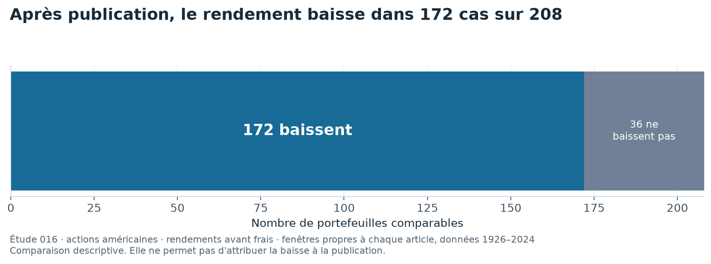

# Vérifier qu'une stratégie résiste à de nouveaux tests

Une stratégie peut réussir sur les données qui ont servi à la choisir, puis échouer dès qu'on change de période. Essayer beaucoup de variantes augmente aussi la chance de trouver un beau résultat par hasard.

Ce dépôt organise la recherche pour rendre ces pièges visibles. Chaque étude conserve ses données, ses hypothèses, ses essais et ses résultats.

**La plateforme sert à décider si les preuves sont suffisantes avant d'envisager une allocation. Elle ne transforme pas un bon test historique en promesse de rendement.**

## Choisir une porte d'entrée

| Votre question | Où regarder |
|---|---|
| Que montrent les études terminées ? | [Tableau de bord des résultats](docs/dashboard/index.md) |
| Que reste-t-il après la publication d'une stratégie ? | [Étude des 212 portefeuilles](studies/016_publication_decay_212/) |
| Que change l'oubli des actions disparues ? | [Étude du biais de survie](studies/013_cross_sectional_ml_long/) |
| Le même calcul fonctionne-t-il dans un autre moteur ? | [Comparaison avec LEAN](lean/README.md) |
| Comment les données et les tests sont-ils organisés ? | [Architecture](docs/architecture/index.md) |

Le [site de documentation](https://guilou001.github.io/quant-research-platform/) et le [rapport complet du tableau de bord](rapport/rapport.pdf) rassemblent les résultats détaillés.

## Un exemple de résultat qui perd de sa force

L'étude 016 compare le rendement de portefeuilles d'actions américaines avant et après la publication de la stratégie. La comparaison est calculable pour 208 des 212 portefeuilles disponibles.



Sur ces 208 comparaisons, 172 montrent un rendement plus faible après publication. Les rendements sont mesurés avant frais. Chaque portefeuille utilise les dates de son article, au sein de données couvrant 1926 à 2024.

Le portefeuille médian conserve environ 42 % de son rendement antérieur. La moyenne des rapports en conserve environ 53 %. Ces deux statistiques répondent à des questions différentes.

Ce constat ne prouve pas que la publication cause la baisse. Il ne reproduit pas non plus, à lui seul, la régression de l'article de référence. [Mesures complètes](studies/016_publication_decay_212/results/metrics.json).

## Ce que la plateforme vérifie

Elle sépare les périodes utilisées pour choisir une stratégie de celles utilisées pour l'évaluer. Elle compte les variantes essayées, estime les coûts et conserve la provenance des données.

Elle peut aussi comparer deux moteurs indépendants et rééchantillonner des blocs de dates pour mesurer l'incertitude.

## Ce qui limite les conclusions

Toutes les études n'ont pas des données de même qualité. Certaines utilisent les titres encore présents aujourd'hui, ce qui peut oublier les entreprises disparues.

L'étude des 212 portefeuilles évite ce biais de survie, mais utilise une version récente des historiques. Elle ne restitue pas nécessairement les données exactement telles qu'elles étaient connues à chaque date.

Le tableau de bord signale ces différences. Ses courbes ne constituent donc pas un classement uniforme de stratégies investissables.

## Explorer et vérifier le dépôt

```bash
uv sync --locked --all-extras --dev
uv run quant info
make lint
make test
make docs
```

Ces commandes vérifient le socle et construisent la documentation. Les téléchargements et calculs propres à chaque étude ont leurs commandes séparées, indiquées dans son dossier. Le graphique de présentation se régénère hors réseau avec `uv run python scripts/figure_presentation.py`, depuis les tableaux publiés.

## Pour aller plus loin

[Méthodes, résultats complets et références](ETUDE_DETAILLEE.md) · [Présentation en PDF](rapport/presentation.pdf) · [Citer le projet](CITATION.cff) · [Licence](LICENSE).

## English summary

A research platform tracks data, trials, costs and validation across investment studies. One study finds lower post-publication returns for 172 of 208 comparable US portfolios, before costs. Data quality varies across studies, so dashboard curves are not a uniform investable ranking.
