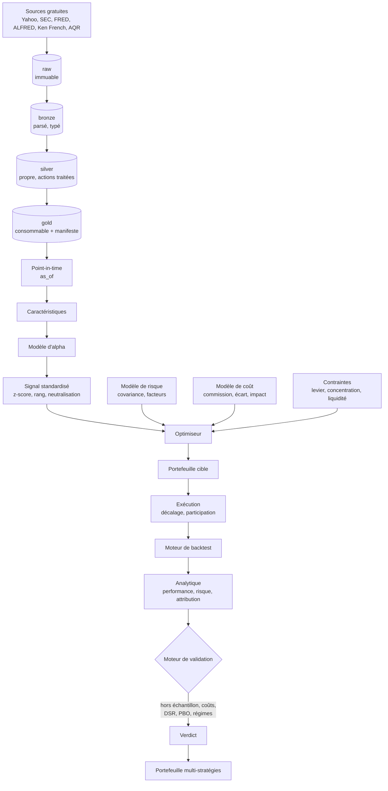
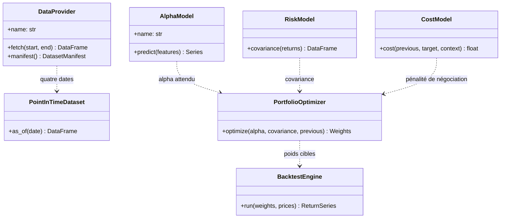
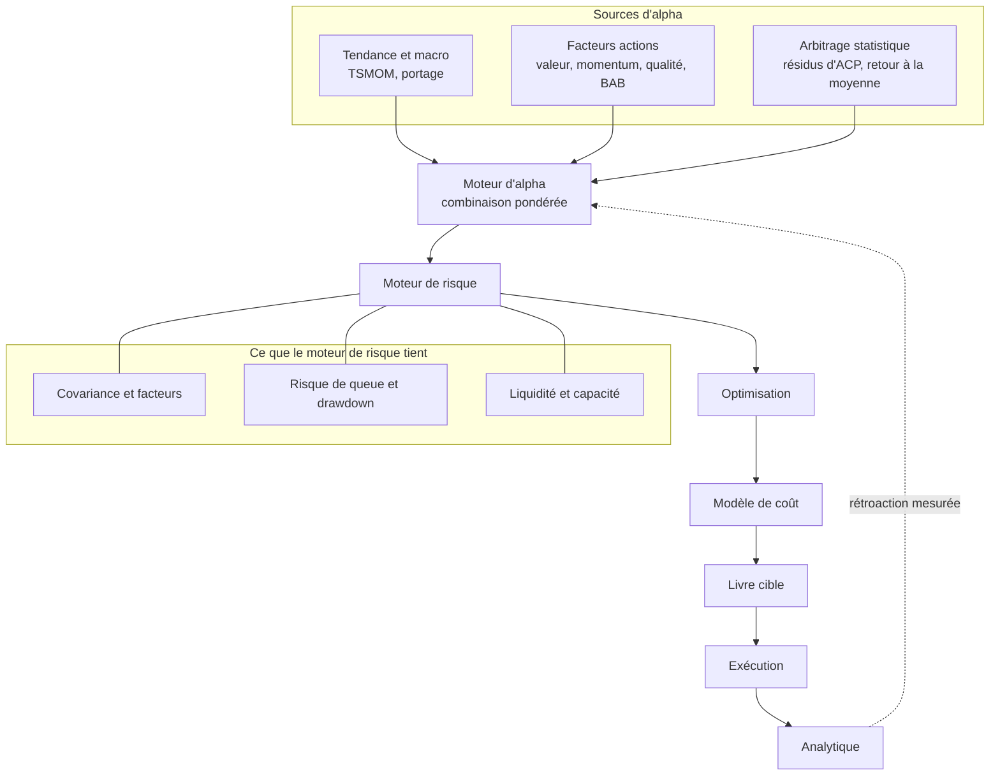

# L'architecture, et la raison de chaque frontière

L'architecture répond à une seule question : qu'est-ce qui devra être remplacé
un jour, et comment le remplacer sans réécrire le reste ? Trois choses le seront
avec certitude. La source de données, quand les données gratuites ne suffiront
plus. Le moteur de backtest, quand il faudra un modèle d'exécution réaliste. Le
modèle d'alpha, à chaque étude.

Tout le reste découle de là.

## La chaîne, de la donnée au verdict

Le point important de ce schéma est ce qui n'y figure pas. Aucune flèche ne
remonte : une étape ne consulte jamais une étape ultérieure, et c'est ce qui
interdit structurellement l'information future.

## Ce que chaque sous-paquet promet

| Sous-paquet | Ce qu'il fait | Ce qu'il ne fait jamais |
|---|---|---|
| `core` | contrats, configuration, calendrier, journal, déterminisme | connaître une source ou une bibliothèque de calcul |
| `data` | lac, provenance, point-in-time, qualité | décider d'une stratégie |
| `features` | transformer des données en caractéristiques | télécharger |
| `signals` | standardiser et neutraliser un signal | fabriquer des poids |
| `strategies` | assembler un signal en règle de portefeuille | connaître un fournisseur |
| `models` | apprentissage statistique | contourner la validation |
| `validation` | séparer un résultat d'une coïncidence | regarder le holdout final sans le compter |
| `portfolio` | covariance, contraintes, optimisation | ignorer les coûts |
| `risk` | contributions, queues, tension | se limiter à la variance |
| `execution` | coûts, impact, participation, capacité | supposer le levier gratuit |
| `backtest` | rejouer une suite de portefeuilles | inventer un prix |
| `analytics` | mesurer performance et risque | dupliquer une métrique |
| `reporting` | rapport d'étude, figures, tableaux | choisir le verdict |
| `experiments` | trace, registre, reproductibilité | oublier un essai |

## Les onze protocoles

Les frontières sont déclarées dans `quantlab.core.protocols` avec
`typing.Protocol`, donc structurelles : une classe satisfait un protocole en
portant les bonnes méthodes, sans hériter de rien.

Le détail du raisonnement vit dans [ADR-003](adr/adr-003-protocoles.md).

## L'architecture cible du fonds

Une fois plusieurs stratégies validées, elles ne s'additionnent pas : elles se
budgètent en risque.

La question posée à chaque nouvelle stratégie n'est pas « rapporte-t-elle ? »
mais « apporte-t-elle quelque chose à ce que nous détenons déjà ? ». Une
stratégie de ratio de Sharpe 0,8 décorrélée des autres vaut mieux qu'une
stratégie de 1,5 qui répète une position existante.
