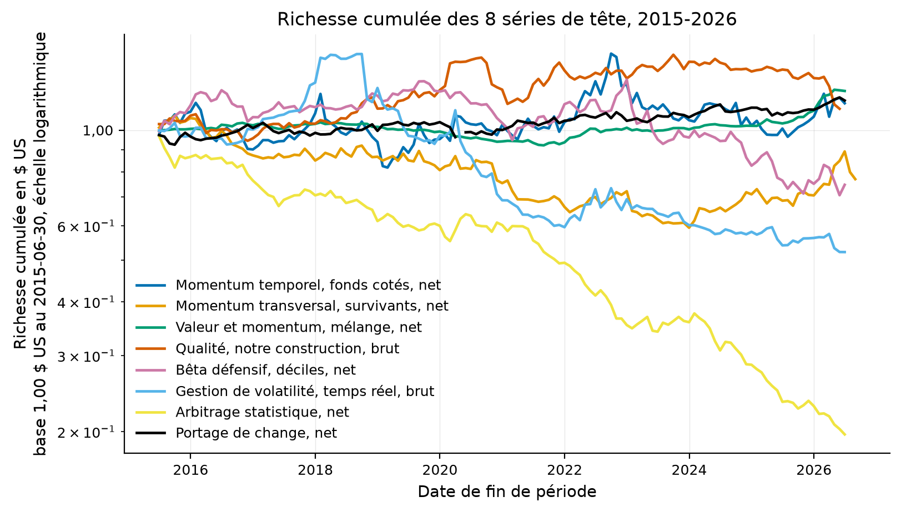
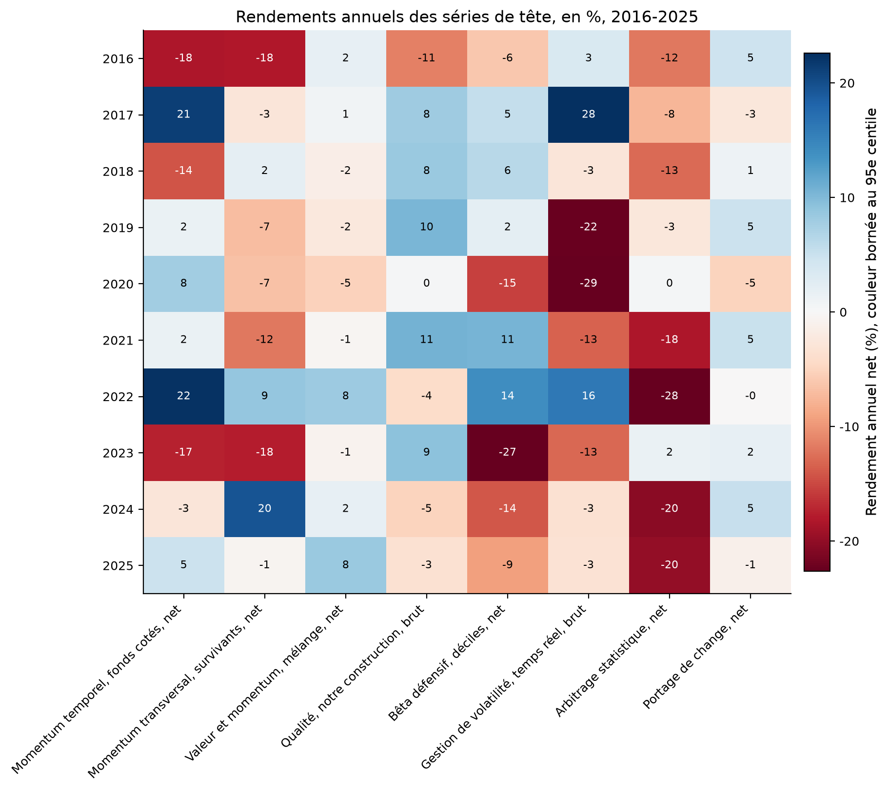
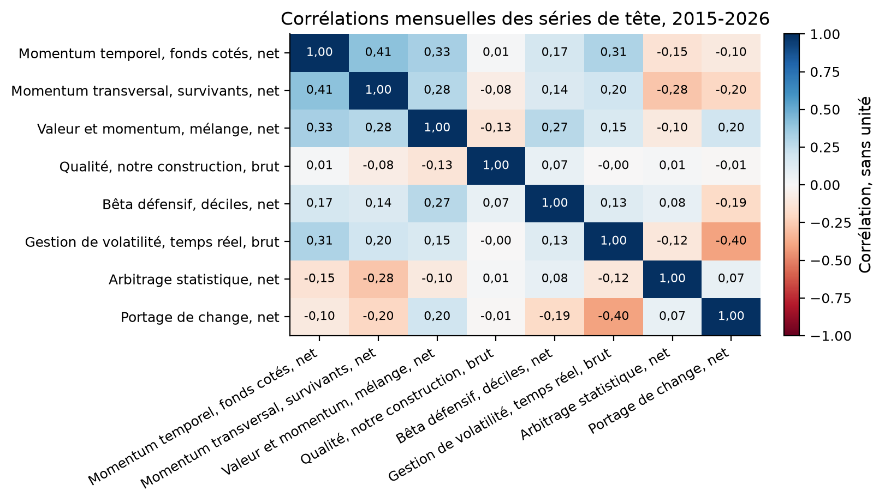
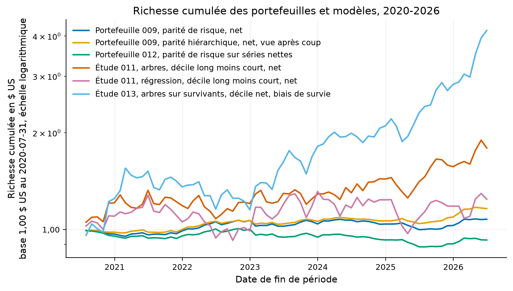
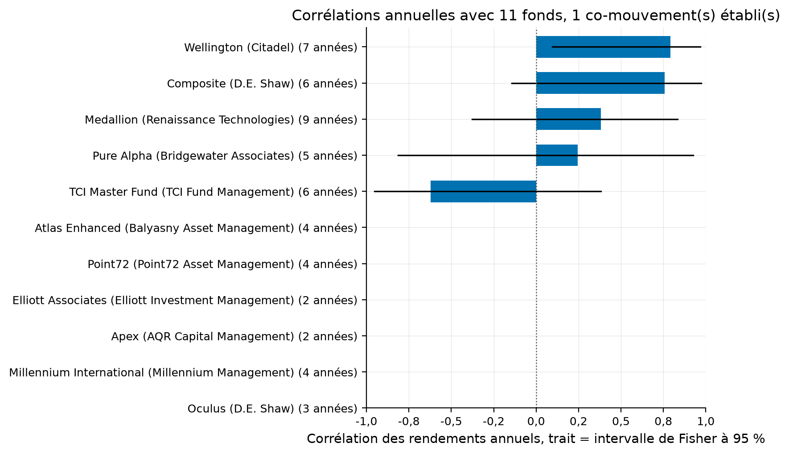

# Tableau de bord du laboratoire

Engendré le 2026-09-04 par `quant dashboard build`, commit `ad1f741`. Chaque chiffre
vient d'un fichier du dépôt, nommé sous chaque tableau. Rien ici n'est un conseil en
investissement.

## L'état en quatre nombres

- **21 études** menées, verdicts : 7 `EXPERIMENTAL`, 13 `REJECTED`, 1 `REPLICATED`.
- **866 essais déclarés** dans les configurations, qui entrent dans le ratio de Sharpe dégonflé.
- **149 expériences** au registre, 866 essais sur les dernières exécutions.
- **2489 fonctions de test**, dont les gardiens d'architecture et de style.

## Les verdicts

Source : `studies/*/config.yaml` et `studies/*/results/metrics.json` ; la phrase de résultat vient
de `studies/README.md`.

| Étude | Essais | Verdict | Ce qui a été mesuré |
|---|---:|---|---|
| 001 Momentum de série temporelle | 73 | `EXPERIMENTAL` | Sur la série des auteurs eux-mêmes, le ratio de Sharpe passe de 1,411 dans leur fenêtre à 0,337 après publication, et la chute est distinguable du hasard, z = 3,239. |
| 002 Momentum transversal | 53 | `EXPERIMENTAL` | Le t de l'écart gagnant moins perdant tombe de 5,12 à 1,746, et le biais de survie RETIRE 2,04 à 4,34 points de pourcentage par an au lieu d'en ajouter. |
| 003 Valeur et momentum, partout | 207 | `EXPERIMENTAL` | La corrélation valeur contre momentum vaut -0,577, le mélange à parts égales porte un Sharpe de 1,096 contre 0,593 pour la meilleure jambe, et 35 % de ce gain vient de la seule corrélation. |
| 004 Qualité moins camelote | 67 | `EXPERIMENTAL` | Le facteur publié se réplique, notre construction sur les fondamentaux point-in-time de la SEC ne le reproduit pas, corrélation 0,106, et la cause est identifiée : notre univers de grandes capitalisations perd la charge de taille qui porte le facteur. |
| 005 Parier contre le bêta | 144 | `REJECTED` | Le facteur ne s'affaiblit pas après publication, p = 0,960, mais le rétrécissement de 0,6 vers un décide de tout : il fait passer le Sharpe reconstruit de 0,394 à -0,001. |
| 006 Portefeuilles gérés en volatilité | 89 | `REJECTED` | L'alpha se réplique sur huit contrôles sur huit, et la version négociable rapporte -1,30 %/an net avec un Sharpe hors échantillon de -0,362. |
| 007 Arbitrage statistique | 49 | `REJECTED` | Le Sharpe brut se réplique, 1,460 contre 1,44, et le coût de seuil de rentabilité vaut 3,92 points de base contre les 5 que l'article lui-même suppose. |
| 008 Portage | 33 | `REPLICATED` | Le coefficient du test central se retrouve à 0,5 % près, 1,084 contre 1,09, et il tombe à 0,303 avec un t de 0,294 après la fin de l'échantillon. |
| 009 Huit sources d'alpha, un portefeuille | 20 | `REJECTED` | Huit stratégies valent 5,4 paris indépendants. Trois allocations sur six battent la meilleure stratégie seule, mais pas la parité de risque désignée à l'avance, et la parité hiérarchique qui domine tout ne peut pas être retenue après coup. |
| 010 La capacité des deux stratégies chiffrables | 8 | `REJECTED` | Le momentum sur fonds cotés est borné par la participation avant de l'être par l'impact : à un million de dollars, un rééquilibrage sur quatre demande plus de dix pour cent du volume d'un fonds de devises. L'arbitrage statistique a une capacité nulle, son brut ne couvrant pas les cinq points de base de l'article sur 1996-2026. Statut modélisé. |
| 011 Arbres contre régression, après coûts | 17 | `REJECTED` | Six méthodes sur 1 526 grandes capitalisations et onze ans : R² mensuel hors échantillon de 0,35 % à 0,48 %, dans la plage de l'article, mais corrélation de rang négative pour les six. Les arbres amplifiés rendent un décile net à 0,663 contre 0,277 pour la régression, sans la battre au test de Diebold et Mariano, p 0,65 ; le linéaire est gardé. |
| 012 Le portefeuille 009 sur séries nettes | 20 | `REJECTED` | Le portefeuille de l'étude 009 sur les séries nettes de chaque stratégie rend -0,128 de Sharpe contre 0,535 pour la meilleure jambe seule. Les corrélations n'ont pas bougé, les signes si : l'arbitrage statistique net, à -0,932, retire 0,379 de Sharpe là où sa version brute en apportait 0,250. |
| 013 Arbres contre régression sur quarante ans de survivants | 17 | `REJECTED` | Sur 502 survivants du S&P 500 rejoués depuis 1986, tout est positif, R² de 1,6 % et déciles nets de 0,60 à 0,85, et c'est le signe du biais de survie plutôt qu'un mérite : les arbres ne battent toujours pas la régression au test de Diebold et Mariano, p 0,58, et un titre encore dans l'indice a remonté par construction. |
| 014 Ce que la publication laisse, huit stratégies ensemble | 12 | `EXPERIMENTAL` | Les huit stratégies perdent après la publication de leur article, 73 % du rendement mensuel moyen par la moyenne des rapports et 67 % par la régression, contre 58 % chez McLean et Pontiff. Entre la fin de l'échantillon et la publication, elles ne perdent presque rien contre 26 %, parce que ce sont celles que leurs années suivantes n'ont pas démenties. |
| 015 Ce que le forfait gratuit de Polygon donne pour un univers sans biais de survie | 3 | `REJECTED` | Le forfait gratuit de Polygon rend deux ans de prix et refuse 2008, mais son référentiel des radiations est entier depuis 2004 : des actions ordinaires cotées en 2014, la moitié ont disparu, mesuré sur 6 425 radiations datées. |
| 016 Ce que la publication laisse, 212 portefeuilles sans biais de survie | 9 | `EXPERIMENTAL` | Sur 208 portefeuilles de Chen et Zimmermann, construits sur CRSP donc sans biais de survie, le rendement après publication vaut en moyenne 53 % de celui de la fenêtre de l'article et 42 % en médiane, 83 % des prédicteurs baissent, et la part perdue ne dépend pas de la force du prédicteur ; ceux publiés depuis 2010 ont perdu 94 % de leur rendement. |
| 017 Viser devant la cible, forme simple | 10 | `REJECTED` | Ne parcourir que la moitié du chemin vers la cible, taux choisi avant publication, réduit la rotation du momentum de série temporelle de 9,15 à 5,75 fois le capital par an et rend pourtant un Sharpe net de 0,162 contre 0,176 au rééquilibrage complet ; la rotation n'est pas le levier, le signal l'est. |
| 018 La nuit contre la journée | 6 | `EXPERIMENTAL` | Le momentum de série temporelle gagne tout son rendement la nuit, 10,2 % par an de la clôture à l'ouverture avec un t de 3,8, et perd 3,0 % par an le jour ; MTUM gagne 99 % de son rendement la nuit, USMV 34 %, et le marché lui-même 62 %. |
| 019 Marché, taille et momentum sur les cryptomonnaies | 10 | `REJECTED` | Les trois facteurs des cryptomonnaies se retrouvent dans la fenêtre de l'article, momentum à 2,65 % par semaine, et perdent les cinq sixièmes de leur rendement après sa parution ; le momentum négocie deux fois le capital par semaine et rend -0,60 de Sharpe net de cinquante points de base. |
| 020 Les meilleures idées des gestionnaires concentrés, lues à leur date de dépôt | 6 | `REJECTED` | La plus grosse position de chaque gestionnaire 13F concentré, formée le quarante-sixième jour après le trimestre, rapporte 14,29 % par an contre 14,18 % pour SPY, écart +0,27 %, t 0,26, bêta 1,08 : c'est l'indice des survivants, et 28,9 % des idées n'ont aucun prix, 50 % en 2013. La valeur des jeux 13F est en milliers de dollars jusqu'en 2022, lue déclaration par déclaration. |
| 021 Le portefeuille de primes pré-inscrit | 13 | `REJECTED` | Le portefeuille de primes déclaré avant tout calcul, tendance, valeur et momentum, vente de puts, en inverse de volatilité et empilé à 1,5, rend 0,629 de Sharpe net sur 2010-2026 et 0,88 en holdout, quatre sous-périodes positives ; il est rejeté parce que la vente de puts seule fait 0,696, que le t vaut 2,30 et que la tendance sur fonds cotés lui coûte 0,25, ce que la pré-inscription interdit de corriger après coup. |

## Les séries, et ce qu'elles valent

Une série de tête par étude, nette de coûts quand une version nette existe, plus les
portefeuilles construits dessus. Mensuel, brut de frais de gestion. Source :
`studies/*/results/series/`, mesures de `quantlab.analytics`. Les figures de richesse
cumulée partent de la première date commune à toutes les séries tracées, donc de la plus
courte d'entre elles.

| Série | Début | Fin | Années | Rendement composé (%) | Volatilité (%) | Sharpe | Pire repli (%) |
|---|---|---|---:|---:|---:|---:|---:|
| Momentum temporel, fonds cotés, net | 2007-01-31 | 2026-06-30 | 19,5 | 2,27 | 17,20 | 0,217 | -35,9 |
| Momentum transversal, survivants, net | 1991-01-31 | 2026-08-31 | 35,7 | -2,36 | 13,74 | -0,103 | -84,4 |
| Valeur et momentum, mélange, net | 1972-01-31 | 2026-06-30 | 54,5 | 4,53 | 4,15 | 1,092 | -11,6 |
| Qualité, notre construction, brut | 2015-06-30 | 2026-05-31 | 11,0 | 1,04 | 10,29 | 0,152 | -25,1 |
| Bêta défensif, déciles, net | 1966-07-31 | 2026-06-30 | 60,0 | 0,37 | 11,06 | 0,090 | -49,1 |
| Gestion de volatilité, temps réel, brut | 1946-08-31 | 2026-06-30 | 79,9 | -1,63 | 16,27 | -0,020 | -91,7 |
| Arbitrage statistique, net | 1996-01-31 | 2026-06-30 | 30,5 | -4,36 | 11,70 | -0,323 | -90,0 |
| Portage de change, net | 1971-02-28 | 2026-06-30 | 55,4 | 3,54 | 7,32 | 0,513 | -27,9 |
| Portefeuille 009, parité de risque, net | 2009-12-31 | 2026-06-30 | 16,6 | 2,28 | 3,59 | 0,646 | -7,7 |
| Portefeuille 009, parité hiérarchique, net, vue après coup | 2009-12-31 | 2026-06-30 | 16,6 | 2,70 | 2,96 | 0,916 | -4,3 |
| Portefeuille 012, parité de risque sur séries nettes | 2009-12-31 | 2026-06-30 | 16,6 | -0,49 | 3,37 | -0,128 | -18,7 |
| Étude 011, arbres, décile long moins court, net | 2020-07-31 | 2026-06-30 | 6,0 | 10,23 | 16,83 | 0,663 | -18,4 |
| Étude 011, régression, décile long moins court, net | 2020-07-31 | 2026-06-30 | 6,0 | 3,69 | 20,48 | 0,277 | -27,7 |
| Étude 013, arbres sur survivants, décile net, biais de survie | 1996-02-29 | 2026-06-30 | 30,4 | 20,54 | 25,87 | 0,849 | -48,8 |
| Étude 017, momentum temporel à rapprochement partiel, net | 2007-01-31 | 2026-06-30 | 19,5 | 2,19 | 15,86 | 0,216 | -32,1 |

## Les trajectoires

## Les comparaisons aux fonds réels

### Facteurs publiés contre fonds cotés, mensuel

Source : `benchmarks/results/facteurs_publies_contre_fonds_reels_2026-09-02.csv`.

| strategy | fund | n_periods | correlation | beta | r_squared | drawdown_overlap | reading |
|---|---|---|---:|---:|---:|---:|---|
| TSMOM (AQR) | AQMIX | 197 | 0,755 | 0,575 | 0,570 | 0,679 | même phénomène |
| TSMOM (AQR) | DBMF | 85 | 0,603 | 0,496 | 0,363 | 0,485 | apparenté, à une autre échelle |
| TSMOM (AQR) | KMLM | 66 | 0,669 | 0,667 | 0,447 | 0,725 | apparenté |
| BAB USA (AQR) | BTAL | 178 | 0,484 | 0,829 | 0,234 | 0,240 | apparenté |
| BAB USA (AQR) | USMV | 177 | 0,192 | 0,248 | 0,037 | 0,271 | distinct |
| QMJ USA (AQR) | QUAL | 156 | -0,372 | -0,555 | 0,138 | 0,122 | distinct |
| Momentum US (VME) | MTUM | 159 | 0,249 | 0,332 | 0,062 | 0,273 | distinct |
| Décile gagnant 12-2 (KF) | MTUM | 159 | 0,887 | 0,658 | 0,787 | 0,571 | même phénomène |
| Valeur US (VME) | VLUE | 159 | 0,159 | 0,225 | 0,025 | 0,375 | distinct |
| TSMOM (AQR) | QSPIX | 152 | 0,133 | 0,125 | 0,018 | 0,451 | distinct |
| BAB USA (AQR) | QMNIX | 141 | 0,167 | 0,178 | 0,028 | 0,191 | distinct |

### Portefeuille 009 contre grands fonds fermés, annuel

Source : `benchmarks/results/fonds_fermes_contre_portefeuille_009_2026-09-02.csv`.

| fund_label | n_years | correlation | corr_lo | corr_hi | mean_fund | mean_strategy | mean_strategy_at_10pct_vol | reading |
|---|---|---:|---:|---:|---:|---:|---:|---|
| Medallion (Renaissance Technologies) | 9 | 0,381 | -0,379 | 0,834 | 0,376 | 0,035 | 0,100 | aucun co-mouvement établi |
| Wellington (Citadel) | 8 | 0,514 | -0,299 | 0,895 | 0,197 | 0,005 | 0,015 | aucun co-mouvement établi |
| Composite (D.E. Shaw) | 7 | 0,457 | -0,451 | 0,900 | 0,171 | 0,003 | 0,009 | aucun co-mouvement établi |
| Oculus (D.E. Shaw) | 4 | n.d. | n.d. | n.d. | 0,254 | -0,013 | -0,037 | trop peu d'années communes (4) |
| Millennium International (Millennium Management) | 4 | n.d. | n.d. | n.d. | 0,119 | 0,010 | 0,029 | trop peu d'années communes (4) |
| Pure Alpha (Bridgewater Associates) | 5 | 0,146 | -0,845 | 0,911 | 0,106 | -0,001 | -0,005 | aucun co-mouvement établi |
| Apex (AQR Capital Management) | 2 | n.d. | n.d. | n.d. | 0,173 | -0,006 | -0,018 | trop peu d'années communes (2) |
| TCI Master Fund (TCI Fund Management) | 7 | -0,415 | -0,890 | 0,492 | 0,201 | 0,009 | 0,026 | aucun co-mouvement établi |
| Elliott Associates (Elliott Investment Management) | 2 | n.d. | n.d. | n.d. | 0,053 | 0,027 | 0,076 | trop peu d'années communes (2) |
| Point72 (Point72 Asset Management) | 5 | -0,293 | -0,934 | 0,795 | 0,145 | -0,013 | -0,038 | aucun co-mouvement établi |
| Atlas Enhanced (Balyasny Asset Management) | 4 | n.d. | n.d. | n.d. | 0,107 | 0,010 | 0,029 | trop peu d'années communes (4) |

## Les dernières expériences du registre

Source : `artifacts/experiments.jsonl`, non suivi par git, régénéré par chaque exécution.

| Expérience | Terminée | Verdict | Essais | Commit |
|---|---|---|---:|---|
| portefeuille_de_primes_021-69102ec468 | 2026-09-05T00:38:23 | REJECTED | 13 | ad1f741 |
| portefeuille_de_primes_021-647aed02d0 | 2026-09-05T00:35:34 | REJECTED | 12 | ad1f741 |
| portefeuille_de_primes_021-697ff3c888 | 2026-09-05T00:26:36 | REJECTED | 12 | ad1f741 |
| meilleures_idees_13f_020-deb95ed444 | 2026-09-04T23:26:22 | REJECTED | 6 | 3e0ad4d |
| meilleures_idees_13f_020-c4a4e54440 | 2026-09-04T23:17:48 | REJECTED | 6 | 3e0ad4d |
| meilleures_idees_13f_020-2414d79a75 | 2026-09-04T22:55:08 | EXPERIMENTAL | 4 | 3e0ad4d |
| facteurs_crypto_019-47e871b885 | 2026-09-04T22:40:01 | REJECTED | 10 | 3e0ad4d |
| univers_polygon_015-da2a56dc17 | 2026-09-04T22:27:50 | REJECTED | 3 | 3e0ad4d |
| viser_devant_la_cible_017-4fc5bcdc6c | 2026-09-04T22:19:51 | REJECTED | 10 | 3e0ad4d |
| nuit_contre_journee_018-3a2bb7dc89 | 2026-09-04T22:19:20 | EXPERIMENTAL | 6 | 3e0ad4d |
| publication_decay_212_016-2634c31f9b | 2026-09-04T22:13:34 | EXPERIMENTAL | 9 | 3e0ad4d |
| publication_decay_212_016-74bf31ebcf | 2026-09-04T22:10:53 | EXPERIMENTAL | 9 | 3e0ad4d |

## Comment lire ce tableau

Aucune étude n'atteint `ROBUST`, et c'est le résultat du laboratoire, pas son échec : les
facteurs publiés se répliquent dans leur fenêtre et ne survivent pas à la publication, aux
coûts ou à la taille. Le parcours qui l'établit est décrit dans
[la méthodologie](../methodology/gauntlet.md), et chaque verdict dans le README de son étude.
