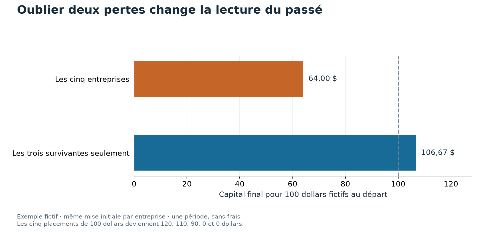

# 013 Un historique plus long peut-il rendre une erreur plus convaincante ?

Les modèles de cette étude obtiennent des performances positives sur un historique long.
L'univers contient toutefois les entreprises encore présentes aujourd'hui, rejouées dans le passé.
Les tests temporels ne corrigent pas cette sélection des entreprises.

## Cinq entreprises, puis trois survivantes

L'exemple est fictif. Nous plaçons 100 dollars dans chacune de cinq entreprises au début d'une période.
Le capital initial vaut donc 500 dollars.

| Entreprise | Capital initial | Capital final | Présente dans la sélection finale |
|---|---:|---:|---|
| A | 100 $ | 120 $ | Oui |
| B | 100 $ | 110 $ | Oui |
| C | 100 $ | 90 $ | Oui |
| D | 100 $ | 0 $ | Non |
| E | 100 $ | 0 $ | Non |

Le capital final complet vaut 320 dollars. La perte du portefeuille initial est `320 / 500 - 1`, soit 36 %.
Si nous oublions D et E, nous comparons les mêmes 320 dollars à seulement 300 dollars de capital initial.
Le calcul affiche alors un gain de 6,67 %.

Ce **biais de survie** vient du choix des entités après avoir observé ce qu'elles sont devenues.
L'exemple montre un mécanisme possible. Toutes les radiations ne sont pas des faillites, et leur prix final ne vaut pas toujours zéro.
L'effet sur une stratégie qui achète certains titres et en vend d'autres peut aussi changer de signe.

La première barre part du portefeuille réellement constitué dans l'exemple. La seconde ne conserve que les trois entreprises sélectionnées à la fin.
Le gain apparent vient du dénominateur et des entités oubliées. Il ne vient pas d'une nouvelle décision de placement.

## Pourquoi prolonger l'étude de Gu, Kelly et Xiu

L'[étude 011](011_cross_sectional_ml.md) dispose d'un historique court et de 27 caractéristiques.
Nous prolongeons ici la durée avec des prix disponibles, mais conservons seulement cinq caractéristiques de prix.
La question est de savoir si les arbres améliorent la prévision face à une régression dans cette autre expérience.

Cette modification change plusieurs éléments à la fois.
L'historique est plus long, les caractéristiques sont différentes et la sélection des entreprises reste imparfaite.
Un meilleur résultat ne permet donc pas d'identifier la seule contribution de la durée.
La [fiche Gu, Kelly et Xiu](../literature/gu_kelly_xiu_2020.md) explique le protocole de référence et ses différences avec nos données.

## Ce qui est effectivement mesuré

L'étude utilise 502 entreprises retenues depuis un univers actuel, avec des prix remontant dans le passé.
Les modèles apprennent sur les observations antérieures à leurs tests.
Le panel de prix couvre 1986 à juin 2026. Les résultats de portefeuille commencent en février 1996 et finissent en juin 2026.

Le portefeuille achète un dixième des actions préférées et vend un dixième des moins préférées.
Les coûts sont modélisés à dix points de base par unité négociée.
Ce sont des résultats hors échantillon pour l'ajustement du modèle, mais pas pour la sélection de l'univers.

| Modèle | R² par rapport à la prévision nulle | Corrélation moyenne du classement | Sharpe du portefeuille net |
|---|---:|---:|---:|
| Régression pénalisée | 1,64 % | 0,027 | 0,601 |
| Arbres amplifiés | 1,56 % | 0,024 | 0,849 |
| Forêt aléatoire | 1,69 % | 0,026 | 0,807 |

Les mesures sont positives, et les arbres présentent un meilleur Sharpe observé que la régression.
Cela ne démontre ni une supériorité de prévision suffisamment précise, ni une stratégie disponible pour un investisseur historique.
Les [erreurs de prévision](https://github.com/Guilou001/quant-research-platform/blob/main/studies/013_cross_sectional_ml_long/results/tables/evaluation.csv)
et les [portefeuilles enregistrés](https://github.com/Guilou001/quant-research-platform/blob/main/studies/013_cross_sectional_ml_long/results/tables/portfolios.csv) sont les sources du tableau.

## Pourquoi des tests peuvent réussir malgré le problème

Un test de stabilité demande si un résultat se retrouve sur plusieurs périodes.
Il ne demande pas automatiquement si les entreprises du panel étaient celles que l'investisseur pouvait choisir à l'époque.
Une sélection persistante peut donc produire un résultat stable sur des données mal adaptées à la question.

Le laboratoire compare aussi des signaux simples aux portefeuilles de Kenneth French, construits avec les titres disparus.
Ces comparaisons révèlent des différences de signe ou d'ampleur selon le signal.
Elles ne constituent pas une mesure pure du biais de survie, car les univers et certaines définitions de signaux diffèrent également.

## La conclusion et ses limites

Le résultat favorable doit être lu avec la sélection des entreprises au premier plan.
On ne peut pas attribuer toute la différence à un modèle plus efficace, ni chiffrer une causalité unique avec cette comparaison.
Un univers historique complet permettrait de refaire la même construction avec et sans les exclusions, en tenant les autres choix constants.

Le verdict `REJECTED` conserve les critères de l'expérience initiale.
Les résultats détaillés et les écarts de définition restent dans l'[annexe technique](https://github.com/Guilou001/quant-research-platform/blob/main/studies/013_cross_sectional_ml_long/ANNEXE_TECHNIQUE.md).
Le [chapitre sur les dates](../guide/02_donnees.md) explique pourquoi dater les informations et reconstruire l'univers sont deux contrôles différents.
