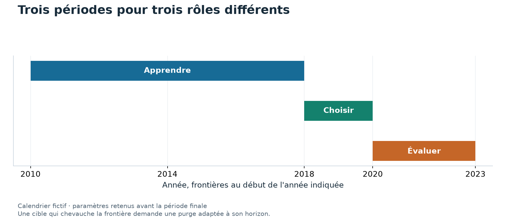

# 03 Séparer ce qui sert à apprendre de ce qui sert à juger

Un modèle apprend des relations sur des observations anciennes.
Ses paramètres peuvent ensuite être choisis sur une période de validation.
Une troisième période sert à évaluer le choix retenu, sans recommencer la sélection en regardant son résultat.

Ces trois rôles évitent une confusion courante.
Un paramètre peut sembler bon parce qu'il a été choisi pour réussir précisément sur les données qui servent ensuite à le vanter.

## Un calendrier fictif

On apprend sur janvier 2010 à décembre 2017.
On choisit les paramètres sur 2018 et 2019.
On évalue une fois le choix retenu sur 2020 à 2022.

Ces dates sont pédagogiques. Les études utilisent leurs propres fenêtres.

Le modèle peut être réestimé à chaque date selon une règle fixée d'avance.
Il doit alors utiliser uniquement les observations devenues disponibles.
Ce protocole est souvent appelé évaluation en fenêtre glissante ou croissante, selon les observations conservées.

## Pourquoi une frontière ne suffit pas

Une observation formée fin décembre peut viser le rendement de janvier.
Si janvier appartient à la période de test, cette étiquette de décembre contient déjà un morceau de la réponse future.

La **purge** retire les observations dont la cible chevauche la période évaluée.
Un **embargo** ajoute une séparation temporelle selon le protocole.
Ces précautions doivent correspondre à l'horizon réellement prévu, plutôt qu'à un délai choisi sans justification.

## Le piège du meilleur réglage après coup

L'[étude 017](../etudes/017_viser_devant_la_cible.md) choisit une vitesse de rééquilibrage avant la période finale.
Un autre réglage aurait mieux fonctionné sur cette période.
Le remplacer après lecture du résultat transformerait le test final en nouvelle période de sélection.

Ce diagnostic reste utile pour préparer une prochaine expérience.
Il ne constitue pas une nouvelle preuve indépendante sur les mêmes dates.

Une période postérieure à un article est hors de son échantillon original.
Elle n'est pas forcément inconnue du chercheur qui réalise le test aujourd'hui.
L'expression « hors échantillon » doit toujours préciser par rapport à quel choix ou à quel modèle.

## Retrouver la méthode dans le dépôt

Les [découpages de validation](../validation/index.md) décrivent les procédures disponibles.
L'[étude 011](../etudes/011_cross_sectional_ml.md) montre leur emploi pour prévoir les rendements des actions.

Avant de comparer deux résultats, vérifiez qu'ils portent sur les mêmes mois.
Le [chapitre suivant](04_hasard.md) explique pourquoi leur différence demande encore une mesure d'incertitude.
