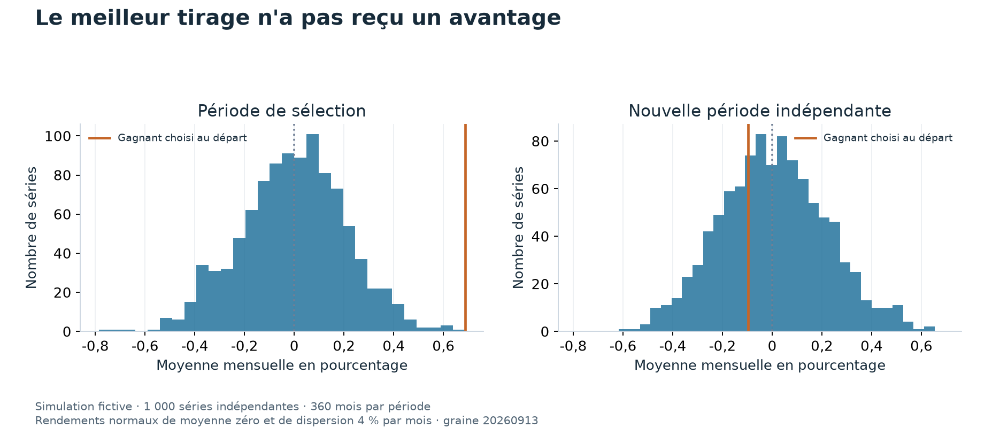
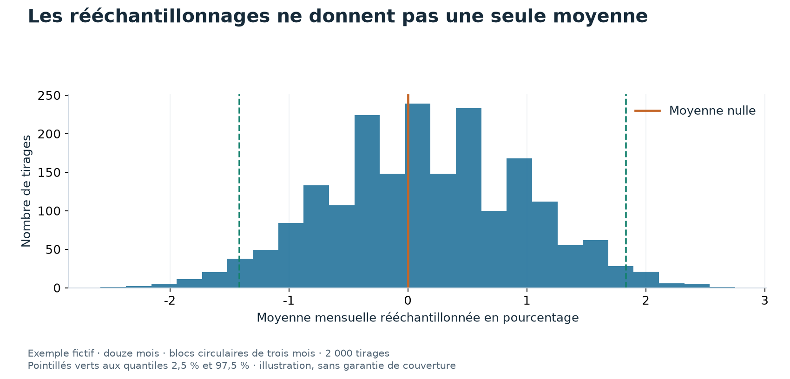

# 04 Distinguer un résultat intéressant d'un gagnant chanceux

Un test statistique peut rejeter une hypothèse vraie par hasard.
Un seuil de 5 % borne cette fréquence sous les hypothèses du test.
Il ne signifie pas que chaque résultat déclaré significatif a 95 % de chances d'être vrai.

Le problème grandit lorsque l'on essaie beaucoup de variantes et que l'on ne présente que la meilleure.

## Cent tests fictifs

Supposons cent tests indépendants, tous appliqués à des relations qui n'existent pas.
Chaque test rejette à tort dans 5 % des cas.
La probabilité d'au moins un rejet à tort vaut alors un moins la probabilité que les cent tests ne rejettent pas.

Le calcul donne « un moins 0,95 à la puissance 100 », soit 99,4 %.
L'indépendance est une hypothèse de cet exemple.
Des stratégies financières proches produisent des tests dépendants, qui demandent un traitement adapté.

## Sélectionner parmi mille stratégies sans signal

Le graphique suivant simule mille séries de 360 rendements mensuels indépendants.
Chaque rendement suit une loi normale de moyenne zéro et de dispersion 4 %.
Le gagnant est celui dont la moyenne est la plus élevée dans cette première période.

Sa moyenne mensuelle vaut 0,687 % pendant la sélection.
Sur 360 nouveaux mois indépendants, elle vaut -0,097 %.
Ce tirage fixé à l'avance illustre la sélection d'un résultat flatteur sans avantage véritable.
Il ne prédit pas la performance d'une stratégie réelle, ni la valeur maximale garantie parmi mille essais.

## Mesurer l'incertitude d'un écart

Le **bootstrap** construit des rééchantillonnages à partir des observations disponibles.
Avec des données mensuelles, prendre des blocs de mois voisins peut préserver une partie de leur dépendance.
Pour comparer deux stratégies, on rééchantillonne les mêmes dates pour les deux, puis on recalcule leur différence.

Ici, douze rendements fictifs sont repris par blocs circulaires de trois mois, avec 2 000 tirages.
L'intervalle entre les quantiles 2,5 % et 97,5 % contient zéro.
Ces données ne séparent donc pas nettement leur moyenne de zéro selon cette procédure.

Douze observations ne constituent pas une démonstration de bonne couverture statistique.
La longueur des blocs et les changements de régime peuvent modifier l'intervalle.
Les études doivent déclarer ces choix et examiner leur sensibilité.

## Deux outils, deux questions

Le **Deflated Sharpe Ratio**, abrégé DSR, compare un Sharpe observé à un repère tenant compte de la sélection parmi plusieurs essais.
Son calcul utilise aussi la longueur de série et la forme de la distribution.
Sa valeur n'est ni un Sharpe réduit, ni la probabilité de gagner de l'argent à l'avenir.

La **probabilité de surapprentissage**, abrégée PBO, mesure une fréquence de mauvais classement dans des découpages de validation.
Elle dépend de la grille de candidats et du protocole.
Ces outils ne corrigent pas des prix erronés ou un univers incomplet.

Les fiches [DSR](../literature/bailey_lopez_de_prado_2014_dsr.md), [PBO](../literature/bailey_et_al_2016_pbo.md) et [tests multiples](../literature/harvey_liu_zhu_2016.md) détaillent leurs hypothèses.
L'[étude 016](../etudes/016_publication_decay_212.md) montre pourquoi une différence historique et une cause établie restent deux conclusions distinctes.
