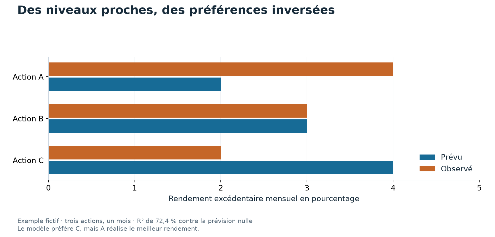

# 05 Prévoir un nombre, classer des actions, construire un portefeuille

Ces trois tâches utilisent parfois le même modèle.
Elles se jugent pourtant avec des mesures différentes.
Une amélioration de l'une ne garantit pas une amélioration des autres.

## Prévoir un rendement

Le modèle annonce une variation chiffrée pour le mois suivant.
On peut mesurer l'écart entre cette prévision et le rendement observé.
Mettre l'écart au carré pénalise davantage les grosses erreurs.

Le R² hors échantillon du laboratoire compare cette erreur à celle d'une prévision nulle du rendement excédentaire.
Une valeur de 1 % indique une réduction de 1 % de la somme des erreurs au carré.
Elle ne signifie pas que le modèle devine un mois sur cent.

## Classer les actions

Un gestionnaire peut vouloir choisir les actions les plus prometteuses.
Le classement importe alors, même si le modèle se trompe sur l'ampleur générale du mouvement.

Dans l'exemple fictif du graphique, le modèle préfère C à B, puis B à A.
Les rendements observés placent A devant B, puis C.
Le classement est entièrement inversé alors que la prévision améliore l'erreur par rapport à zéro.

L'[étude 011](../etudes/011_cross_sectional_ml.md) déroule le calcul à la main.
Son R² fictif vaut 72,4 %.
Les gains mesurés dans l'étude réelle sont beaucoup plus petits.

## Passer du classement aux positions

Un portefeuille peut acheter le groupe préféré et vendre le groupe le moins préféré.
Les pondérations, les titres exclus, les coûts et la fréquence des échanges influencent ensuite le résultat.
Les rendements des groupes extrêmes peuvent aussi différer du comportement du classement complet.

Le ratio de Sharpe compare un rendement excédentaire moyen à sa dispersion.
Il complète les mesures de prévision, sans les remplacer.
Il faut aussi regarder les pertes, la rotation et les périodes difficiles.

## Ce que l'apprentissage automatique ajoute

Gu, Kelly et Xiu comparent des relations linéaires et des méthodes capables de représenter des interactions.
Une relation peut dépendre d'une autre caractéristique.
Une hausse récente n'a, par exemple, pas nécessairement la même signification pour un titre liquide et un titre difficile à négocier.

Cet exemple explique une possibilité de modélisation.
Il n'affirme pas que notre expérience a identifié cette relation particulière.
La [fiche de l'article](../literature/gu_kelly_xiu_2020.md) sépare la méthode originale et notre adaptation.

L'[étude 013](../etudes/013_cross_sectional_ml_long.md) étend la période étudiée.
Elle rappelle qu'un modèle plus sophistiqué ne restitue pas les entreprises absentes des données.
