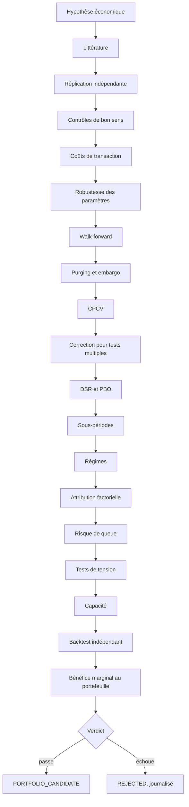

# Le parcours d'une stratégie

Une idée devient candidate au capital après vingt étapes, et pas avant. Le
parcours est le même pour toutes : une stratégie tirée d'un article de 1993 et
une stratégie découverte par un algorithme passent les mêmes contrôles. Aucune
faveur n'est faite à l'intelligence artificielle.

## Ce que chaque étape cherche à casser

| Étape | La question qu'elle pose | Ce qui la fait échouer |
|---|---|---|
| Hypothèse économique | pourquoi ce rendement existerait-il ? | aucun mécanisme nommé |
| Littérature | qu'a-t-on déjà trouvé, et qui l'a contredit ? | fiche absente ou sans critique |
| Réplication | retrouvons-nous les chiffres de l'article ? | écart non expliqué |
| Contrôles de bon sens | le signal survit-il à un décalage d'un jour ? | rendement qui s'effondre |
| Coûts | reste-t-il quelque chose après frais ? | alpha net négatif |
| Robustesse | y a-t-il un plateau de paramètres ? | un pic isolé |
| Walk-forward | le résultat tient-il hors de l'échantillon d'estimation ? | effondrement hors échantillon |
| Purging, embargo | les étiquettes recouvrantes faussent-elles la validation ? | fuite mesurée |
| CPCV | la performance dépend-elle du découpage choisi ? | dispersion large entre chemins |
| Tests multiples | combien d'essais ont été menés ? | t insuffisant après correction |
| DSR, PBO | le résultat survit-il à la sélection ? | DSR sous le seuil, PBO élevée |
| Sous-périodes | tient-il sur chaque décennie ? | un seul sous-échantillon porte tout |
| Régimes | dans quel état du monde fonctionne-t-il ? | dépendance à un régime unique |
| Attribution | est-ce de l'alpha ou une exposition connue ? | alpha nul contre cinq facteurs |
| Risque de queue | à quoi ressemblent les pires mois ? | asymétrie négative extrême |
| Tension | survit-il à une corrélation qui monte à un ? | perte inacceptable |
| Capacité | jusqu'à quel capital tient-il ? | capacité sous le seuil utile |
| Backtest indépendant | une seconde implémentation le retrouve-t-elle ? | écart inexpliqué |
| Bénéfice marginal | ajoute-t-il au portefeuille détenu ? | corrélation élevée avec l'existant |

## Le verdict

Cinq verdicts, et aucun ne se choisit à la main. Ils se déduisent des contrôles
qui ont réellement tourné, selon les seuils déclarés dans la configuration de
l'étude.

| Verdict | Ce qu'il signifie |
|---|---|
| `REJECTED` | l'hypothèse ne survit pas aux données |
| `EXPERIMENTAL` | un résultat existe, les contrôles ne sont pas tous passés |
| `REPLICATED` | les chiffres de l'article sont retrouvés dans nos tolérances |
| `ROBUST` | le résultat survit aux coûts, aux sous-périodes et au hors échantillon |
| `PORTFOLIO_CANDIDATE` | il est robuste et apporte au portefeuille existant |

Un ratio de Sharpe supérieur à 1 ne suffit à aucun de ces verdicts, et le
laboratoire ne connaît pas de seuil de Sharpe qui suffirait seul.

## La frontière de la preuve

Une partie des données est gelée en holdout final. Elle ne sert jamais à choisir
un paramètre.

Le point délicat est qu'après l'avoir regardée, elle n'est plus hors
échantillon. Un chercheur qui consulte son holdout, ajuste, et le consulte à
nouveau a transformé son échantillon de preuve en échantillon d'entraînement,
sans s'en apercevoir.

Le laboratoire compte donc les consultations. Le registre d'expériences porte
le nombre de fois où chaque holdout a été lu, et ce nombre est publié à côté du
résultat.
