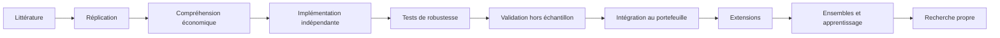

# Ce qui sépare un résultat d'une coïncidence

Un backtest flatteur ne prouve rien, et la raison est arithmétique. Prenez mille
stratégies aléatoires, et testez-les sur trente ans de données. La meilleure
affichera un ratio de Sharpe supérieur à 2 sans porter le moindre signal. Ce
n'est pas une possibilité théorique : c'est la conséquence mécanique du maximum
de mille tirages d'une loi centrée.

Le laboratoire est construit autour de cette phrase. Tout ce qui suit sert à
distinguer un rendement d'un tirage chanceux.

## Le modèle mental

La performance d'un fonds systématique ne vient pas d'un indicateur secret. Elle
se décompose :

\[
\text{Performance} \approx
\text{Edge} \times
\text{Breadth} \times
\text{Diversification} \times
\text{Execution} \times
\text{RiskManagement}
\]

Chaque terme est un produit, donc un zéro sur un seul annule tout. Un signal
excellent exécuté trop cher rend zéro. Mille paris parfaitement corrélés valent
un pari.

L'objectif que le laboratoire cherche à maximiser est :

\[
\max \; \frac{\mathbb{E}[\text{Alpha net}]}{\text{Risque}}
\quad\text{avec}\quad
\text{Alpha net} = \text{Alpha brut} - C_{\text{transaction}} - C_{\text{impact}} - C_{\text{emprunt}} - C_{\text{financement}}
\]

sous contraintes de levier, de perte maximale, de concentration, de liquidité,
de capacité, d'expositions factorielles, de risque de queue et de rotation.

## L'ordre des questions

La première question posée à une stratégie n'est jamais « est-ce que ça marche
dans les données ? ». Elle est :

> Pourquoi ce rendement devrait-il exister économiquement ?

Trois réponses seulement sont recevables, et chacune se teste.

**Une prime de risque.** Le rendement paie l'acceptation d'un risque que
d'autres refusent. Alors il doit être douloureux au mauvais moment, et le
laboratoire vérifie que la stratégie perd effectivement dans les crises.

**Un biais comportemental.** Le rendement vient d'une erreur systématique des
autres participants. Alors il doit s'affaiblir à mesure qu'il est publié et
exploité, et le laboratoire compare la période avant et après publication.

**Une contrainte institutionnelle.** Le rendement paie une friction : interdiction
de levier, mandat de suivi d'indice, contrainte réglementaire. Alors il doit
survivre tant que la contrainte survit, et disparaître avec elle.

Une stratégie sans mécanisme nommé n'entre pas dans le parcours de validation.
Elle est intéressante et elle attend.

## La progression, des épaules des géants vers la recherche propre

L'ordre compte. Répliquer d'abord donne une vérité connue contre laquelle
mesurer notre code : quand nos chiffres diffèrent de ceux de l'article, l'écart
est un fait à expliquer, et l'explication apprend toujours quelque chose. Partir
d'une idée neuve prive de ce repère.

## Ce qui est refusé

Une stratégie trouvée en testant dix mille variantes jusqu'à trouver la
meilleure n'est pas valide, quel que soit son ratio de Sharpe. Le laboratoire
compte les essais, les publie, et dégonfle le ratio de Sharpe en conséquence.

Un paramètre qui n'a de bonne valeur qu'en un point isolé n'est pas valide non
plus. Une fenêtre de 179 jours mauvaise, 180 excellente et 181 mauvaise décrit
le bruit de l'échantillon, pas un mécanisme. On cherche des plateaux.
