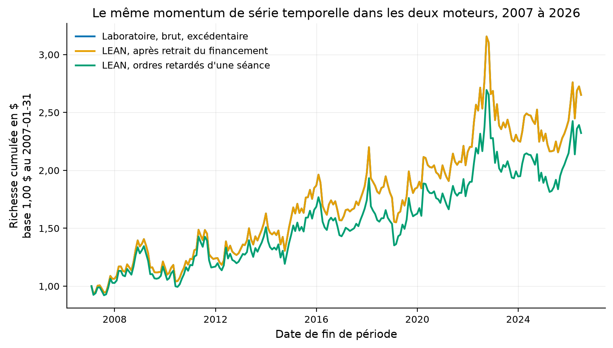
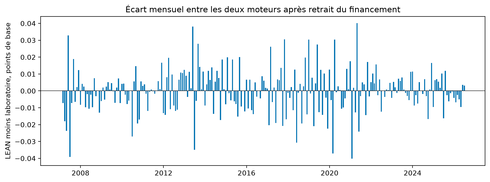

# Phase 9 : le même momentum dans deux moteurs, et chaque écart expliqué

**Résultat : LEAN retrouve les 234 rendements mensuels du laboratoire à
4,0e-6 près, et le ratio de Sharpe vaut 0,377 des deux côtés**. Aucun mois ne
dépasse le seuil de 1e-4 déclaré avant la lecture. Les 6 447 ordres ont tous
été remplis au prix que le moteur du laboratoire suppose, la clôture du jour de
décision. Sur 234 dates de décision, les deux moteurs retiennent le même nombre
d'instruments et le même signe partout. Le plus grand écart de poids, 0,0015
sur le fonds SHY, vient de l'encodage des prix de LEAN en dix-millièmes de
dollar. C'est vérifié en recalculant la volatilité du laboratoire sur les prix
arrondis. Une mesure que le laboratoire seul ne pouvait pas faire : retarder
les ordres d'une seule séance coûte **71 points de base par an** à cette
stratégie. Le rendement passe de 5,13 % à 4,42 % par an, et le ratio de Sharpe
de 0,377 à 0,336.

## La question posée

L'ADR-008 exige qu'une stratégie soit rejouée dans un moteur écrit par d'autres
avant de mériter du capital, parce qu'un moteur écrit par la même personne que
la stratégie partage ses angles morts. Aucune stratégie n'a atteint `ROBUST`,
donc aucune n'y avait droit. Le contrôle vaut pourtant pour le moteur lui-même :
si le moteur du laboratoire invente du rendement par un décalage d'une
période, toutes les études le portent. La question de cette phase est donc
celle-ci. Un moteur événementiel, qui passe des ordres et les remplit à un prix
de marché, retrouve-t-il les rendements que le moteur du laboratoire calcule
depuis des poids et des rendements ?

En mots simples : si l'on donne la même recette à deux cuisiniers qui ne se
parlent pas, sortent-ils le même plat ?

## Ce qui a été fait, dans l'ordre

1. **Les entrées communes.** `lean/export_inputs.py` télécharge une seule fois
   les prix ajustés des vingt-huit fonds cotés de l'étude 001 et le taux sans
   risque de Kenneth French. Il les écrit sous deux formes : un Parquet que le
   laboratoire relit, et les archives quotidiennes au format de LEAN. Les
   deux moteurs voient exactement les mêmes nombres. Mesuré : 28 fonds, 8 411
   séances du 1993-01-29 au 2026-06-30, aucun trou intérieur.
2. **La série du laboratoire.** `lean/reference.py` rejoue la jambe B de
   l'étude 001 avec les fonctions du laboratoire sur ces entrées. Elle diffère
   de la série publiée par l'étude de 5,1e-6 au plus, sur 59 mois, ce qui est
   la révision des prix par Yahoo entre les deux téléchargements.
3. **L'algorithme de contrôle.** `lean/algorithm/main.py` refait les quatre
   équations de Moskowitz, Ooi et Pedersen (2012) depuis leur énoncé, sans
   importer le laboratoire, ce qu'un test vérifie mécaniquement. La volatilité
   à pondération exponentielle y est une somme explicite, là où le laboratoire
   appelle la moyenne exponentielle de pandas.
4. **L'exécution.** `lean/run_lean.sh` lance l'image publique `quantconnect/lean`
   dans Docker, sans inscription et sans `lean-cli`, dont l'initialisation
   exige un identifiant et un jeton. Deux variantes : les ordres passés sur la
   barre de fin de mois, puis retardés d'une séance. Mesuré : dix secondes de
   moteur par variante, 1993 à 2026.
5. **La réconciliation.** `lean/reconcile.py` relit la valeur liquidative que
   l'algorithme journalise chaque jour, retranche le terme de financement, et
   compare mois par mois, décision par décision, ordre par ordre.

## Les trois conventions de passage, déclarées

**L'ouverture est la clôture de la veille.** LEAN remplit un ordre au marché à
l'ouverture de la barre qui suit la décision. Le laboratoire suppose
l'exécution à la clôture de la barre de décision. L'export écrit donc, pour le
jour d, une ouverture égale à la clôture du jour d moins un, si bien que les
deux conventions désignent le même prix. C'est une convention d'export,
mesurée sur les 6 447 exécutions : toutes tombent à la clôture de la veille, à
1,5e-4 dollar près, et la première a lieu le 2007-02-01 à 16 h.

**Le financement se retranche.** Le laboratoire travaille en rendements
excédentaires, le taux sans risque déjà retiré. LEAN travaille en rendements
totaux, sans rémunérer l'encaisse ni facturer l'emprunt. Sur un mois où les
poids exécutés somment à Σw et où le taux vaut r, le rendement de LEAN vaut
celui du laboratoire plus r × Σw. Ce terme vaut 0,63 % par an en moyenne sur
2007-2026, et il est retranché avant comparaison. Le ratio de Sharpe total de
LEAN, avant retrait, vaut 0,408.

**Le taux sans risque vient de deux fichiers.** L'algorithme lit le taux
quotidien et le taux mensuel de Kenneth French dans deux CSV montés avec les
données. Il n'en consulte jamais une valeur postérieure à la date courante.

## Les résultats

Tous les chiffres viennent de `results/metrics.json` et de
`results/tables/`, statut mesuré.

| Mesure, 234 mois de 2007-01 à 2026-06 | Laboratoire | LEAN, ordres à la fin de mois | LEAN, ordres retardés d'une séance |
|---|---:|---:|---:|
| Rendement annualisé, brut, excédentaire | 5,129 % | 5,129 % | 4,416 % |
| Ratio de Sharpe | 0,3770 | 0,3770 | 0,3361 |
| Richesse finale pour un dollar | 2,6521 | 2,6521 | 2,3225 |
| Écart mensuel maximal au laboratoire | | 4,0e-6 | 0,0333 |
| Écart quadratique moyen | | 1,3e-6 | 0,0066 |
| Mois au-delà du seuil de 1e-4 | | 0 sur 234 | 226 sur 234 |
| Corrélation des rendements mensuels | | 0,9999999997 | 0,9914 |

Comment lire ce tableau, en trois constats. Le premier est que la deuxième
colonne est la première : les deux moteurs rendent la même série au millionième.
L'écart résiduel de 4,0e-6 est l'arrondi des quantités à l'action entière, sur
un capital de cent millions. Le deuxième est que la troisième colonne est une
autre stratégie. La même recette exécutée une séance plus tard rend 71 points
de base de moins par an, et 226 mois sur 234 s'écartent au-delà du seuil. Le
troisième est que cette perte n'est pas du bruit d'exécution, la corrélation
restant à 0,991. C'est le prix d'une séance de momentum manquée à chaque
rééquilibrage, 5,5 points de base par mois en moyenne.



Comment lire cette figure : les deux premières courbes sont confondues sur
toute la fenêtre, et la troisième s'en détache lentement, sans jamais changer
de forme. Un dollar placé en janvier 2007 vaut 2,65 dans les deux moteurs et
2,32 avec une séance de retard.



Comment lire cette figure : chaque barre est l'écart d'un mois entre LEAN et
le laboratoire, en points de base, après retrait du financement. L'axe ne
dépasse pas 0,04 point de base, et le seuil déclaré de 1 point de base est
hors du cadre.

## Les décisions, comparées une à une

| Contrôle sur les 234 dates de décision | Mesure |
|---|---:|
| Dates où le nombre d'instruments diffère | 0 |
| Désaccords de signe, sur 234 × 28 cases | 0 |
| Écart absolu moyen sur les poids | 5,8e-6 |
| Écart absolu maximal sur les poids | 0,0015, SHY, 2012-09 |
| Cases au-delà de 1e-4 | 67, toutes sur SHY |

**L'écart sur SHY est expliqué, et il vient de LEAN.** Ce fonds d'obligations
du Trésor à un à trois ans porte une volatilité annualisée de 0,45 %. Son poids
vaut donc 3,2 fois le capital, à 40 % de volatilité cible sur 28 instruments. LEAN
encode les prix en dix-millièmes de dollar, alors que Yahoo publie des prix
ajustés à six décimales, et le mouvement quotidien typique de SHY vaut 0,8 cent
après ajustement des dividendes. Recalculer la volatilité du laboratoire sur les
prix arrondis rend 0,0044575033, la valeur que LEAN a employée à quinze chiffres,
contre 0,0044595888 sur les prix exacts. L'écart de 0,05 % sur la volatilité
donne 0,0015 sur le poids, et 4e-6 au plus sur le rendement du mois. Aucun autre
instrument n'a une volatilité assez basse pour que l'encodage se voie.

## Ce que le retard d'une séance mesure

Le laboratoire ne peut pas mesurer ce coût seul, parce que son moteur travaille
sur des rendements mensuels : il n'a pas de séance. LEAN en a. Sur 234 mois, le
même signal exécuté à la clôture du premier jour du mois, plutôt qu'à celle du
dernier jour du mois précédent, perd 5,5 points de base par mois en moyenne.
Le ratio de Sharpe passe de 0,377 à 0,336. Statut mesuré, sur des ordres au
marché sans frais ni glissement. Le sens est celui qu'on attend d'un signal de
tendance : la première séance après la décision est en moyenne dans le sens de
la position.

## Reproduire

```bash
# 1. Les entrées communes, réseau nécessaire, en-tête d'identification exigé.
QUANTLAB_USER_AGENT="Prénom Nom (courriel)" uv run python lean/export_inputs.py
# 2. La série du laboratoire sur ces entrées.
uv run python lean/reference.py
# 3. LEAN, dans Docker, image publique, aucune inscription. Dix secondes de moteur.
sh lean/run_lean.sh 0
sh lean/run_lean.sh 1
# 4. La réconciliation, les tables et les figures.
uv run python lean/reconcile.py
```

L'image `quantconnect/lean:latest` pèse 19,4 Go, mesuré le 2026-09-03. Les
données de `lean/data/` ne sont pas suivies par git et se reconstruisent par
la première commande.

## Limites, avec leur statut

| Limite | Statut |
|---|---|
| Une seule stratégie réconciliée, celle de l'étude 001 | reconnu ; aucune n'a atteint `ROBUST`, le moteur est contrôlé, pas une candidate |
| Barres à ouverture égale à la clôture de la veille, donc pas de prix d'ouverture réel | déclaré, convention d'export mesurée sur les 6 447 exécutions |
| Aucun frais, aucun glissement, aucun coût d'emprunt dans LEAN | déclaré ; la comparaison porte sur le brut, les coûts sont le sujet de la phase 6 |
| Prix encodés en dix-millièmes de dollar | mesuré, effet borné à 4e-6 par mois, visible sur SHY seulement |
| Ni fichiers de correspondance ni fichiers de facteurs, prix déjà ajustés | déclaré, mode `Raw` de LEAN |
| Le retard d'une séance est mesuré sans écart acheteur-vendeur | déclaré, il s'ajoute aux coûts de l'étude 001, il ne les remplace pas |

## Les fichiers

| Fichier | Contenu |
|---|---|
| `export_inputs.py` | les entrées communes et les archives au format de LEAN |
| `reference.py` | la série du laboratoire sur ces entrées, ses poids et son financement |
| `algorithm/main.py` | l'algorithme de contrôle, sans import du laboratoire |
| `run_lean.sh` | le lancement de l'image Docker, avec le retard en argument |
| `reconcile.py` | la comparaison mois par mois, décision par décision, ordre par ordre |
| `results/metrics.json` | tous les chiffres de cette page |
| `results/tables/reconciliation_monthly_delay_0.csv` | les 234 mois, les deux moteurs, le financement, l'écart |
| `results/tables/decisions_delay_0.csv` | les 234 décisions, nombre d'instruments et écart de poids |
