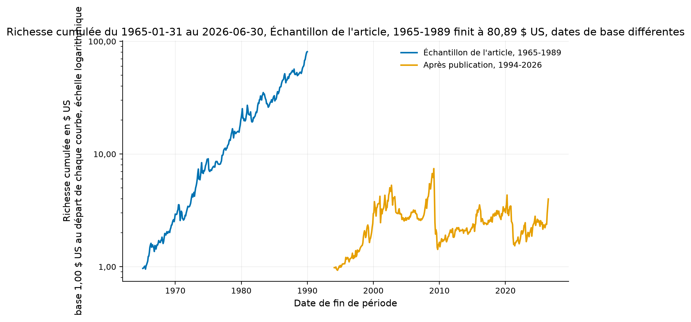
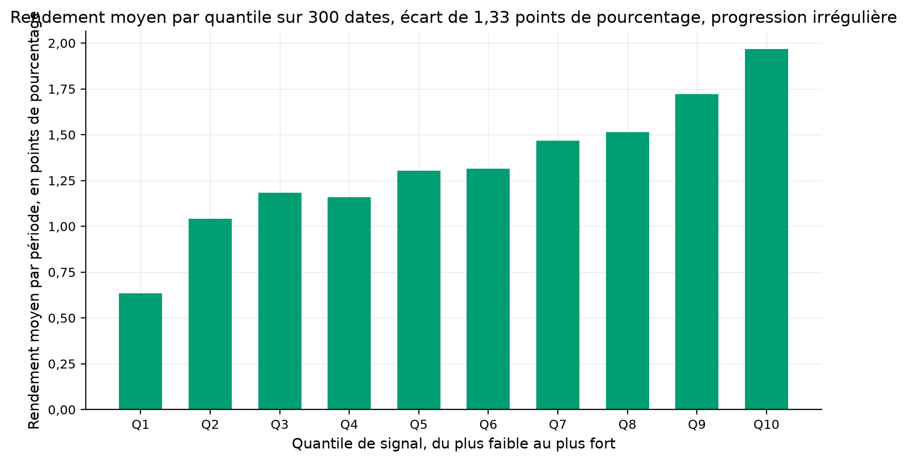
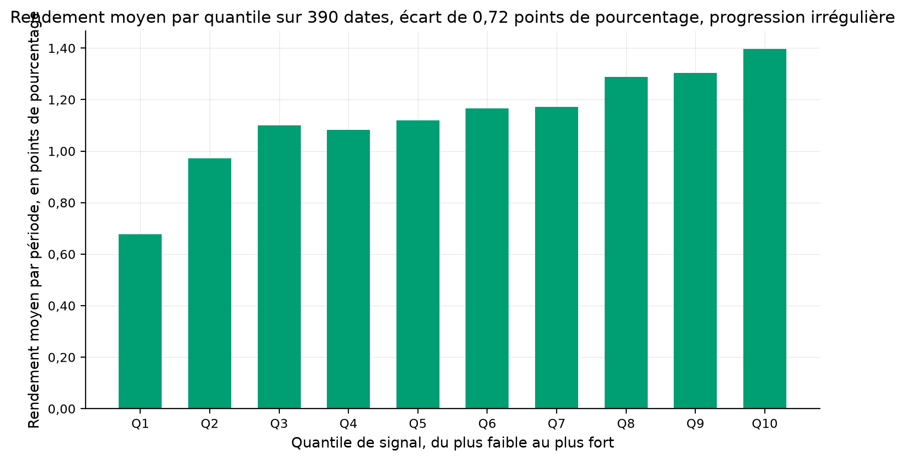
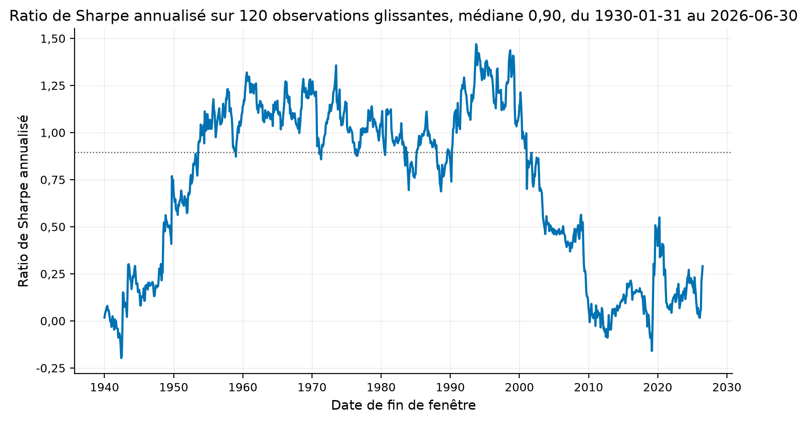
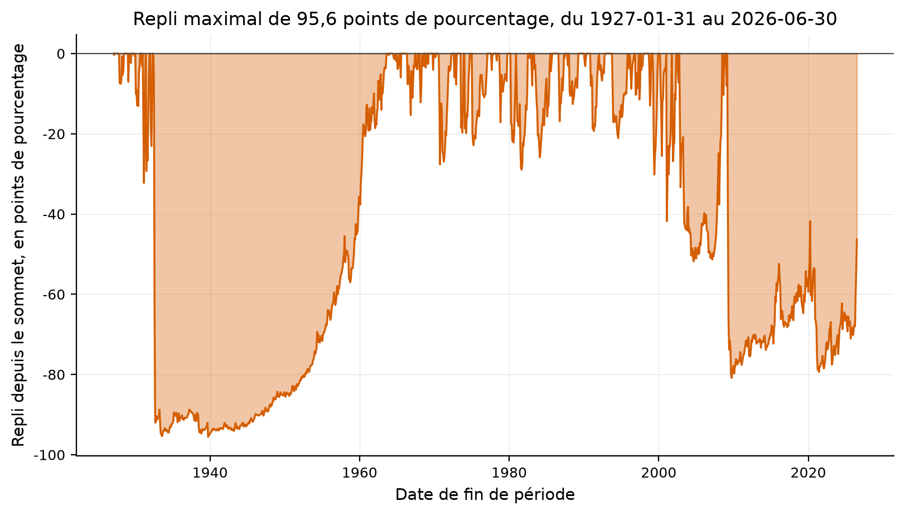
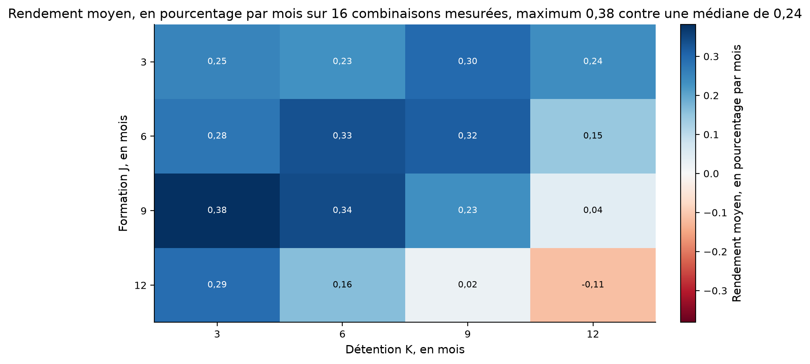
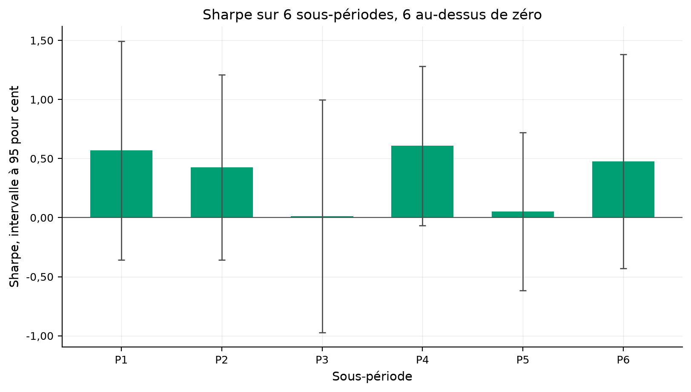
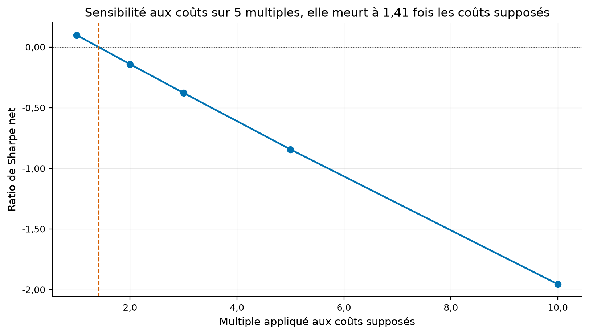
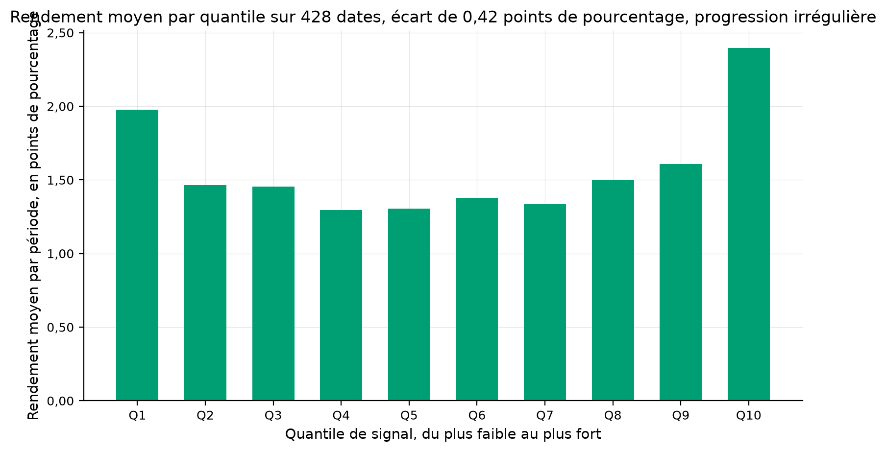
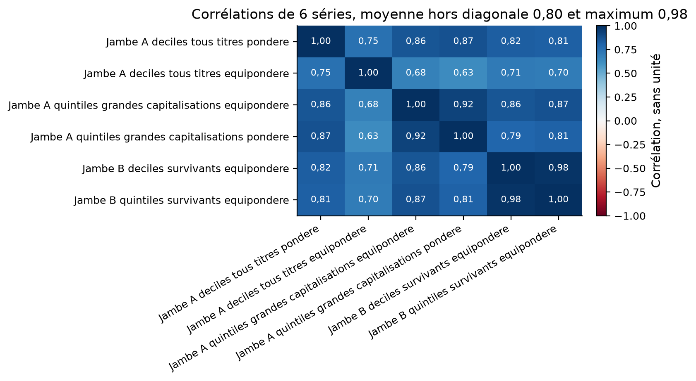

# Momentum transversal

**La réponse, en quatre phrases.** Le momentum transversal a survécu à sa
publication en montant, mais il ne survit plus à l'examen statistique. L'écart
gagnant moins perdant vaut encore 0,7683 % par mois sur 1994-2026, contre
1,6303 % sur la fenêtre de l'article, et son t de Student tombe de 5,12 à 1,75.
Il passe donc sous le seuil ordinaire de 1,96, et loin sous le seuil de 3,18 que
Harvey, Liu et Zhu exigent d'une anomalie nouvelle. Le biais de survie, lui, ne
gonfle pas ce rendement. Refait sur les seuls membres actuels du S&P 500, le même
tri rend 2,04 points de pourcentage par an de MOINS que sur l'univers complet,
le décile perdant s'y remplissant de titres tombés puis remontés.

Tous les chiffres de cette fiche viennent de `results/`, et chaque tableau dit de
quel fichier. Aucun n'est retapé de mémoire. Le verdict est déduit par
`quantlab.reporting.study.decide_verdict` depuis les contrôles qui ont tourné,
et il vaut **EXPERIMENTAL**.

## La question de recherche

Deux faits également vrais s'opposent. Jegadeesh et Titman mesurent en 1993 que
l'achat des titres montés et la vente des titres descendus rapportent. Trente et
une de leurs trente-deux combinaisons sont significatives, souvent avec un t
au-dessus de trois. Trente-trois ans plus tard, la même mesure sur les mêmes
déciles rend un t de 1,75, que personne ne publierait aujourd'hui.

De cette tension naissent les deux questions de l'étude. Le momentum transversal
a-t-il survécu à sa publication ? Et combien du rendement encore mesuré sur des
données courantes vient du simple fait que les titres disparus n'y sont plus ?

La seconde question compte autant que la première. Un chercheur qui reconstruit
aujourd'hui l'univers américain à partir d'une source gratuite obtient les
sociétés vivantes, jamais les radiées. Personne ne sait dans quel sens cette
amputation déplace le résultat, et l'étude le mesure.

## L'article

Narasimhan Jegadeesh et Sheridan Titman, « Returns to Buying Winners and Selling
Losers: Implications for Stock Market Efficiency », *The Journal of Finance*,
volume 48, numéro 1, mars 1993, pages 65 à 91.
[doi:10.1111/j.1540-6261.1993.tb04702.x](https://doi.org/10.1111/j.1540-6261.1993.tb04702.x)

La fiche de littérature complète, avec les trente-deux cellules des panneaux A et
B et les six critiques connues, vit dans
[`docs/literature/jegadeesh_titman_1993.md`](../../docs/literature/jegadeesh_titman_1993.md).

Deux pièges de nommage gouvernent toute implémentation. Dans l'article de 1993,
P1 désigne le décile de plus FAIBLE rendement passé, donc les perdants, et la
convention s'inverse dans l'article de 2001 des mêmes auteurs. Le décalage du
panneau B vaut une SEMAINE, jamais un mois, et la convention dite « 12 moins 1 »
appartient à la littérature postérieure.

## L'intuition économique

Le prix intègre trop lentement l'information propre à l'entreprise, et le titre
continue donc de monter après la nouvelle qui l'a fait monter. Ce mécanisme est
une sous-réaction, c'est-à-dire un ajustement du prix plus lent que l'arrivée de
l'information.

L'article élimine trois explications concurrentes. La dispersion transversale des
rendements espérés supposerait que les gagnants portent plus de risque de marché.
Or le bêta du portefeuille à coût nul vaut moins 0,08 chez eux, et moins 0,027
chez nous sur les déciles équipondérés. La synchronisation du facteur commun
supposerait une autocorrélation positive de l'indice, mesurée négative. L'effet
de retard de Lo et MacKinlay exigerait un profit croissant avec le carré du
rendement passé du marché, et la pente mesurée est de signe contraire.

Reste la sous-réaction. Ce qui la ferait disparaître est écrit dans l'article
lui-même : une erreur de prix se corrige quand elle devient connue, alors qu'une
prime de risque ne se rend pas. La publication de 1993 est donc l'événement dont
cette étude mesure l'effet.

## La définition mathématique

Le signal de formation est le rendement des J derniers mois, mesuré sur des prix
ajustés des divisions et des dividendes :

\[ S_{i,t} = \frac{P^{\text{cl}}_{i,t}}{P_{i,t-J}} - 1 \]

où \(P^{\text{cl}}_{i,t}\) est le prix de classement de l'actif i, reculé du
décalage du panneau, et \(P_{i,t-J}\) son prix de fin de mois J mois plus tôt.

Les titres sont classés en ordre croissant de \(S_{i,t}\), puis répartis en dix
paquets équipondérés. Le portefeuille à coût nul achète le dernier paquet et vend
le premier. Les cohortes se chevauchent, donc le rendement du mois est la moyenne
des K cohortes vivantes :

\[ r^{(q)}_t = \frac{1}{K} \sum_{k=1}^{K} r^{(q)}_{t \mid t-k} \]

La somme part de k égal à un et jamais de zéro, ce qui interdit au signal de la
date t de gouverner un rendement de la date t.

Le t de Student ordinaire, celui que l'article publie, vaut la moyenne divisée
par l'écart type d'échantillon, multipliée par la racine du nombre de mois. Le t
corrigé à la Newey-West remplace la variance de la moyenne par sa variance de
long terme, estimée avec la fenêtre de Bartlett. Les deux sont publiés côte à
côte, parce que les cohortes qui se chevauchent autocorrèlent mécaniquement la
série dès que K dépasse un mois.

## Les données

L'étude tient sur deux jeux, choisis pour se contredire.

**La jambe A** consomme `10_Portfolios_Prior_12_2` de Kenneth French, les dix
déciles de momentum construits sur CRSP, titres radiés compris, mensuels de
janvier 1927 à juin 2026, soit 1 194 mois. Le tri y est le 12 moins 2, donc la
fenêtre de formation saute le mois le plus récent. Le croisement
`25_Portfolios_ME_Prior_12_2` fournit le contrôle à grande capitalisation, et
`benchmark_factors` les cinq facteurs de Fama et French plus le momentum de
Carhart.

**La jambe B** consomme les prix quotidiens ajustés des 503 membres du S&P 500
relevés le 2026-09-02, téléchargés chez Yahoo de 1985 à août 2026. Cette liste
EST le biais que l'étude mesure : elle ne contient que des sociétés vivantes et
encore membres de l'indice aujourd'hui. Le détail titre par titre, avec la date
de première cotation, vit dans `results/tables/univers_jambe_b.csv`.

Deux ruptures de série de prix ont été trouvées et coupées, dans
`results/tables/jambe_b_ruptures_de_prix.csv`.

| Titre | Mois de rupture | Rendement imprimé | Mois retirés |
|---|---|---:|---:|
| NVR | 1993-10 | +2 600,0 % | 105 |
| HUBB | 1994-10 | +885,9 % | 117 |

Comment lire ce tableau, en trois constats. Premièrement, ces deux rendements ne
sont pas des mouvements de marché, ce sont des changements de base de la série de
prix. Le plus fort mouvement RÉEL de l'univers vaut +358,88 %, pour Regeneron en
février 2000, et il reste sous le seuil de 400 %. Deuxièmement, la règle
appliquée retire tout l'historique ANTÉRIEUR à la rupture, ces prix étant
exprimés dans une autre base. Troisièmement, ce nettoyage n'est pas cosmétique.
Sans lui, le mois d'octobre 1993 rendait un écart de moins 111,47 %, et la jambe
B rendait 0,1751 % par mois au lieu de 0,4172 %. Un seul mois à moins 111,47 %,
réparti sur 428, déplace la moyenne de 0,26 point de pourcentage par mois.
Source des cinq nombres de ce paragraphe : `results/metrics.json`, section
`leg_b_cleaning`.

## La méthodologie originale

L'article forme seize combinaisons de J dans {3, 6, 9, 12} et de K dans
{3, 6, 9, 12}, doublées par le traitement du décalage, soit trente-deux
stratégies. Le panneau A forme le portefeuille aussitôt après la mesure des
rendements passés ; le panneau B attend une semaine, pour échapper au rebond
mécanique entre le cours acheteur et le cours vendeur.

L'univers est composé de toutes les actions du NYSE et de l'AMEX disposant de
rendements sur les J mois précédents, sans filtre de prix ni de capitalisation.
La période d'analyse va de janvier 1965 à décembre 1989, soit 300 mois. Les
rendements mensuels sont obtenus en composant les rendements quotidiens du CRSP,
et non en lisant le fichier mensuel.

Chaque cohorte est rééquilibrée mensuellement vers l'équipondération. L'article
signale que l'achat et conservation rapporte légèrement plus, sans publier de
combien.

## Notre implémentation

Le tri, les cohortes, les poids et les résumés vivent dans
`src/quantlab/strategies/cross_sectional_momentum.py`, couvert par
`tests/unit/test_strategies_cross_sectional_momentum.py`, trente-deux tests
verts. Le point d'entrée `run.py` orchestre et ne calcule pas.

Cinq décisions méritent d'être écrites.

**Le décalage d'exécution vit à un seul endroit.** Les poids rendus par
`long_short_weights` sont construits sur l'information de la date t, et c'est le
moteur de backtest qui applique le retard d'une période. Le poser aux deux
endroits le compterait deux fois, faute qu'aucun rendement ne signalerait. Un
test le fixe, et un contrôle interne vérifie que les poids retardés d'une période
reproduisent l'écart publié par le tri.

**Le découpage en paquets est recopié à l'identique.** Le numéro de paquet vaut
`min(floor(Q (rang - 1) / n), Q - 1)`, la formule de
`quantlab.analytics.ic.quantile_returns`. Un découpage différent ferait diverger
les poids des rendements sur tout effectif que le nombre de paquets ne divise
pas, et un test le vérifie sur sept actifs et trois paquets.

**Aucune métrique n'est réécrite.** Le ratio de Sharpe, le t corrigé, la
rotation, le repli maximal, l'amorce et les régressions viennent de
`quantlab.analytics`. Le seul calcul propre au module est le t ordinaire, déduit
du ratio d'information rendu par `ic_summary` en le multipliant par la racine du
nombre de mois.

**Les deux jambes sont appariées sur le mois, pas sur la date.** Kenneth French
date ses mois du dernier jour du CALENDRIER, Yahoo de la dernière SÉANCE, et mars
1991 tombe donc le 31 chez l'un et le 28 chez l'autre. Une intersection de dates
brutes perdait un mois sur trois en silence, et rendait 298 mois communs au lieu
de 426.

**Le contrôle interne des poids contre les rendements.** Sur 428 mois, trois
dates seulement font désaccord, pour un écart maximal de 0,0574. Ce sont les
dates où un titre porte un signal valide mais pas de rendement réalisé. Le tri le
retire alors de l'univers, ce qui déplace les bornes de déciles, quand le
portefeuille le garde. L'écart est publié plutôt que corrigé : les deux
conventions se défendent, et le lecteur doit savoir laquelle porte quel
chiffre.

## Nos écarts avec l'article

Huit écarts, tous délibérés, aucun caché.

**Le tri de la jambe A saute un mois.** Kenneth French publie le 12 moins 2, où
la fenêtre de formation s'arrête un mois avant la formation. L'article n'en a
aucun. La contrepartie est décisive et vaut l'écart : ces déciles sont construits
sur CRSP, incluent les titres radiés et remontent à 1927, ce qu'aucune source
gratuite ne permet de refaire.

**La grille J sur K ne tourne que sur la jambe B.** La jambe A ne dispose que
d'un seul tri, et il n'existe aucun moyen de fabriquer les seize combinaisons
depuis des rendements de déciles déjà agrégés. Les trente-deux cellules sont donc
mesurées sur l'univers biaisé et sur 1991-2026, jamais sur l'échantillon
d'origine.

**Le décalage du panneau B recule la mesure au lieu d'avancer la détention.**
L'article classe en fin de mois puis attend une semaine avant de former. Nous
classons sur la fenêtre qui s'arrête cinq séances avant la fin du mois, puis
formons à la fin du mois. L'intervalle d'une semaine entre la mesure et la
détention est le même, et les périodes de détention restent alignées sur le
calendrier mensuel.

**La jambe B est équipondérée seulement.** La pondération par la capitalisation
exige le nombre d'actions en circulation, que le fournisseur de prix ne rend pas.
La jambe A, elle, est publiée dans les deux pondérations.

**Les onze contrôles de réplication portent sur les déciles ÉQUIPONDÉRÉS, quand
les résultats de tête et le verdict portent sur les déciles pondérés par la
capitalisation.** L'article équipondère ses portefeuilles, donc la réplication
doit l'équipondérer aussi. Le verdict retient la pondération par la
capitalisation, la plus défavorable des deux après publication, son ratio de
Sharpe valant 0,306 contre 0,341. Les deux pondérations sont publiées côte à côte
dans `results/tables/jambe_a_fenetres.csv`, et le choix ne cache donc rien.

**Le délai d'exécution est testé sur la jambe B, jamais sur la jambe A.** Les
déciles de Kenneth French sont des rendements agrégés dont le signal n'existe
plus, et retarder une série de rendements ne retarde aucune exécution. La jambe
B, elle, porte des poids, et le moteur de backtest les exécute avec le retard
demandé.

**Le coût d'emprunt de titre est ajouté.** L'article retient 0,5 % par sens et
n'inclut aucun coût de vente à découvert. La configuration ajoute 40 points de
base par an, valeur MODÉLISÉE, et la sensibilité aux coûts est publiée.

**La rotation de la jambe A est empruntée à la jambe B.** Les déciles de Kenneth
French sont des rendements agrégés, sans détention observable, donc leur rotation
ne se mesure pas. Le seuil de rentabilité de la jambe A emploie la rotation
mesurée sur la jambe B pour la même configuration, un tri 12 moins 2 détenu un
mois. Ce transfert est déclaré et il est la principale faiblesse de la section
des coûts.

## Les résultats

**Toutes les mesures ci-dessous portent sur les déciles de momentum 12 moins 2 de
Kenneth French, construits sur CRSP, titres radiés compris, univers NYSE plus
AMEX plus NASDAQ, rendements BRUTS de frais, mensuels.** Source :
`results/tables/jambe_a_fenetres.csv`.

| Fenêtre | Échantillon | Pondération | Mois | %/mois | t ordinaire | t Newey-West | Sharpe | Pire mois |
|---|---|---|---:|---:|---:|---:|---:|---:|
| 1927-1964 | hors échantillon | capitalisation | 456 | 1,0809 | 2,63 | 2,89 | 0,427 | -77,66 % |
| 1965-1989 | IS | capitalisation | 300 | **1,6303** | **5,12** | 5,33 | 1,023 | -19,74 % |
| 1990-2026 | OOS | capitalisation | 438 | 0,9243 | 2,31 | 2,22 | 0,382 | -45,18 % |
| 1994-2026 | OOS | capitalisation | 390 | **0,7683** | **1,75** | 1,71 | 0,306 | -45,18 % |
| 1927-2026 | mêlé | capitalisation | 1 194 | 1,1615 | 5,06 | 5,20 | 0,507 | -77,66 % |
| 1927-1964 | hors échantillon | égale | 456 | 0,6792 | 1,56 | 1,70 | 0,254 | -87,44 % |
| 1965-1989 | IS | égale | 300 | 1,3319 | 4,80 | 5,53 | 0,959 | -27,89 % |
| 1990-2026 | OOS | égale | 438 | 0,6971 | 2,04 | 1,92 | 0,338 | -60,66 % |
| 1994-2026 | OOS | égale | 390 | 0,7194 | 1,94 | 1,82 | 0,341 | -60,66 % |
| 1927-2026 | mêlé | égale | 1 194 | 0,8498 | 3,88 | 3,99 | 0,389 | -87,44 % |

Comment lire ce tableau, en quatre constats. Premièrement, la fenêtre de
l'article est la MEILLEURE des cinq dans les deux pondérations, et le rendement y
vaut à peu près le double de celui qui suit la publication. Deuxièmement, le t
tombe de 5,12 à 1,75 en pondération par la capitalisation, donc sous le seuil
ordinaire de 1,96, et de 4,80 à 1,94 en équipondération, donc juste sous lui.
Troisièmement, le rendement reste POSITIF partout, y compris sur les 456 mois qui
précèdent l'échantillon de l'article, ce qui écarte l'idée d'un pur artefact
d'exploration. Quatrièmement, le pire mois de la période récente vaut moins
45,18 % et celui des années trente moins 77,66 %, donc la moyenne ne décrit
qu'une partie de ce que la stratégie fait vivre.

Mode d'emploi de cette figure. L'axe vertical porte la richesse cumulée d'un
dollar, en échelle logarithmique, donc une même pente y signifie un même taux de
croissance. Les deux courbes partent chacune de un à leur propre date de départ,
et ne se comparent donc pas en niveau, seulement en pente. La pente de la courbe
1994-2026 est visiblement plus faible que celle de 1965-1989, et c'est cela que
le tableau ci-dessus chiffre.

Mode d'emploi de ces deux figures. Chaque barre est le rendement moyen d'un
décile sur la fenêtre, du plus faible rendement passé à gauche au plus fort à
droite. Le titre de chaque figure est déduit des données et porte l'écart entre
les deux barres extrêmes. Les deux figures se lisent ensemble : la progression
reste croissante après publication, et c'est la hauteur de la dernière barre qui
a baissé.

**Le profil des déciles, équipondéré, en pourcentage par mois.** Source :
`results/tables/jambe_a_deciles.csv`.

| Fenêtre | D1 | D2 | D3 | D4 | D5 | D6 | D7 | D8 | D9 | D10 |
|---|---:|---:|---:|---:|---:|---:|---:|---:|---:|---:|
| 1965-1989, IS | 0,635 | 1,042 | 1,184 | 1,160 | 1,305 | 1,314 | 1,467 | 1,513 | 1,721 | 1,966 |
| 1994-2026, OOS | 0,677 | 0,971 | 1,099 | 1,083 | 1,120 | 1,165 | 1,171 | 1,288 | 1,305 | 1,396 |

Comment lire ce tableau, en trois constats. Premièrement, la progression est
croissante dans les deux fenêtres, à une inversion près entre D3 et D4, donc le
signal ordonne encore correctement les titres après publication. Deuxièmement,
c'est la PENTE qui s'est aplatie, l'écart entre les deux extrêmes passant de
1,331 à 0,719 point par mois. Troisièmement, le décile perdant a peu bougé, 0,635
puis 0,677, et l'affaissement vient du décile gagnant, tombé de 1,966 à 1,396.

**La chute est-elle significative ?** Source : `results/tables/jambe_a_rupture.csv`.
La série des 300 mois de l'article et celle des 390 mois qui suivent la
publication sont empilées, puis régressées sur une indicatrice, avec des erreurs
types corrigées à la Newey-West.

| Pondération | Mois | Moyenne avant | Chute | t Newey-West | Valeur p |
|---|---:|---:|---:|---:|---:|
| capitalisation | 690 | 1,6303 %/mois | **-0,862 pp/mois** | -1,58 | 0,115 |
| égale | 690 | 1,3319 %/mois | -0,612 pp/mois | -1,30 | 0,194 |

Comment lire ce tableau, en trois constats, et le troisième est l'objection la
plus forte contre la thèse de cette étude. Premièrement, la chute mesurée est
grande, elle retire plus de la moitié du rendement en pondération par la
capitalisation. Deuxièmement, elle n'est PAS significative, la valeur p valant
0,115 et 0,194. Troisièmement, il faut donc énoncer les deux faits ensemble : le
t de la stratégie est passé sous le seuil, et la différence entre les deux
périodes reste indistinguable du hasard. La bonne lecture n'est pas « le momentum
est mort », elle est « le momentum ne se démontre plus, et sa mort ne se démontre
pas davantage ».

Mode d'emploi de cette figure. Chaque point est le ratio de Sharpe annualisé des
120 mois qui le précèdent, donc la courbe est décalée de dix ans par rapport aux
événements qu'elle décrit. Elle sert à voir si la baisse est un décrochage daté
ou une érosion continue. La ligne à zéro sépare les fenêtres de dix ans où la
stratégie a gagné de celles où elle a perdu.

**Le seuil de Harvey, Liu et Zhu (2016).** Leur seuil minimal, 3,18, est celui de
la procédure de Benjamini, Hochberg et Yekutieli à 5 % dans le cas où des essais
sont cachés, et toutes leurs autres configurations donnent des seuils plus
élevés. La fiche est dans
[`docs/literature/harvey_liu_zhu_2016.md`](../../docs/literature/harvey_liu_zhu_2016.md).
Notre t après publication vaut 1,746, soit 55 % du seuil. La correction de
Bonferroni sur les 53 essais de cette étude exige 3,307, et nous en sommes plus
loin encore.

**L'attribution factorielle.** Source : `results/tables/jambe_a_attribution.csv`.
L'écart est régressé sur les cinq facteurs de Fama et French plus le momentum de
Carhart, erreurs types corrigées à la Newey-West, depuis juillet 1963.

| Pondération | Fenêtre | Mois | Alpha %/an | Erreur type | t | Bêta momentum | t | R² |
|---|---|---:|---:|---:|---:|---:|---:|---:|
| capitalisation | 1965-1989, IS | 300 | **+5,49** | 1,94 | 2,83 | 1,4355 | 28,8 | 0,852 |
| capitalisation | 1994-2026, OOS | 390 | +2,19 | 2,09 | 1,05 | 1,575 | 29,0 | 0,809 |
| égale | 1965-1989, IS | 300 | **+7,26** | 1,93 | 3,76 | 1,077 | 15,1 | 0,732 |
| égale | 1994-2026, OOS | 390 | **-0,11** | 2,74 | -0,04 | 1,277 | 14,2 | 0,678 |

Comment lire ce tableau, en trois constats. Premièrement, sur la fenêtre de
l'article, le tri par déciles battait le facteur de momentum publié de 5,5 à
7,3 points par an, avec des t de 2,83 et 3,76. Deuxièmement, cet apport a
disparu, l'alpha équipondéré tombant à moins 0,11 point par an avec un t de moins
0,04. Troisièmement, le R² reste au-dessus de 0,67 dans les quatre fenêtres du
tableau, donc l'écart est très largement le facteur de momentum lui-même, dont il
n'est qu'une version amplifiée d'un facteur 1,08 à 1,57. Le fichier porte quatre
fenêtres de plus, et deux d'entre elles descendent à 0,660 et 0,666.

**La saisonnalité de janvier.** Source : `results/tables/jambe_a_janvier.csv`.

| Pondération | Fenêtre | Segment | Mois | %/mois | t ordinaire |
|---|---|---|---:|---:|---:|
| égale | 1965-1989, IS | janvier | 25 | **-5,262** | -3,37 |
| égale | 1965-1989, IS | février à décembre | 275 | +1,931 | 8,12 |
| égale | 1994-2026, OOS | janvier | 33 | **-5,869** | -2,73 |
| égale | 1994-2026, OOS | février à décembre | 357 | +1,328 | 3,95 |

Comment lire ce tableau, en trois constats. Premièrement, l'article mesure moins
6,86 % en janvier avec un t de moins 3,52, et nous mesurons moins 5,26 % avec un
t de moins 3,37 sur la même fenêtre. Deuxièmement, le renversement de janvier a
SURVÉCU à la publication, et il s'est même creusé, à moins 5,87 % sur 33 janviers.
Troisièmement, hors janvier, l'écart après publication vaut encore 1,328 % par
mois avec un t de 3,95, donc un test qui exclut janvier mesure autre chose que la
stratégie complète, et doit le dire.

**Les krachs de momentum.** Source : `results/tables/jambe_a_pires_mois.csv`,
pondération par la capitalisation.

| Rang | Mois | Rendement |
|---:|---|---:|
| 1 | 1932-08 | -77,66 % |
| 2 | 1932-07 | -62,37 % |
| 3 | 2009-04 | -45,18 % |
| 4 | 1939-09 | -44,36 % |
| 5 | 2001-01 | -41,77 % |
| 6 | 2009-03 | -39,18 % |

Comment lire ce tableau, en trois constats. Premièrement, les deux pires mois se
suivent, juillet et août 1932, exactement comme Daniel et Moskowitz (2016) le
documentent. Deuxièmement, mars et avril 2009 se suivent aussi, et ce sont les
mois où le marché est reparti après le creux de la crise. Troisièmement, ces
épisodes sont donc des reprises de marché, où le décile perdant, chargé de titres
proches de la faillite, monte en flèche pendant que la stratégie le vend.

Mode d'emploi de cette figure. L'axe vertical porte l'écart, en pourcentage,
entre la richesse du moment et son plus haut passé, donc la courbe vaut zéro
quand la stratégie est à son sommet et descend dès qu'elle perd. Elle sert à
voir la DURÉE des mauvaises périodes, que la moyenne mensuelle cache. Les deux
creux les plus profonds encadrent 1932 et 2009, les deux épisodes de reprise de
marché que le tableau des pires mois liste.

**La grille J sur K, jambe B.** Source : `results/tables/jambe_b_grille.csv`,
1991-01 à 2026-08, 428 mois, univers des 503 membres actuels du S&P 500,
équipondéré, rendements BRUTS, échantillon OOS. Panneau à décalage d'une semaine,
en pourcentage par mois, nos chiffres et ceux de l'article entre parenthèses.

| J \ K | 3 | 6 | 9 | 12 |
|---|---:|---:|---:|---:|
| 3 | 0,251 (0,73) | 0,232 (0,78) | 0,298 (0,74) | 0,236 (0,77) |
| 6 | 0,276 (1,14) | 0,331 (1,10) | 0,315 (1,08) | 0,145 (0,90) |
| 9 | **0,381** (1,35) | 0,341 (1,30) | 0,233 (1,09) | 0,040 (0,85) |
| 12 | 0,292 (**1,49**) | 0,164 (1,21) | 0,022 (0,96) | -0,114 (0,69) |

Comment lire ce tableau, en quatre constats. Premièrement, aucune des
trente-deux cellules ne porte un t ordinaire au-dessus de 1,96, alors que
trente et une des trente-deux de l'article dépassent le seuil. Deuxièmement,
trente cellules sur trente-deux restent positives, donc le signe survit là où
l'ampleur ne survit pas. Troisièmement, la FORME de la grille se retrouve
partiellement. La corrélation de rang de Spearman entre nos trente-deux cellules
et les siennes vaut 0,566, et le décalage d'une semaine améliore quinze des seize
cellules comparées, comme chez lui. Quatrièmement, notre meilleure cellule
est la formation à neuf mois détenue trois mois, quand la sienne est la formation
à douze mois détenue trois mois, donc la case voisine.

## La robustesse

Mode d'emploi de cette figure. Chaque case porte le rendement moyen en
pourcentage par mois de la combinaison formation par détention, la formation en
lignes et la détention en colonnes. La couleur code la valeur, du plus faible au
plus fort, et la lecture utile est celle du GRADIENT, non des cases prises une à
une. Le coin des formations longues détenues longtemps est le plus sombre, comme
dans la table de l'article, où il porte aussi les plus faibles rendements.

**Les sous-périodes.** Source : `results/tables/robustesse_sous_periodes.csv`,
jambe A pondérée par la capitalisation, six tranches égales de 65 mois après
publication, rendements bruts, échantillon OOS.

| Tranche | Période | Sharpe | Erreur type | t | Pire repli |
|---|---|---:|---:|---:|---:|
| P1 | 1994-01 à 1999-05 | 0,568 | 0,472 | 1,20 | -30,2 % |
| P2 | 1999-06 à 2004-10 | 0,425 | 0,400 | 1,06 | -51,8 % |
| P3 | 2004-11 à 2010-03 | **0,012** | 0,503 | 0,02 | -80,8 % |
| P4 | 2010-04 à 2015-08 | 0,607 | 0,344 | 1,77 | -16,3 % |
| P5 | 2015-09 à 2021-01 | **0,051** | 0,341 | 0,15 | -45,5 % |
| P6 | 2021-02 à 2026-06 | 0,475 | 0,462 | 1,03 | -35,0 % |

Comment lire ce tableau, en trois constats. Premièrement, les six tranches
portent un Sharpe positif, ce qui satisfait le critère de robustesse fixé à 60 %.
Deuxièmement, deux d'entre elles sont indistinguables de zéro, P3 à 0,012 et P5 à
0,051, et P3 contient un repli de 80,8 %. Troisièmement, aucune tranche ne porte
un t au-dessus de 1,77, donc la constance du signe ne vaut pas constance de la
preuve.

Mode d'emploi de cette figure. Chaque barre est le ratio de Sharpe d'une tranche
de 65 mois, et le trait vertical qui la traverse est son intervalle de confiance
à 95 %, calculé avec l'erreur type de Lo. Une barre dont l'intervalle coupe le
zéro ne se distingue pas du hasard. Les six intervalles coupent le zéro, ce qui
est la lecture la plus importante de cette figure.

**Le bootstrap.** Source : `results/metrics.json`, section `bootstrap`. La règle
de Politis et White rend une taille de bloc de 1,0, le plancher, ce qui signale
l'absence de dépendance exploitable dans la série. Le tirage est donc
indépendant, sur 10 000 rééchantillonnages, graine 20260902. La moyenne observée
vaut 0,7683 % par mois et son intervalle de confiance à 95 % va de moins 0,0950 %
à plus 1,6208 %. **L'intervalle contient zéro.**

**Le délai d'exécution.** Source : `results/tables/robustesse_delais.csv`. Le
moteur de backtest exécute les poids de la jambe B un, deux, trois puis six mois
après la date de formation, échantillon OOS, 1991-2026, 428 mois, rendements
BRUTS, exposition brute de un.

| Délai d'exécution | Sharpe | Part retenue |
|---:|---:|---:|
| 1 mois, le réglage de l'étude | 0,189 | 100 % |
| 2 mois | 0,147 | 77,9 % |
| 3 mois | 0,075 | 39,9 % |
| 6 mois | 0,007 | 3,7 % |

Comment lire ce tableau, en trois constats. Premièrement, le signal se périme
vite : trois mois de retard en retirent 60 % et six mois n'en laissent rien,
0,007 contre 0,189. Deuxièmement, c'est cohérent avec la grille, dont les
cellules à longue détention sont les plus faibles, et avec l'article lui-même,
dont le rendement décroît quand K passe de trois à douze mois. Troisièmement, ce
test porte sur la jambe B et sur elle seule. Kenneth French publie des rendements
de déciles déjà agrégés, dont le signal n'existe plus. Retarder cette série de
rendements ne retarderait aucune exécution : elle ferait seulement glisser la
fenêtre de mesure de quelques mois vers le passé.

**Le surapprentissage.** Source : `results/metrics.json`, sections
`deflated_sharpe` et `pbo`. La probabilité de surapprentissage, calculée par
validation croisée symétrique combinatoire sur les trente-deux cellules de la
grille, 428 mois, seize découpes et 12 870 partitions, vaut **0,326**, contre un
maximum accepté de 0,20. Le rang relatif médian hors échantillon vaut 0,697, donc
la meilleure configuration en échantillon se retrouve en moyenne autour du
septième décile hors échantillon.

## Les coûts

**Le seuil de rentabilité est le chiffre décisif de cette étude, et il vaut
70,53 points de base par unité négociée.** Source : `results/metrics.json`,
section `costs`. Ce nombre est le coût unitaire qui annulerait exactement le
rendement brut de la jambe A après publication. La stratégie négocie 7,659 fois
son capital par an en somme entière, sur les 274 mois où la rotation transférée
existe. Source : `results/metrics.json`, clé
`costs.leg_a_transferred_turnover`.

**Les deux nombres du rapport portent la même exposition brute, et c'est ce qui
décide du résultat.** L'écart des déciles achète un dollar et en vend un, donc
son exposition brute vaut deux, quand la rotation empruntée à la jambe B est
celle d'un portefeuille d'exposition brute un. Le rendement de la jambe A est
donc ramené à l'exposition un avant d'être divisé par cette rotation, et le
facteur d'échelle appliqué est publié sous
`costs.leg_a_transferred_turnover.spread_rescaled_by`. Laisser les deux séries à
des expositions différentes doublerait le seuil, et aucun contrôle de forme ne
le signalerait.

L'article retient 0,5 % par sens, jugé conservateur au regard des 23 points de
base estimés par Berkowitz, Logue et Noser (1988) pour les institutionnels. Le
seuil mesuré vaut donc 1,41 fois cette hypothèse.

| Multiple des coûts | Coût implicite par sens | Sharpe net | Survit |
|---:|---:|---:|---|
| 1 | 50 pb | 0,099 | oui |
| 2 | 100 pb | -0,141 | non |
| 3 | 150 pb | -0,378 | non |
| 5 | 250 pb | -0,844 | non |
| 10 | 500 pb | -1,956 | non |

Source : `results/tables/robustesse_couts.csv`. Comment lire ce tableau, en trois
constats. Premièrement, la stratégie survit à l'hypothèse de coût de l'article,
et elle meurt avant son double, entre 50 et 100 points de base par sens.
Deuxièmement, cette marge est très mince au regard de la critique de Lesmond,
Schill et Zhou (2004). Ils placent le seuil de rentabilité à 1,5 % par
transaction, soit le double de notre seuil mesuré, et n'ont trouvé aucune preuve
que les coûts réels soient inférieurs sur les titres concernés. Si leur chiffre
est le bon, la stratégie ne rapporte rien. Troisièmement, leur argument de fond
n'est pas testé ici. Les titres qui produisent les plus gros gains sont ceux dont
les coûts sont les plus élevés, et un coût unique appliqué à tous ignore cette
corrélation.

Mode d'emploi de cette figure. L'axe horizontal porte le multiple appliqué aux
coûts et l'axe vertical le ratio de Sharpe net qui en résulte. La lecture utile
est l'abscisse où la courbe croise le zéro, ici entre un et deux. Une courbe
qui plongerait sous le zéro dès le multiple un signalerait une stratégie que ses
propres hypothèses de coût tuent déjà, ce qui est le cas de la jambe B.

**La rotation vient de la jambe B, pas de la jambe A.** Les déciles de Kenneth
French sont des rendements agrégés, dont la détention n'est pas observable. La
rotation employée, 0,638 par mois en somme entière sur les 274 mois communs, est
celle mesurée sur la jambe B pour un tri 12 moins 2 détenu un mois. Sur ses
propres 428 mois, la jambe B tourne de 0,633 par mois. C'est le maillon faible de
cette section, et il est déclaré.

**Sur la jambe B, les coûts tuent la stratégie.** Source :
`results/tables/jambe_b_couts.csv`, exposition brute de un, donc la moitié de
l'écart publié par le tri. Le rendement brut vaut 0,2155 % par mois et le net
moins 0,1174 %, pour un seuil de rentabilité de 34,12 points de base, sous
l'hypothèse de 50 de l'article. Le ratio de Sharpe net vaut moins 0,103.

## Le hors échantillon

**La question du biais de survie, et sa réponse mesurée.** Sur les 426 mois
communs, de janvier 1991 à juin 2026, le même tri appliqué aux seuls survivants
rend MOINS que sur l'univers complet, et non plus. Source :
`results/tables/biais_de_survie_niveaux.csv` et
`results/tables/biais_de_survie_ecarts.csv`.

| Série | Univers | Paquets | %/mois | t Newey-West | Sharpe |
|---|---|---|---:|---:|---:|
| jambe A, pondérée | tous titres, radiés compris | déciles | 0,8449 | 2,00 | 0,346 |
| jambe A, équipondérée | tous titres, radiés compris | déciles | 0,6536 | 1,74 | 0,314 |
| jambe A, équipondérée | grandes capitalisations | quintiles | 0,5836 | 1,82 | 0,308 |
| jambe A, pondérée | grandes capitalisations | quintiles | 0,4335 | 1,30 | 0,219 |
| **jambe B, équipondérée** | **survivants seuls** | déciles | **0,4832** | 1,19 | 0,213 |
| **jambe B, équipondérée** | **survivants seuls** | quintiles | **0,3212** | 1,12 | 0,193 |

| Comparaison appariée | Écart pp/mois | Écart pp/an | t Newey-West |
|---|---:|---:|---:|
| déciles tous titres équipondérés moins survivants | 0,170 | **2,04** | 0,61 |
| quintiles grandes capitalisations moins survivants | 0,262 | **3,15** | 1,57 |
| déciles tous titres pondérés moins survivants | 0,362 | **4,34** | 1,44 |

Comment lire ces deux tableaux, en quatre constats. Premièrement, le signe est
l'inverse de ce que l'intuition annonce. Le biais de survie ne gonfle pas le
momentum, il le RETIRE, de 2,04 à 4,34 points de pourcentage par an selon la
référence retenue. Deuxièmement, la comparaison la plus propre est la deuxième
ligne, qui met en face deux univers de grandes capitalisations découpés en
quintiles, et elle donne 3,15 points par an. Troisièmement, aucun des trois
écarts n'est significatif, les t appariés valant 0,61, 1,57 et 1,44, donc
l'ampleur est mesurée mais elle n'est pas distinguable de zéro. Quatrièmement, la
conclusion utile tient malgré cela : quiconque reconstruit le momentum sur une
liste d'indice actuelle doit s'attendre à SOUS-estimer l'effet, jamais à le
surestimer.

**Le mécanisme est visible dans le profil des déciles.** Source :
`results/tables/jambe_b_paquets.csv`, jambe B, tri 12 moins 2, détention un mois,
équipondéré, 428 mois, rendements bruts, échantillon OOS.

| Décile | 1 | 2 | 3 | 4 | 5 | 6 | 7 | 8 | 9 | 10 |
|---|---:|---:|---:|---:|---:|---:|---:|---:|---:|---:|
| %/mois | **1,978** | 1,466 | 1,453 | 1,294 | 1,306 | 1,378 | 1,336 | 1,498 | 1,609 | **2,395** |

Comment lire ce tableau, en trois constats. Premièrement, la relation n'est pas
croissante, elle est en forme de U : le décile PERDANT rapporte 1,978 % par mois,
davantage que les huit déciles qui le suivent. Deuxièmement, c'est exactement ce
que le biais de survie fabrique, puisqu'un titre ne se retrouve dans l'univers
d'aujourd'hui qu'après avoir survécu, donc les perdants d'hier qui y figurent
sont ceux qui sont remontés. Troisièmement, la jambe A, sur la même période,
garde un profil croissant, ce qui achève de rattacher la forme en U à l'univers
et non à l'époque.

Mode d'emploi de cette figure. Elle se lit contre celle des déciles de la jambe
A, dont l'axe horizontal est identique. La barre de gauche, le décile perdant,
monte ici presque aussi haut que celle de droite, ce qu'aucune des deux figures
de la jambe A ne montre. Cette forme en U EST le biais de survie, rendu visible.

Mode d'emploi de cette figure. Chaque case porte la corrélation de deux des six
écarts comparés sur les 426 mois communs, la diagonale valant un par
construction. Elle sert à vérifier que les six séries mesurent bien la même
chose avant de comparer leurs moyennes. Une corrélation basse entre la jambe A
et la jambe B signalerait deux stratégies différentes, et non deux univers pour
la même stratégie.

**La corrélation avec ce qui est déjà achetable.** Source :
`results/metrics.json`. Sur 1994-2026, l'écart de la jambe A porte une
corrélation de **0,893** avec le facteur de momentum de Carhart publié par
Kenneth French. Le quatrième critère du verdict, fixé à 0,60, échoue donc
nettement, et c'est la bonne conclusion de portefeuille : reconstruire ce tri
n'apporte presque rien à qui peut acheter le facteur publié.

## Les limites

**Le confondant de la jambe B est réel et n'est pas éliminé.** L'univers des
membres actuels du S&P 500 diffère de l'univers CRSP complet par deux choses à la
fois, la survie et la taille. Le contrôle à grande capitalisation de Kenneth
French retire l'essentiel de la seconde, et l'écart passe de 4,34 à 3,15 points
par an. Il ne la retire pas entièrement : ses quintiles de taille sont découpés
sur tout CRSP, pas sur l'appartenance à un indice.

**Un second biais s'ajoute au biais de survie, et il est plus fort que lui.**
L'appartenance actuelle au S&P 500 n'est pas seulement la survie, c'est la
réussite. Une société n'entre dans l'indice qu'après être devenue grande, donc la
jambe B connaît le futur de ses titres deux fois, par la survie et par la
sélection. Le nombre publié mesure les deux ensemble, et rien ici ne les sépare.

**Le tri de la jambe A n'est pas celui de l'article.** Le 12 moins 2 saute le
mois de renversement à court terme que l'article inclut, et les onze contrôles de
réplication portent donc sur un tri voisin, jamais identique. Les valeurs
publiées retenues en face sont celles de la cellule la plus proche, formation à
douze mois et détention à trois mois du panneau A.

**Les onze contrôles passent leur tolérance déclarée, et le verdict rejette
pourtant le groupe.** Le contrôle du bêta de l'écart porte une tolérance ABSOLUE
de 0,10, sur une valeur publiée de moins 0,08. Le moteur de verdict convertit
cette tolérance en 1,25 en relatif, ce qui dépasse la tolérance relative de
l'étude, fixée à 0,30. Une tolérance relative de 0,30 sur une valeur publiée de
moins 0,08 autoriserait un écart de 0,024, plus fin que la mesure elle-même. Le
défaut appartient au réglage, il est publié tel quel, et il illustre qu'un seuil
relatif n'a pas de sens sur une grandeur voisine de zéro.

**Les ruptures de série de prix sont cherchées sur TOUT l'échantillon, ce qui est
une information future.** La règle retient la dernière rupture d'un titre et
efface tout ce qui la précède. Une rupture datée de 2010 effacerait donc un
historique de 1991 à 2010 au nom d'un événement de 2010, que personne ne
connaissait alors. Mesuré, le cas ne se présente pas : les deux seules ruptures
de l'univers tombent en octobre 1993 et en octobre 1994, et la jambe B commence
en janvier 1991. Le risque existe dans le code, son effet sur les chiffres publiés
est nul, et les deux faits sont écrits.

**Les prix de la jambe B ne se retéléchargent pas à l'identique.** L'étude a été
relancée avec l'option `--refresh`, qui reprend les 503 séries chez Yahoo. Les
vingt et un tableaux se reproduisent, mais la troisième décimale bouge sur la
jambe B. La meilleure cellule de la grille passe de 0,3814 à 0,3819 % par mois et
la probabilité de surapprentissage de 0,3258 à 0,3265. Aucun chiffre de cette
fiche n'en change à la précision imprimée, et l'ampleur du déplacement est
publiée ici plutôt que tue.

**Trois dates sur 428 font désaccord entre les poids et les rendements**, pour un
écart maximal de 0,0574. La cause est identifiée et publiée dans la section
« Notre implémentation ».

**Deux défauts d'infrastructure ont été trouvés et contournés, non corrigés.**
Trois appels de journalisation passent la clé réservée `name` dans leur `extra`,
aux lignes 283 de `quantlab/experiments/registry.py` et 439 et 564 de
`quantlab/strategies/base.py`. La bibliothèque standard lève alors une
`KeyError`, et les deux registres sont inutilisables tant que ces journaux sont
actifs. Cette étude n'a pas le droit d'écrire dans ces fichiers, elle élève donc
le niveau des deux journaux le temps d'écrire au registre, et signale le défaut.

**La rotation transférée**, la pondération manquante de la jambe B et le coût
d'emprunt modélisé sont décrits dans la section « Nos écarts avec l'article ».

**Ce qui n'a pas été fait.** La décomposition en trois sources de l'article n'est
pas refaite. Elle sépare la dispersion des rendements espérés, la synchronisation
du facteur et l'autocovariance des composantes propres. Elle demande des
rendements par titre sur 1965-1989, que la jambe B n'a pas et que la jambe A ne
fournit qu'agrégés. Le test de retard de Lo et MacKinlay est écarté pour la même
raison. Le rendement de radiation n'est pas modélisé, l'article ne disant pas
comment il traite les titres sortis de la cote.

## Le verdict

**EXPERIMENTAL.** Le verdict est déduit par `decide_verdict` depuis les huit
critères déclarés dans `config.yaml` avant que les résultats existent. Les
raisons complètes, critère par critère, sont dans `results/metrics.json`.

| Critère | Mesuré | Seuil | Résultat |
|---|---:|---:|---|
| signe économique attendu | positif | positif | réussi |
| signe du Sharpe hors échantillon | 0,306 | au-dessus de 0 | réussi |
| onze contrôles de réplication | 10 sur 11 | 11 sur 11 | **échoué** |
| Sharpe hors échantillon | 0,306 | 0,300 | réussi |
| t après correction | 1,746 | 3,180 | **échoué** |
| Sharpe dégonflé | 0,061 | 0,950 | **échoué** |
| probabilité de surapprentissage | 0,326 | 0,200 | **échoué** |
| part de sous-périodes positives | 1,000 | 0,600 | réussi |
| multiple de coûts survécu | 1,412 | 1,000 | réussi |
| corrélation avec le momentum publié | 0,893 | 0,600 | **échoué** |

Comment lire ce tableau, en trois constats. Premièrement, le rejet n'est pas
prononcé, parce que le signe attendu se retrouve et que le Sharpe hors
échantillon reste positif. Deuxièmement, la marche vers REPLICATED échoue sur un
seul contrôle des onze, et ce contrôle bute sur un réglage de tolérance décrit
dans les limites, non sur un désaccord de fond avec l'article. Troisièmement, la
marche vers ROBUST échouerait de toute façon sur trois critères indépendants, le
t corrigé, le Sharpe dégonflé et la probabilité de surapprentissage.

**Ce que l'étude permet d'affirmer.** Le momentum transversal se retrouve sur les
données de Kenneth French, avec les mêmes bêtas, le même renversement de janvier
et la même part de mois positifs que dans l'article. Après publication, il rend
encore 0,7683 % par mois, mais son t vaut 1,75. Son ratio de Sharpe dégonflé sur
53 essais vaut 0,061, sa probabilité de surapprentissage 0,326, et son intervalle
de confiance par bootstrap contient zéro. Sa corrélation de 0,893 avec le facteur
publié achève de le disqualifier comme apport de portefeuille.

**Ce que l'étude ajoute à l'article.** Une mesure du biais de survie, que
l'article ne donne pas, et dont le SIGNE contredit l'intuition courante. Refait
sur les 503 membres actuels du S&P 500, le même tri rend 2,04 à 4,34 points de
pourcentage par an de moins. Le décile perdant s'y remplit de titres tombés puis
remontés. Aucun de ces trois écarts n'est significatif, et cela se dit aussi.

**La prochaine décision.** L'étude 003 croise valeur et momentum, et la
corrélation de moins 0,577 mesurée entre les deux facteurs d'AQR est la raison
pour laquelle un momentum seul disqualifié peut encore servir en mélange. C'est
là qu'il faut le tester, et non ici.
