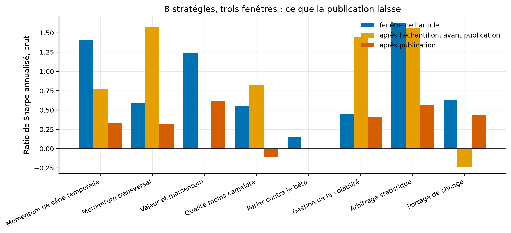

# Étude 014 : ce qui survit à la publication, sur nos huit réplications

**Verdict : `EXPERIMENTAL`. Les huit stratégies perdent après la publication
de leur article, sans exception**. Elles perdent en moyenne 73 % de leur
rendement mensuel par la moyenne des rapports, et 67 % par la régression de
l'article, contre 58 % chez McLean et Pontiff (2016). L'intervalle à 95 % par
rééchantillonnage des stratégies va de 54 % à 94 %, et il contient le chiffre
publié. La tolérance du laboratoire, 10 % en relatif, ne le contient pas, et
c'est ce qui borne le verdict. La différence avec l'article est
ailleurs : entre la fin de l'échantillon et la publication, nos stratégies ne
perdent que 3 % à 8 %, contre 26 % chez les auteurs. Sur ces huit, la perte
arrive avec la publication, pas avec la fin de l'échantillon.

## La question de recherche

Le laboratoire a répliqué huit stratégies, et chacune de ses études mesurait
seule ce que la stratégie devenait après son article. Aucune ne les mettait
ensemble. La question de cette étude est celle que McLean et Pontiff posent à
97 caractéristiques d'actions américaines, posée ici à nos huit séries de
toutes classes d'actifs. Quelle part du rendement de la fenêtre de l'article
survit, d'abord à la fin de l'échantillon, puis à la publication ?

En mots simples : une fois qu'un article a dit à tout le monde comment gagner,
combien reste-t-il à gagner ?

## L'article

McLean, R. D. et Pontiff, J. (2016), *Does Academic Research Destroy Stock
Return Predictability?*, The Journal of Finance 71(1), 5-32. Fiche :
[docs/literature/mclean_pontiff_2016.md](../../docs/literature/mclean_pontiff_2016.md).
Résumé lu le 2026-09-03 par Crossref ; l'article entier n'a pas été
consulté, l'éditeur et SSRN refusant l'accès automatisé ce jour-là.

## L'intuition économique

Deux causes, séparées par le calendrier. Un chercheur trouve une régularité
dans un échantillon, et le meilleur de plusieurs essais dépasse en moyenne sa
vraie valeur : la baisse entre l'échantillon et la publication borne cet effet
par le haut. Puis des investisseurs lisent l'article et négocient la
régularité, ce qui la fait diminuer : la baisse supplémentaire après
publication mesure cet apprentissage. Chez les auteurs, 26 % puis 58 %, donc
32 % attribués aux lecteurs.

## La définition mathématique

Pour une stratégie *i*, trois fenêtres, dont les deux bornes sont lues dans
la configuration de l'étude source, champs `paper_sample_end` et
`publication_date`, écrits une fois depuis la fiche de littérature. Celle de
l'article va de la première observation à la fin de son échantillon. Celle d'après échantillon va jusqu'au
mois du numéro de la revue, et celle d'après publication jusqu'à 2026. La
mesure d'une fenêtre est le rapport de son rendement mensuel moyen au
rendement mensuel moyen de la fenêtre de l'article, et la baisse est un moins
ce rapport. La mise en commun se fait de deux façons. La moyenne des huit
rapports, avec un intervalle par rééchantillonnage des stratégies. Et la
régression des rendements normalisés, chaque série divisée par sa moyenne dans
la fenêtre de l'article, sur deux indicatrices. Elle porte un effet fixe par
stratégie et des erreurs types groupées par mois, parce que les huit séries
partagent les mêmes mois.

## Les données

Une série de tête par étude, la plus longue et brute de frais, parce que
l'article mesure des rendements bruts. Les dates viennent des fiches de
littérature. Source : `config.yaml`, `results/tables/windows.csv`.

| Stratégie | Série | Début | Fin d'échantillon | Publication | Mois après publication |
|---|---|---|---|---|---:|
| Momentum de série temporelle | facteur TSMOM d'AQR, la série des auteurs | 1985-01 | 2009-12 | 2012-05 | 168 |
| Momentum transversal | écart des déciles de Kenneth French | 1927-01 | 1989-12 | 1993-03 | 399 |
| Valeur et momentum | mélange de l'étude 003 | 1972-01 | 2011-07 | 2013-06 | 156 |
| Qualité moins camelote | facteur publié d'AQR, États-Unis | 1957-07 | 2012-12 | 2019-03 | 87 |
| Parier contre le bêta | déciles de Kenneth French, étude 005 | 1966-07 | 2012-03 | 2014-01 | 149 |
| Gestion de la volatilité | marché géré en temps réel, étude 006 | 1936-08 | 2015-04 | 2017-08 | 106 |
| Arbitrage statistique | étude 007, brut, mensualisé | 1996-01 | 2007-12 | 2010-08 | 190 |
| Portage de change | étude 008, brut | 1971-02 | 2012-09 | 2018-02 | 100 |

Pour l'étude 001, la série des auteurs remplace notre reconstruction sur
fonds cotés, qui ne commence qu'en 2007 et n'aurait que trois ans dans la
fenêtre de l'article. Deux fenêtres d'après échantillon comptent moins de
vingt-quatre mois, 23 pour la valeur et le momentum et 22 pour le bêta, et ne
sont pas mesurées, seuil écrit dans la configuration.

## La méthodologie originale

Celle du résumé : trois fenêtres par prédicteur, et la comparaison des
rendements entre elles. La forme exacte de la régression des auteurs n'a pas
été consultée ; celle employée ici est la lecture la plus simple de leur
énoncé, et elle est déclarée.

## Notre implémentation

Le script `run.py` charge les huit séries par `quantlab.reporting.series`,
mensualise la seule série quotidienne, étiquette chaque mois, calcule par
fenêtre le rendement moyen, son t au sens de Lo (2002) par
`quantlab.analytics.ratios`, le ratio de Sharpe, puis les rapports. La
régression est estimée par `statsmodels` avec des erreurs types groupées par
mois, sur les seules fenêtres qui atteignent le seuil de vingt-quatre mois,
le même seuil que pour les rapports. L'intervalle de la moyenne vient de
10 000 rééchantillonnages des stratégies par `quantlab.validation.bootstrap`,
graine 20260903. Douze essais déclarés : trois mesures mises en
commun, un test d'hétérogénéité, huit retraits d'une stratégie.

## Nos écarts avec l'article

Huit stratégies au lieu de 97, de toutes classes d'actifs et non des tris
d'actions. La date de publication est celle du numéro de la revue, alors que
les documents de travail circulent avant. Un seuil de vingt-quatre mois par
fenêtre.

## Les résultats

Tous les chiffres : `results/tables/windows.csv`, `results/metrics.json`.
Rendements bruts, mensuels, statut mesuré.

| Stratégie | Sharpe, fenêtre de l'article | Sharpe, après échantillon | Sharpe, après publication | Rendement après publication, part de celui de l'article |
|---|---:|---:|---:|---:|
| Momentum de série temporelle | 1,411 | 0,766 | 0,337 | 0,260 |
| Momentum transversal | 0,588 | 1,578 | 0,317 | 0,608 |
| Valeur et momentum | 1,245 | non mesuré, 23 mois | 0,618 | 0,339 |
| Qualité moins camelote | 0,559 | 0,826 | -0,103 | -0,282 |
| Parier contre le bêta | 0,153 | non mesuré, 22 mois | -0,007 | -0,057 |
| Gestion de la volatilité | 0,448 | 1,441 | 0,409 | 0,605 |
| Arbitrage statistique | 1,621 | 1,568 | 0,568 | 0,250 |
| Portage de change | 0,624 | -0,230 | 0,431 | 0,462 |

Comment lire ce tableau, en trois constats. Le premier est que la dernière
colonne est partout sous un. Les huit stratégies rapportent moins après
publication que dans la fenêtre de leur article, et deux, la qualité et le
bêta, rapportent moins que zéro. Le deuxième est que la colonne d'après
échantillon ne baisse pas : trois des six fenêtres mesurées ont un Sharpe
plus haut que celui de l'article, quatre un rendement moyen plus haut, et la
moyenne des rapports de rendement vaut 0,97. Le troisième est que la baisse ne suit pas la force de l'article. Le
momentum de série temporelle, à 1,41 de Sharpe, garde 26 % de son rendement, et
la gestion de volatilité, à 0,45, en garde 60 %.

| Mise en commun | Après échantillon | Après publication | Article |
|---|---:|---:|---:|
| Baisse du rendement moyen, moyenne des rapports | 3 %, 6 stratégies | 73 %, 8 stratégies | 26 % puis 58 % |
| Intervalle à 95 %, rééchantillonnage des stratégies | -45 % à 59 % | 54 % à 94 % | |
| Baisse par la régression, effet fixe et erreurs groupées par mois | 8 %, t -0,31 | 67 %, t -1,77 | |
| Baisse du ratio de Sharpe, moyenne des rapports | -42 % | 63 % | |
| Stratégies dont le rendement baisse | 2 sur 6 | 8 sur 8 | |

Comment lire ce tableau, en trois constats. Le premier est que la baisse après
publication est du même ordre que celle de l'article, 67 % à 73 % contre 58 %,
et que l'intervalle contient 58 %. Le deuxième est que la baisse avant
publication est presque nulle, 3 % à 8 %, là où l'article mesure 26 %. La part que les
auteurs attribuent au surapprentissage de l'échantillon ne se voit pas sur ces
huit. Le troisième est que huit stratégies ne font pas une estimation
précise. L'erreur type de la régression vaut 0,38, et le t de -1,77 dit que la
baisse après publication est à peine distinguable de zéro par ce seul test.
Huit sur huit baissent pourtant.

Comment lire cette figure : trois barres par stratégie, le ratio de Sharpe
annualisé brut dans la fenêtre de l'article, dans les mois entre l'échantillon
et la publication, puis après publication. Une barre absente est une fenêtre
de moins de vingt-quatre mois. La troisième barre est plus basse que la
première pour les huit stratégies, et la deuxième ne l'est que pour trois.

## La robustesse

**Retirer une stratégie à la fois.** La baisse après publication reste entre
65 % et 77 % par la moyenne des rapports, et entre 61 % et 77 % par la
régression. Aucune des huit ne porte le résultat seule.
Source : `results/tables/leave_one_out.csv`.

**L'hétérogénéité de l'article ne se retrouve pas.** Les auteurs trouvent une
baisse plus forte pour les prédicteurs au rendement plus élevé dans
l'échantillon. Sur nos huit, la corrélation de rang entre le t de la fenêtre
de l'article et la baisse vaut 0,12, valeur p par permutation 0,78. À huit
observations, ce test ne peut rien détecter, et il est publié pour le dire.

## Les coûts

Aucun : l'article mesure des rendements bruts, et l'étude aussi. Les études
sources portent chacune leurs coûts, et l'étude 012 dit ce que le net change.

## Le hors échantillon

Le dispositif est lui-même un hors échantillon : les deux fenêtres après
l'échantillon de chaque article n'ont servi à aucun choix de l'article. Les
dates ont été écrites dans la configuration avant le premier chiffre.

## Les limites

| Limite | Statut |
|---|---|
| Huit stratégies, choisies parce qu'elles sont célèbres, donc parce qu'elles ont survécu | reconnu ; c'est l'objection la plus forte, traitée au verdict |
| Date de publication au numéro de la revue, documents de travail antérieurs | déclaré ; pousse la fenêtre d'après échantillon vers la suivante, or elle ne baisse pas |
| Deux fenêtres d'après échantillon non mesurées, 22 et 23 mois | déclaré, seuil écrit avant le résultat |
| Fenêtres après publication courtes pour la qualité et le portage, 87 et 100 mois | reconnu |
| Régression à 5 958 observations et 1 194 grappes, mais huit unités | mesuré, t de -1,77 |
| Article non lu en entier, forme exacte de sa régression non consultée | déclaré |

## Le verdict

`EXPERIMENTAL`. L'hypothèse tient dans son signe, huit sur huit. La mise en
commun rend 0,668 contre 0,58 publié, écart relatif 15 %, au-delà des 10 % du
laboratoire, et la baisse d'après échantillon rend 0,083 contre 0,26, écart
relatif 68 %. Aucun contrôle de robustesse de stratégie ne s'applique, puisque
rien n'est négocié.

L'objection la plus forte est la sélection. Les huit stratégies sont celles
que le laboratoire a choisi de répliquer, donc celles restées assez connues
pour l'être dix à trente ans après leur article. Les 97 caractéristiques des
auteurs incluent celles qui ont disparu. Cette
sélection explique la fenêtre d'après échantillon : on ne réplique pas un
article que ses propres années suivantes ont démenti, donc la baisse de 26 %
des auteurs ne peut pas se voir ici. Elle rend en revanche la baisse après
publication plus difficile à obtenir, et elle est là quand même, à 67 % et
73 %. Ce que l'étude établit tient en une phrase. Sur les stratégies les mieux
établies de la littérature, la publication laisse en moyenne un quart à un
tiers du rendement de l'article. C'est ce que le laboratoire mesure étude par
étude depuis la phase 4.
