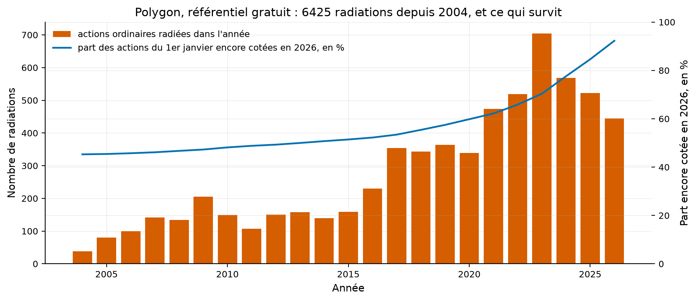

# Étude 015 : ce que le forfait gratuit de Polygon donne pour un univers sans biais de survie

**Verdict : `REJECTED`. Le forfait gratuit de Polygon rend deux ans de prix
quotidiens, 500 barres du 2024-09-04 au 2026-09-01 sur AAPL, et répond 403 à
une demande sur Lehman Brothers en 2008 : il ne donne pas l'univers depuis
1996 que la spécification 001 exigeait**. Son référentiel, lui, est entier et
gratuit : 6 425 actions ordinaires radiées, datées, depuis 2004. Il permet la
première mesure libre du biais de survie sur le marché américain entier : des
11 743 actions ordinaires cotées au 1er janvier 2004, 45 % existent encore ;
de celles de 2014, 51 % ; de celles de 2019, 58 %. La moitié de l'univers
d'il y a douze ans a disparu, et aucune source libre du dépôt n'en porte les
prix.

## La question de recherche

L'étude 013 a mesuré ce qu'un panneau de survivants fabrique, et la feuille de
route a fait de l'univers sans biais de survie son premier chantier, avec
Polygon pour source candidate et une clé déjà en place. La spécification 001
exigeait de mesurer le forfait avant de coder. Cette étude est cette mesure :
que rend la clé, sur les prix et sur le référentiel ?

En mots simples : la porte est-elle ouverte, et sur quoi ?

## L'article

Aucun. La spécification
[001-univers-sans-biais-de-survie](../../docs/specs/001-univers-sans-biais-de-survie.md)
et la documentation de Polygon, page produit, rapportée le 2026-09-03 :
« delisted tickers keep their full history ».

## L'intuition économique

Sans objet : c'est une mesure de source. Ce qu'elle protège est le résultat de
l'étude 013, où le biais de survie fabrique un renversement de 7,1 % par an.

## La définition mathématique

Pour une année Y, les actions ordinaires qui existaient au 1er janvier sont
celles cotées aujourd'hui plus celles radiées depuis cette date ; la part qui
survit est le rapport des premières aux secondes. Cette mesure suppose que
le référentiel date toutes les radiations depuis 2004, ce qu'il fait pour
6 425 titres sur 6 626, et qu'il ne compte pas les introductions postérieures
à Y, qu'il ne date pas : la part survivante est donc un minorant pour les
années récentes, un titre introduit après Y et encore coté étant compté
comme existant en Y.

## Les données

| Source | Contenu | Mesure |
|---|---|---|
| Polygon, agrégats quotidiens | AAPL depuis 1990, LEH sur 2008 | 500 barres depuis 2024-09-04 ; 403 sur LEH |
| Polygon, référentiel des titres | 36 623 titres, 23 469 radiés, tous types | 11 944 actions ordinaires, 5 318 actives, 6 626 radiées dont 6 425 datées |

Source : `results/tables/price_probes.csv`, `results/tables/delistings_by_year.csv`,
`results/tables/survivorship_by_year.csv`, `results/metrics.json`. Le
fournisseur `quantlab.data.providers.polygon` lit la clé hors du code et ne
l'écrit jamais dans le cache, ce qu'un test vérifie.

## La méthodologie originale

Sans objet.

## Notre implémentation

Deux sondes de prix, le référentiel des titres actifs et radiés en 36 pages à
la cadence du forfait, treize secondes entre deux pages, puis le calendrier
des radiations et la part survivante par année. Trois essais.

## Nos écarts avec l'article

Sans objet.

## Les résultats

| Année | Actions ordinaires existant au 1er janvier | Encore cotées en 2026 | Part survivante |
|---:|---:|---:|---:|
| 2004 | 11 743 | 5 318 | 45 % |
| 2009 | 11 249 | 5 318 | 47 % |
| 2014 | 10 480 | 5 318 | 51 % |
| 2019 | 9 254 | 5 318 | 58 % |
| 2024 | 6 854 | 5 318 | 78 % |

Comment lire ce tableau, en trois constats. Le premier est que l'univers
d'aujourd'hui est la moitié de celui de 2014 : un backtest sur les titres
cotés aujourd'hui ignore un titre sur deux de ce que 2014 offrait. Le
deuxième est que les radiations s'accélèrent, 704 en 2023 contre 140 en
2014, mesuré sur le référentiel ; que ce soit une vague de retraits de cote ou
une meilleure couverture du référentiel, l'étude ne peut pas le dire. Le
troisième est que la part survivante des années récentes est un minorant,
parce que les introductions postérieures y sont comptées comme existantes.

Comment lire cette figure : les barres comptent les actions ordinaires radiées
dans l'année, échelle de gauche ; la courbe donne la part des actions du 1er
janvier encore cotées en 2026, échelle de droite, en pourcentage.

## La robustesse

La mesure est un décompte, sans paramètre. Sa limite est celle du référentiel,
qui commence ses dates en 2004.

## Les coûts

Sans objet.

## Le hors échantillon

Sans objet.

## Les limites

| Limite | Statut |
|---|---|
| Prix limités à deux ans sur le forfait gratuit | mesuré, c'est le verdict |
| Référentiel sans date d'introduction dans la liste | mesuré ; la part survivante des années récentes est un minorant |
| 201 radiations non datées sur 6 626 | mesuré, exclues du calendrier |
| Documentation de Polygon lue sur la page produit, non sur le contrat du forfait | rapporté |

## Le verdict

`REJECTED` pour l'hypothèse : le forfait gratuit ne donne pas l'univers de
1996. Ce que l'étude établit tient en deux phrases. Le référentiel des
radiations est libre, entier depuis 2004, et il chiffre le biais que l'étude
013 subissait : la moitié des titres de 2014 ont disparu. Les prix de ces
titres, eux, restent derrière un forfait, et la feuille de route le note
comme la première dépense de données qui aurait un sens.
