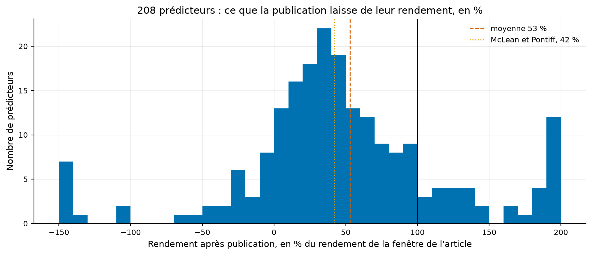
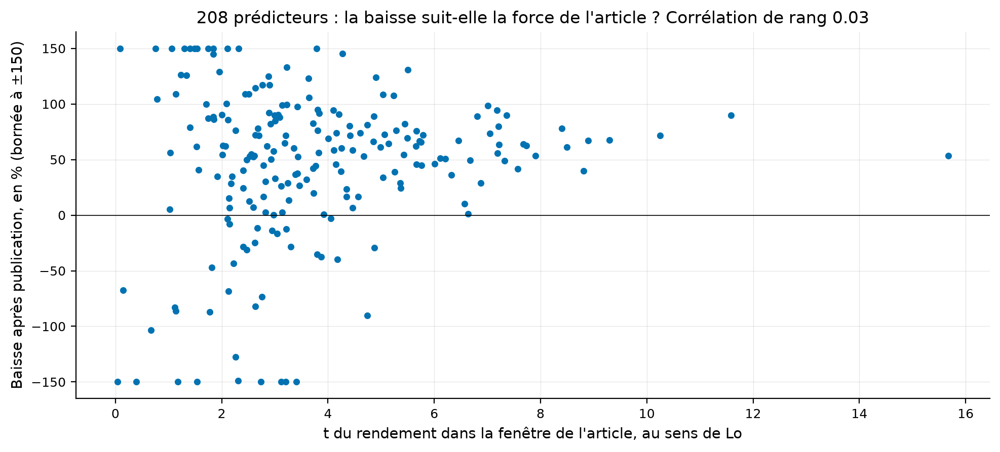

# Étude 016 : ce que la publication laisse, sur 212 portefeuilles sans biais de survie

**Verdict : `EXPERIMENTAL`. Sur 208 prédicteurs de Chen et Zimmermann, le
rendement après publication vaut en moyenne 53 % de celui de la fenêtre de
l'article, 42 % en médiane, et 83 % des prédicteurs baissent**. C'est la
question de l'étude 014, huit stratégies, posée à deux cents portefeuilles
construits sur CRSP, donc sans biais de survie et sans la sélection qui
bornait l'étude 014. La baisse moyenne, 47 %, contient les 58 % de McLean et
Pontiff dans son intervalle, 14 % à 74 % ; la régression de l'article rend
36 %, hors de la tolérance du laboratoire, et c'est ce qui borne le verdict.
Deux résultats que l'étude 014 ne pouvait pas donner. L'hétérogénéité que
l'article annonce, une baisse plus forte pour les prédicteurs plus forts, se
retrouve en niveau, corrélation de rang 0,54, et disparaît en proportion,
0,03 : chaque prédicteur perd à peu près la même part de ce qu'il rapportait.
Et les 47 prédicteurs publiés depuis 2010 ont perdu 94 % de leur rendement.

## La question de recherche

L'étude 014 mesurait sur huit stratégies ce que la publication laisse, et son
verdict disait que huit unités ne font pas une estimation, et que ces huit
étaient des survivantes de la littérature. Les 212 portefeuilles long moins
court d'Open Source Asset Pricing, reconstruits sur CRSP par Chen et
Zimmermann (2022), lèvent les deux limites : deux cents unités, et des
portefeuilles qui gardent les sociétés radiées. La question est la même.
Quelle part du rendement de la fenêtre de l'article survit, d'abord à la fin
de l'échantillon, puis à la publication, et la baisse dépend-elle de la force
du prédicteur ?

En mots simples : quand deux cents recettes ont été publiées, combien rapporte
encore chacune, et les meilleures perdent-elles plus ?

## L'article

McLean, R. D. et Pontiff, J. (2016), *Does Academic Research Destroy Stock
Return Predictability?*, The Journal of Finance 71(1), 5-32, fiche
[docs/literature/mclean_pontiff_2016.md](../../docs/literature/mclean_pontiff_2016.md).
Données de Chen, A. Y. et Zimmermann, T. (2022), *Open Source Cross-Sectional
Asset Pricing*, Critical Finance Review 11(2), 207-264, fiche
[docs/literature/chen_zimmermann_2022.md](../../docs/literature/chen_zimmermann_2022.md).

## L'intuition économique

Celle de l'étude 014 : la baisse entre l'échantillon et la publication borne
par le haut ce que l'échantillon avait exagéré, et la baisse supplémentaire
après publication mesure ce que les lecteurs de l'article ont négocié. Avec
deux cents unités, une troisième question devient testable : si les lecteurs
négocient d'abord les prédicteurs les plus rentables, la baisse doit croître
avec la force du prédicteur.

## La définition mathématique

Celle de l'étude 014, avec deux précisions. La fiche des signaux donne des
années : la fin d'échantillon est le 31 décembre de l'année de fin, la
publication le 31 décembre de l'année de publication, déclaré. Et la baisse se
mesure de deux façons : en proportion, un moins le rapport des rendements
moyens, et en niveau, la différence des rendements moyens mensuels en points.

## Les données

| Source | Contenu | Mesure |
|---|---|---|
| Open Source Asset Pricing, publication d'octobre 2025 | 212 rendements mensuels long moins court, 1926-01 à 2024-12, en pourcentage dans le fichier | 1 188 mois, fractions dans le laboratoire |
| Fiche des signaux, même publication | auteurs, revue, année de publication, fin d'échantillon, t rapporté | 212 prédicteurs, tous datés |

Source : `results/metrics.json`, clé `data`, et le manifeste du fournisseur
`quantlab.data.providers.osap`. Statut de la licence : non énoncée sur la
page des données, mesuré le 2026-09-04 ; le code des auteurs est sous GPL-2.0
et la citation est demandée.

Deux prédicteurs sont écartés parce que leur rendement moyen dans la fenêtre
de l'article n'est pas positif, ce qui rend le rapport indéfini ; 28 mois
tombent sous le seuil de vingt-quatre mois par fenêtre. Restent 210
prédicteurs dans la régression et 208 avec un rapport après publication.

## La méthodologie originale

Celle du résumé de l'article, résumée dans l'étude 014.

## Notre implémentation

Le script de l'étude 014 avec un autre chargeur, le fournisseur d'Open Source
Asset Pricing. Trois fenêtres par prédicteur, seuil de vingt-quatre mois pour
les deux mesures, moyenne des rapports avec intervalle par rééchantillonnage
des prédicteurs, régression des rendements normalisés sur deux indicatrices
avec effet fixe par prédicteur et erreurs types groupées par mois. Quatre
tests d'hétérogénéité par corrélation de rang et permutation, et une mise en
commun par décennie de publication. Neuf essais déclarés, graine 20260904.

## Nos écarts avec l'article

Deux cents portefeuilles au lieu de 97 caractéristiques, construits par
d'autres que nous ; la publication datée à l'année ; le seuil de vingt-quatre
mois.

## Les résultats

Tous les chiffres : `results/tables/windows.csv`,
`results/tables/by_publication_decade.csv`, `results/metrics.json`.
Rendements bruts, mensuels, statut mesuré ; 1 188 mois de 1926 à 2024.

| Mise en commun | Après échantillon | Après publication | Article |
|---|---:|---:|---:|
| Baisse du rendement moyen, moyenne des rapports | 32 %, 210 prédicteurs | 47 %, 208 prédicteurs | 26 % puis 58 % |
| Intervalle à 95 %, rééchantillonnage des prédicteurs | -6 % à 81 % | 14 % à 74 % | |
| Baisse du rendement moyen, médiane des rapports | 27 % | 58 % | |
| Baisse par la régression, effet fixe et erreurs groupées par mois | 20 %, t -0,33 | 36 %, t -1,20 | |
| Baisse du ratio de Sharpe, moyenne des rapports | 23 % | 40 % | |
| Prédicteurs dont le rendement baisse | 63 % | 83 % | |
| Prédicteurs dont le rendement devient négatif | 27 % | 16 % | |

Comment lire ce tableau, en trois constats. Le premier est que la médiane
après publication, 58 %, est exactement le chiffre de l'article, et que la
moyenne, 47 %, est tirée vers le haut par des prédicteurs qui ont rebondi.
La distribution est large, écart type des rapports de 2,2, et l'intervalle
de la moyenne va de 14 % à 74 %. Le deuxième est que la régression rend moins,
36 %, parce qu'elle pèse les mois et non les prédicteurs : les prédicteurs à
long historique, publiés tôt et moins érodés, y pèsent davantage. Le
troisième est que la baisse d'après échantillon existe ici, 27 % en médiane
et 32 % en moyenne, là où l'étude 014 n'en voyait pas : les survivantes de
l'étude 014 étaient sélectionnées sur cette fenêtre, et ces deux cents ne le
sont pas.

Comment lire cette figure : chaque barre compte les prédicteurs dont le
rendement après publication vaut la part indiquée du rendement de la fenêtre
de l'article, en pourcentage ; la ligne noire marque 100 %, le rendement
conservé en entier, le trait orange les 42 % qui restent chez McLean et
Pontiff, et le trait rouge la moyenne de l'étude. Les valeurs au-delà de
200 % ou sous -150 % sont ramenées au bord.

**L'hétérogénéité, en niveau et en proportion.** Source : `results/metrics.json`,
clé `heterogeneity`.

| Test de corrélation de rang, permutation à 10 000 tirages | Corrélation | Valeur p | Prédicteurs |
|---|---:|---:|---:|
| Baisse en proportion contre le t de la fenêtre de l'article | 0,03 | 0,66 | 208 |
| Baisse en proportion contre le rendement moyen de la fenêtre de l'article | -0,02 | 0,82 | 208 |
| Baisse en niveau contre le rendement moyen de la fenêtre de l'article | 0,54 | < 0,0001 | 210 |
| Baisse en proportion contre le t rapporté par l'article d'origine | 0,02 | 0,80 | 184 |

Comment lire ce tableau, en trois constats. Le premier est que l'article a
raison en niveau : un prédicteur qui rapportait plus perd plus de points de
rendement, corrélation 0,54. Le deuxième est que cette relation disparaît en
proportion : la part perdue ne dépend ni de la force mesurée ici ni du t que
l'article d'origine annonçait. Chaque prédicteur perd à peu près la même
fraction, et la relation en niveau est ce qu'un retour à la moyenne des
estimations produit à lui seul. Le troisième est que l'étude 014, sur huit
unités, ne pouvait ni voir ni exclure ces deux faits ; deux cents unités
suffisent.

Comment lire cette figure : chaque point est un prédicteur, en abscisse le t de
son rendement dans la fenêtre de l'article, en ordonnée la part perdue après
publication en pourcentage, bornée à plus ou moins 150. Aucune pente ne se
voit, et c'est le résultat.

**Par décennie de publication.** Source : `results/tables/by_publication_decade.csv`.

| Décennie de publication | Prédicteurs | Baisse après publication, moyenne des rapports | Baisse par la régression |
|---|---:|---:|---:|
| 1980 | 8 | 51 % | 56 % |
| 1990 | 34 | 30 % | 26 % |
| 2000 | 115 | 33 % | 26 % |
| 2010 | 47 | 94 % | 78 % |

Comment lire ce tableau, en deux constats. Le premier est que les prédicteurs
des années 1990 et 2000 gardent les deux tiers de leur rendement, ce qui est
mieux que l'article ne le dit. Le second est que les 47 prédicteurs publiés
depuis 2010 ont presque tout perdu : leur fenêtre d'après publication va de
2016 à 2024, et c'est la décennie où les données de ce type sont devenues
publiques et où le laboratoire lui-même les lit. Que ce soit la publication ou
la décennie qui les efface, cette étude ne peut pas le dire, et c'est écrit
comme tel.

## La robustesse

La moyenne des rapports, la médiane, la régression et la baisse du ratio de
Sharpe pointent dans le même sens, entre 36 % et 58 % après publication. Les
quatre décennies baissent toutes. Aucun retrait d'un prédicteur n'est
nécessaire à deux cents unités ; l'intervalle par rééchantillonnage en tient
lieu.

## Les coûts

Aucun : portefeuilles bruts, comme dans l'article.

## Le hors échantillon

Le dispositif est lui-même un hors échantillon, comme dans l'étude 014. Les
dates viennent de la fiche des auteurs et non de nos choix.

## Les limites

| Limite | Statut |
|---|---|
| Publication datée à l'année, la parution pouvant tomber en janvier ou en décembre | déclaré ; pousse la fenêtre d'après échantillon vers la suivante |
| Portefeuilles construits par d'autres, avec leurs choix de tri et de pondération | déclaré, fiche de littérature |
| Rapports instables quand le rendement de la fenêtre de l'article est proche de zéro | mesuré, écart type 2,2, médiane publiée à côté de la moyenne |
| Licence des données non énoncée | mesuré le 2026-09-04, citation demandée et donnée |
| Article de McLean et Pontiff non lu en entier | déclaré |

## Le verdict

`EXPERIMENTAL`. L'hypothèse tient dans son signe, 83 % des prédicteurs
baissent, et dans l'ordre de grandeur, la médiane redonne les 58 % de
l'article. La régression, la mesure retenue avant le premier chiffre pour le
contrôle de réplication, rend 0,364 contre 0,58, écart relatif 37 %, et 0,204
contre 0,26 pour l'après échantillon, écart 21 %, hors des 10 % du
laboratoire. Ce que l'étude établit tient en trois phrases. Deux cents
prédicteurs perdent en médiane 58 % de leur rendement après publication, ce
que l'article disait. Ils perdent tous à peu près la même part, ce que
l'article ne disait pas. Et ceux publiés depuis 2010 ont presque tout perdu.
