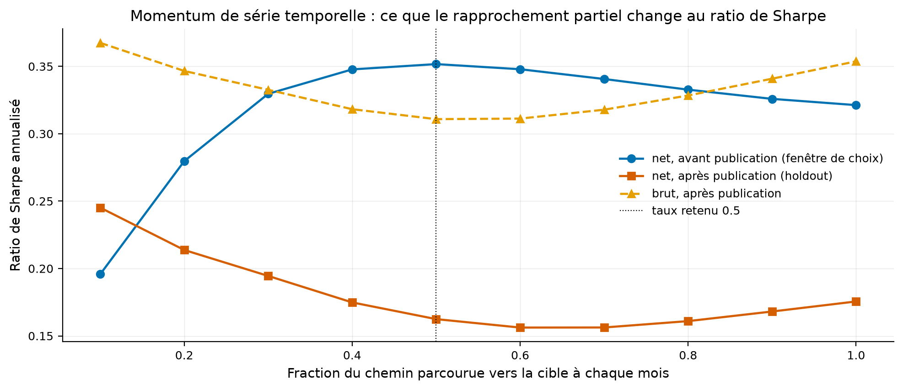

# Étude 017 : viser devant la cible, forme simple, sur le momentum de série temporelle

**Verdict : `REJECTED`. Ne parcourir que la moitié du chemin vers la cible,
le taux choisi sur la fenêtre d'avant publication, réduit la rotation de 9,15
à 5,75 fois le capital par an et le coût de 2,76 % à 2,11 % par an, et rend
pourtant après publication un ratio de Sharpe net de 0,162 contre 0,176 pour
le rééquilibrage complet**. La rotation économisée vaut moins que le retard
sur le signal, sur cette stratégie et ces coûts. Le meilleur taux lu après
coup sur le holdout, 0,1, aurait rendu 0,245 : l'optimum n'est pas stable
d'une fenêtre à l'autre, et c'est le résultat le plus utile de l'étude.

## La question de recherche

La phase 9 a mesuré qu'une séance de retard coûte 71 points de base par an au
momentum de série temporelle, et l'étude 007 qu'un arbitrage statistique meurt
à 3,92 points de base. La rotation est le premier coût du laboratoire.
Gârleanu et Pedersen (2013) disent qu'avec des coûts, la position optimale ne
rejoint pas la cible mais s'en rapproche d'une fraction fixe. Cette fraction,
choisie sans regarder le holdout, améliore-t-elle le net ?

En mots simples : quand chaque pas coûte, vaut-il mieux courir vers la cible
ou marcher ?

## L'article

Gârleanu, N. et Pedersen, L. H. (2013), *Dynamic Trading with Predictable
Returns and Transaction Costs*, The Journal of Finance 68(6), 2309-2340.
Fiche : [docs/literature/garleanu_pedersen_2013.md](../../docs/literature/garleanu_pedersen_2013.md).
Spécification : [docs/specs/003-viser-devant-la-cible.md](../../docs/specs/003-viser-devant-la-cible.md).

## L'intuition économique

Un signal qui persiste plusieurs mois n'a pas besoin d'être suivi à la lettre
chaque mois : rejoindre la cible à moitié capte l'essentiel de la position et
divise la rotation. Ce qui est perdu est le rendement des mois où la cible
avait raison tout de suite ; ce qui est gagné est le coût des mois où elle
allait changer d'avis.

## La définition mathématique

Avec les poids dérivés à l'entrée de la période, la cible et un taux,

$$
h_t = b_t + \theta\,(w^*_t - b_t), \qquad 0 \le \theta \le 1
$$

à taux un, le rééquilibrage complet ; à taux nul, rien n'est jamais négocié.
Module `quantlab.execution.rebalancing`, testé à la main sur deux actifs et
trois périodes.

## Les données

Celles de l'étude 001, lues dans sa configuration : vingt-huit fonds cotés de
Yahoo depuis 1993, taux sans risque de Kenneth French, poids par
`monthly_inputs_from_prices` et `tsmom_weights`, coûts de l'étude 001, 1 point
de base de commission, 2 de demi-écart, 1 de glissement, 50 par an de
financement au-delà d'une fois le capital. Statut modélisé pour les coûts.

## La méthodologie originale

Une forme fermée sous coûts quadratiques et signaux autorégressifs, appliquée
à des contrats à terme sur matières premières ; rapportée, non lue en entier.

## Notre implémentation

Dix taux de 0,1 à 1,0. Pour chacun, les poids décidés par rapprochement
partiel, le moteur du laboratoire avec décalage d'un mois et les coûts de
l'étude 001. Le taux retenu est celui du meilleur ratio de Sharpe net sur la
fenêtre d'avant publication, janvier 2007 à mai 2012, 65 mois ; le holdout,
juin 2012 à juin 2026, 169 mois, est lu une fois. Dix essais.

## Nos écarts avec l'article

La forme simple : un taux constant, sans l'escompte des signaux par leur
vitesse d'extinction, sur une stratégie de fonds cotés et non des contrats à
terme. Déclaré dans la spécification.

## Les résultats

Source : `results/tables/rate_grid.csv`, `results/metrics.json`. Net des
coûts de l'étude 001, brut de frais de gestion, statut mesuré et modélisé.

| Taux | Sharpe net, avant publication | Sharpe net, après publication | Sharpe brut, après publication | Rotation par an | Coût par an |
|---:|---:|---:|---:|---:|---:|
| 0,1 | 0,196 | 0,245 | 0,367 | 2,00 | 1,09 % |
| 0,3 | 0,330 | 0,194 | 0,333 | 4,18 | 1,78 % |
| 0,5, retenu | 0,352 | 0,162 | 0,311 | 5,75 | 2,11 % |
| 0,7 | 0,341 | 0,156 | 0,318 | 7,08 | 2,40 % |
| 1,0, complet | 0,321 | 0,176 | 0,354 | 9,15 | 2,76 % |

Comment lire ce tableau, en trois constats. Le premier est que la fenêtre de
choix désigne 0,5, avec un plateau de 0,4 à 0,7 : avant publication, aller à
moitié vaut mieux qu'aller au bout. Le deuxième est que le holdout dit
l'inverse : 0,5 rend 0,162 contre 0,176 au complet, et le net est le plus
haut au taux le plus bas, 0,245 à 0,1, où le brut lui-même est le plus haut,
0,367. Après publication, le signal est devenu si lent que le suivre coûte
plus qu'il ne rapporte, à tous les taux sauf le plus lent. Le troisième est
que la rotation économisée est réelle, 3,4 fois le capital par an, et le
coût aussi, 0,65 % par an ; c'est le brut qui recule davantage, de 0,354 à
0,311.

Comment lire cette figure : en abscisse la fraction du chemin parcourue vers
la cible à chaque mois, en ordonnée le ratio de Sharpe annualisé. La courbe
bleue est la fenêtre de choix, la rouge le holdout net, la orange le holdout
brut ; le trait pointillé marque le taux retenu. Les deux courbes nettes n'ont
pas le même sommet.

## La robustesse

Le plateau de la fenêtre de choix va de 0,4 à 0,7, ce qui est un vrai plateau
au sens du laboratoire ; il ne se retrouve pas sur le holdout. Le meilleur
taux du holdout est publié comme lu après coup et n'est retenu nulle part.

## Les coûts

Ceux de l'étude 001, modélisés. À 0,5, le coût annuel tombe de 2,76 % à
2,11 % ; à 0,1, à 1,09 %.

## Le hors échantillon

Le holdout n'a servi à aucun choix. Il est lu une fois par taux, dix lectures
publiées ensemble.

## Les limites

| Limite | Statut |
|---|---|
| Forme simple, taux constant, sans escompte par la vitesse d'extinction | déclaré, spécification 003 |
| Une seule stratégie, celle dont les poids sont reconstructibles | reconnu |
| Coûts proportionnels de l'étude 001, sans impact | modélisé |
| Le sommet de la fenêtre de choix ne se retrouve pas sur le holdout | mesuré, c'est le résultat |

## Le verdict

`REJECTED` : le taux choisi avant publication ne bat pas le rééquilibrage
complet après. Ce que l'étude établit : sur ce momentum, la rotation n'est pas
le levier, le signal l'est. Réduire les transactions de moitié économise
0,65 % par an et coûte 0,04 de ratio de Sharpe brut, et le seul taux qui
gagne après publication est celui qui ne négocie presque plus.
