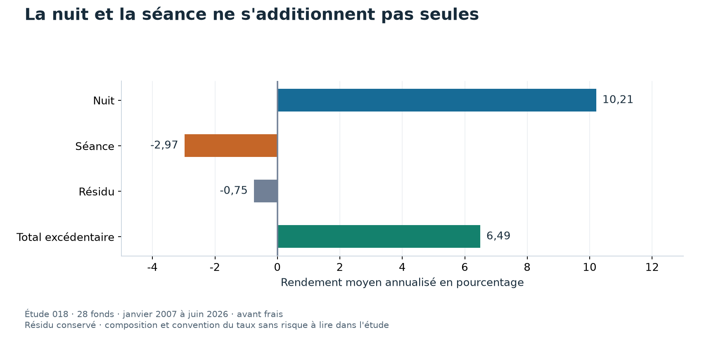

# 018 À quel moment de la journée les rendements apparaissent-ils ?

Dans cette décomposition historique, le momentum temporel gagne pendant la nuit et perd pendant la séance.
Les calculs portent sur des rendements bruts et sur les positions de l'étude 001.
Ils ne mesurent pas encore la performance nette d'une stratégie qui négocierait tous les soirs et tous les matins.

## Suivre le prix sur une seule séance

Prenons un exemple fictif, sans dividende ni division d'action.
Le titre clôture à 100 dollars, ouvre le lendemain à 102 dollars, puis clôture à 101 dollars.

| Moment | Prix | Calcul du rendement |
|---|---:|---|
| Clôture précédente | 100 $ | Point de départ |
| Ouverture suivante | 102 $ | Nuit, `102 / 100 - 1 = 2 %` |
| Nouvelle clôture | 101 $ | Séance, `101 / 102 - 1 = -0,9804 %` |

Sur la période entière, le rendement vaut `101 / 100 - 1 = 1 %`.
Additionner les deux pourcentages donne environ 1,0196 %, ce qui n'est pas le bon calcul.
Il faut composer les facteurs de croissance, `1,02 × (101 / 102) = 1,01`.
La différence vient du montant sur lequel le second rendement s'applique.

## Ce que la littérature cherche à distinguer

Lou, Polk et Skouras étudient séparément les rendements de nuit et de séance pour des stratégies sur actions.
Des populations d'investisseurs et des contraintes différentes peuvent intervenir à ces moments.
Le partage du rendement aide à décrire où se situe une régularité.
Il ne permet pas, seul, de désigner les investisseurs responsables.
La [fiche de l'article](../../docs/literature/lou_polk_skouras_2019.md) présente les stratégies et les limites de la transposition.

Le laboratoire applique cette question à une stratégie de momentum temporel et à cinq fonds cotés.
Un **momentum temporel** choisit le sens d'une position selon le passé du même actif.
Il diffère d'un classement des actions les unes contre les autres.

## Comment la décomposition est construite

Pour chaque fonds, le code sépare l'ouverture et la clôture quotidiennes.
Il applique un ajustement des prix afin de tenir compte des événements sur les titres.
Cet ajustement est exact pour une division, mais son emploi pour les dividendes reste une approximation déclarée.

Les parts quotidiennes sont ensuite composées dans le mois.
Les mêmes poids de portefeuille, décidés avec un décalage d'un mois, sont appliqués au total et aux deux parts.
Le résultat concerne 234 mois, de janvier 2007 à juin 2026, sur 28 fonds.

## Lire le résultat sans oublier le terme de composition

| Composante de la stratégie | Rendement moyen annualisé |
|---|---:|
| Nuit | 10,21 % |
| Séance | -2,97 % |
| Résidu de la décomposition retenue | -0,75 % |
| Total excédentaire | 6,49 % |

Ces nombres viennent de la section `strategy` des [résultats enregistrés](results/metrics.json).
Le résidu conserve l'écart entre le total excédentaire et les deux composantes calculées.
La composition et les conventions de soustraction du taux sans risque doivent rester cohérentes pour l'interpréter.

Les barres montrent les contributions mesurées selon les conventions de l'étude.
Le résidu est visible au lieu d'être absorbé dans l'une des périodes.
Le bleu positif et l'orange négatif indiquent où les gains et les pertes sont observés, avant frais.

## Pourquoi cela ne donne pas directement une règle profitable

Détenir seulement la nuit demanderait une entrée et une sortie fréquentes.
Dans un exemple fictif, un aller-retour coûtant 0,04 % répété 250 fois représente 10 % du capital initial en coûts additionnés.
Ce calcul suppose un montant négocié constant. Il ne mesure pas le coût réel des positions variables du laboratoire.

Il faut également tenir compte des prix d'exécution et des risques entre la clôture et l'ouverture.
Le résultat brut ne prouve donc pas que la stratégie de nuit domine après frais.
Inversement, on ne peut pas affirmer que les frais l'annulent sans calculer les montants réellement négociés.

## Ce que l'étude laisse ouvert

La même décomposition devrait être examinée sur plusieurs sous-périodes et avec des conventions de dividendes contrôlées.
Une règle négociable de nuit demanderait son propre protocole, ses prix d'exécution et ses coûts.
Ces expériences ne sont pas remplacées par le graphique de décomposition.

L'[annexe technique](ANNEXE_TECHNIQUE.md) conserve les cinq fonds et les contrôles d'identité.
La [comparaison avec LEAN](../../lean/README.md) examine séparément ce que change un autre calendrier d'exécution.
