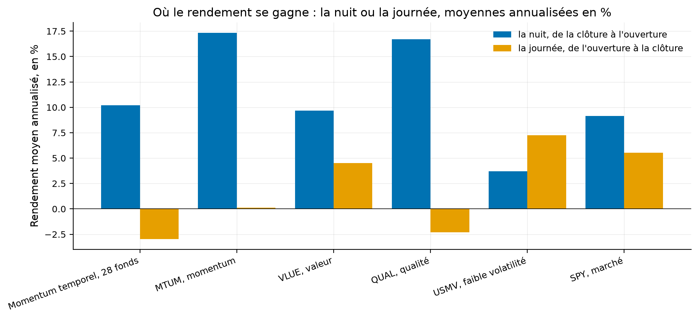

# Étude 018 : la nuit contre la journée, sur le momentum de série temporelle et cinq fonds de facteurs

**Verdict : `EXPERIMENTAL`. Le momentum de série temporelle de l'étude 001
gagne tout son rendement la nuit : 10,2 % par an de la clôture à l'ouverture
suivante, ratio de Sharpe 0,83 et t de 3,8, contre -3,0 % par an de
l'ouverture à la clôture**, sur 234 mois et vingt-huit fonds cotés. La part de
nuit vaut 157 % du total, et la différence entre les deux parts, 13,2 % par
an, a un t de 4,0. Les cinq fonds de facteurs disent la même chose pour le
momentum, MTUM à 99 % la nuit, et pour la qualité, et l'inverse pour la faible
volatilité, USMV à 34 %. La valeur, VLUE, gagne aux deux tiers la nuit, là où
l'article la place le jour.

## La question de recherche

Un rendement de clôture à clôture mélange deux moments : la nuit, quand le
marché est fermé et que l'ouverture absorbe ce qui s'est passé, et la journée.
Lou, Polk et Skouras (2019) rapportent que le momentum gagne la nuit et la
valeur le jour. Où le momentum de série temporelle du laboratoire gagne-t-il,
et les fonds de facteurs cotés suivent-ils l'article ?

En mots simples : gagne-t-on en dormant ou en travaillant ?

## L'article

Lou, D., Polk, C. et Skouras, S. (2019), *A Tug of War: Overnight versus
Intraday Expected Returns*, Journal of Financial Economics 134(1), 192-213.
Fiche : [docs/literature/lou_polk_skouras_2019.md](../../docs/literature/lou_polk_skouras_2019.md).
Spécification : [docs/specs/004-la-nuit-contre-la-journee.md](../../docs/specs/004-la-nuit-contre-la-journee.md).

## L'intuition économique

Des investisseurs différents négocient à l'ouverture et pendant la séance.
Si le momentum vient d'une demande qui s'exprime à l'ouverture, ses gains
tombent la nuit ; si la valeur vient d'un rééquilibrage patient pendant la
séance, ses gains tombent le jour.

## La définition mathématique

L'ouverture ajustée est l'ouverture brute multipliée par le rapport de la
clôture ajustée à la clôture brute. La nuit va de la clôture ajustée de la
veille à l'ouverture ajustée, la journée de l'ouverture ajustée à la clôture
ajustée, et les deux parts se composent en le rendement de clôture à clôture :
identité mesurée à 2e-16 sur toutes les séances. Pour la stratégie, les parts
quotidiennes de chaque fonds sont composées dans le mois, puis les poids de
l'étude 001 leur sont appliqués avec le décalage d'un mois, par le moteur du
laboratoire. Module `quantlab.analytics.returns.overnight_intraday_split`.

## Les données

| Source | Contenu | Mesure |
|---|---|---|
| Yahoo | ouverture, clôture, clôture ajustée des 28 fonds de l'étude 001, 1993-2026 | 234 mois de stratégie, 2007-01 à 2026-06 |
| Yahoo | les mêmes prix pour MTUM, VLUE, QUAL, USMV et SPY | 3 247 séances depuis 2013-08 |
| Kenneth French | taux sans risque quotidien et mensuel | même fenêtre |

## La méthodologie originale

Celle du résumé : quatorze stratégies sur actions, chacune mesurée sur chaque
part.

## Notre implémentation

Le partage nuit et journée par fonds et par séance ; la stratégie de l'étude
001 rejouée trois fois, sur le rendement total, sur la part de nuit et sur la
part de journée, avec les mêmes poids ; les cinq fonds mesurés depuis leur
première séance commune. Six essais.

## Nos écarts avec l'article

Fonds cotés au lieu d'actions ; une stratégie de laboratoire et cinq fonds au
lieu de quatorze stratégies ; parts composées dans le mois pour la stratégie.

## Les résultats

Source : `results/tables/strategy_parts_monthly.csv`,
`results/tables/factor_funds_split.csv`, `results/metrics.json`. Bruts,
statut mesuré.

| Momentum de série temporelle, 234 mois | Rendement moyen annualisé | Ratio de Sharpe | t |
|---|---:|---:|---:|
| Total, excédentaire | 6,5 % | 0,377 | 1,9 |
| La nuit, de la clôture à l'ouverture | 10,2 % | 0,826 | 3,8 |
| La journée, de l'ouverture à la clôture | -3,0 % | -0,256 | -1,3 |
| Nuit moins journée | 13,2 % | 0,805 | 4,0 |

Comment lire ce tableau, en trois constats. Le premier est que la stratégie
entière gagne moins que sa seule part de nuit : la journée lui retire 3 % par
an. Le deuxième est que la part de nuit est plus sûre que le total, ratio de
Sharpe 0,83 contre 0,38, avec un t qui passe le seuil que le total ne passe
pas. Le troisième est que la somme des deux parts ne redonne pas exactement le
total, l'écart valant -0,75 % par an : c'est le terme croisé de la
composition, publié dans la table.

| Fonds, depuis 2013-08 | Facteur | La nuit, % par an | La journée, % par an | Part de nuit | Sharpe nuit | Sharpe journée |
|---|---|---:|---:|---:|---:|---:|
| MTUM | momentum | 17,4 | 0,1 | 99 % | 1,40 | 0,01 |
| QUAL | qualité | 16,7 | -2,3 | 116 % | 1,54 | -0,17 |
| VLUE | valeur | 9,7 | 4,5 | 68 % | 0,80 | 0,33 |
| SPY | marché | 9,1 | 5,5 | 62 % | 0,83 | 0,43 |
| USMV | faible volatilité | 3,7 | 7,3 | 34 % | 0,44 | 0,66 |

Comment lire ce tableau, en trois constats. Le premier est que le momentum
est le cas le plus net : MTUM gagne 17,4 % par an la nuit et rien le jour, ce
que l'article rapporte pour le momentum sur actions. Le deuxième est que le
marché lui-même gagne aux deux tiers la nuit, si bien qu'un fonds long
seulement hérite de cette part avant tout facteur ; la lecture qui compte est
l'écart au marché, et la valeur est à 68 % contre 62 %, donc à peine
différente du marché, quand l'article la place le jour. Le troisième est que
la faible volatilité est le seul fonds qui gagne le jour, ce que l'article ne
rapporte pas et que cette étude ne peut qu'observer.

Comment lire cette figure : deux barres par série, le rendement moyen
annualisé de la nuit en bleu et de la journée en orange, en pourcentage. La
stratégie et trois fonds sur cinq ont leur barre orange sous ou près de
zéro.

## La robustesse

Les t de la part de nuit et de la différence sont ceux de Lo, 3,8 et 4,0 sur
234 mois. Aucune sous-période n'a été lue, la question n'ayant pas été posée
avant le premier chiffre.

## Les coûts

Aucun : la décomposition porte sur le brut. Exploiter la part de nuit seule
exigerait d'acheter à la clôture et de vendre à l'ouverture chaque jour, dont
le coût dépasse les 13 % par an de différence sur des fonds cotés à quelques
points de base l'aller-retour, deux cent cinquante fois par an ; la phase 6
donne les ordres de grandeur.

## Le hors échantillon

Aucun paramètre n'a été choisi ; les poids sont ceux de l'étude 001.

## Les limites

| Limite | Statut |
|---|---|
| Ouverture ajustée par le facteur de la clôture, exact pour une division, approché pour un dividende | déclaré |
| Fonds cotés au lieu d'actions | déclaré |
| Terme croisé de la composition, -0,75 % par an | mesuré et publié |
| Cinq fonds depuis 2013 seulement | reconnu |
| Aucune sous-période | déclaré |

## Le verdict

`EXPERIMENTAL` : l'hypothèse tient, le momentum de série temporelle gagne la
nuit, et aucun chiffre publié sur ces fonds n'existe à répliquer. Ce que
l'étude établit : sur vingt ans, tout le rendement de ce momentum tombe entre
la clôture et l'ouverture suivante, et la journée lui coûte ; une exécution
qui attend le lendemain, comme la phase 9 l'a mesuré, manque exactement le
moment où il gagne.
