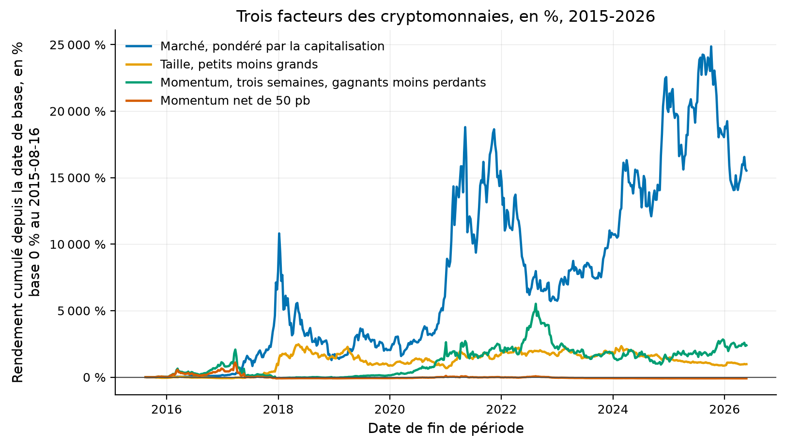

# Étude 019 : marché, taille et momentum sur les cryptomonnaies, actifs disparus compris

**Verdict : `REJECTED`. Les trois facteurs de Liu, Tsyvinski et Wu se
retrouvent dans leur fenêtre, le momentum à 2,65 % par semaine brut, t 2,6,
contre environ 3 % rapportés ; après publication, il ne rend plus que 0,44 %
par semaine brut, et sa rotation de 204 % du capital par semaine le fait
passer à -0,64 % par semaine net de cinquante points de base**, ratio de
Sharpe -0,60 sur 213 semaines. La taille est négative après publication
avant tout coût, -0,27 % par semaine. Le marché lui-même passe de 2,06 % à
0,30 % par semaine. Ce qui reste des facteurs de 2022 n'est pas négociable
gratuitement, et l'univers de cette étude est le seul libre : 139 actifs à
prix daté, sur les 2 258 fichiers de Coin Metrics, contre 1 827 monnaies dans
l'article.

## La question de recherche

Les facteurs académiques sur actions ont perdu la moitié de leur rendement
après publication, études 014 et 016. Les cryptomonnaies sont le seul marché
jeune où les facteurs ont été publiés après 2020, donc où la fenêtre d'après
publication se mesure déjà. Liu, Tsyvinski et Wu (2022) rapportent trois
facteurs, marché, taille et momentum, sur 2014-2020. Se retrouvent-ils sur
un univers libre qui garde les monnaies disparues, et que valent-ils depuis
avril 2022, une fois payés des coûts de transaction ?

En mots simples : les recettes qui marchaient sur les cryptomonnaies avant
2020 marchent-elles encore, et paient-elles leurs frais ?

## L'article

Liu, Y., Tsyvinski, A. et Wu, X. (2022), *Common Risk Factors in
Cryptocurrency*, The Journal of Finance 77(2), 1133-1177. Résumé lu le
2026-09-03 ; l'article n'a pas été lu en entier, et le chiffre de 3 % par
semaine pour le momentum vient d'un résumé secondaire, rapporté et non
revérifié. Spécification :
[005-cryptomonnaies-coin-metrics](../../docs/specs/005-cryptomonnaies-coin-metrics.md).

## L'intuition économique

Celle des actions, transposée : le marché rémunère le risque commun, les
petites monnaies rémunèrent l'illiquidité et le risque de disparition, et le
momentum de quelques semaines vient d'une attention qui arrive par vagues.
Sur un marché où le capital académique est arrivé tard, ces primes devraient
être plus larges, et s'éroder plus vite une fois lues.

## La définition mathématique

Chaque semaine, calendrier du dimanche, l'univers est l'ensemble des actifs
dont la capitalisation en fin de semaine précédente dépasse un million de
dollars, comme dans l'article. Le marché est le rendement pondéré par la
capitalisation. La taille est le tiers du bas moins le tiers du haut par
capitalisation, chaque jambe pondérée par la capitalisation. Le momentum est
le tiers du haut moins le tiers du bas du rendement des trois semaines
précédentes, même pondération. Les coûts sont un demi-écart par unité négociée
sur la rotation mesurée, cinquante points de base au cas de base, statut
modélisé.

## Les données

| Source | Contenu | Mesure |
|---|---|---|
| Coin Metrics, données communautaires | 2 258 fichiers, un par actif, prix et capitalisation quotidiens en dollars, CC BY-NC 4.0 | 139 actifs portent un prix ; 555 semaines du 2015-08-16 au 2026-05-24 |

Source : `results/metrics.json`, clés `data` et `universe`. Le fichier de
BTC s'arrête au 2026-05-24, retard de publication de la source. L'univers
compte 10 actifs en 2015, 63 en 2018, 112 en 2021 et 106 en 2026 ; la première
semaine à dix actifs est en août 2015, donc la fenêtre de l'article commence
là et non en 2014.

**La limite qui compte.** Coin Metrics ne publie un prix que pour les actifs
qu'il suit comme référence, 139 sur 2 258 ; les 2 119 autres fichiers portent
des mesures de chaîne sans prix. L'univers est donc celui des monnaies assez
grosses pour être suivies, monnaies disparues comprises quand elles l'ont été
un jour, et non les 1 827 de l'article.

## La méthodologie originale

Celle du résumé : des portefeuilles hebdomadaires par tri, sur les monnaies
de plus d'un million de dollars, de 2014 à 2020.

## Notre implémentation

Le fournisseur `quantlab.data.providers.coinmetrics`, l'univers par semaine,
les trois facteurs, la rotation de chaque facteur, une grille de coûts de 0 à
200 points de base, trois fenêtres, la fenêtre de l'article jusqu'en juillet
2020, l'après échantillon jusqu'en avril 2022, l'après publication ensuite.
Dix essais.

## Nos écarts avec l'article

139 actifs au lieu de 1 827 ; des tiers au lieu des quantiles exacts de
l'article, non lus ; la fenêtre de l'article commence en août 2015 faute
d'univers avant.

## Les résultats

Source : `results/tables/factors_weekly.csv`, `results/tables/cost_grid.csv`,
`results/metrics.json`. Hebdomadaire, brut sauf mention, statut mesuré.

| Facteur, rendement moyen par semaine et Sharpe annualisé | Fenêtre de l'article, 251 semaines | Après échantillon, 91 semaines | Après publication, 213 semaines |
|---|---:|---:|---:|
| Marché | 2,06 %, Sharpe 1,25 | 1,95 %, 1,45 | 0,30 %, 0,37 |
| Taille, petits moins grands | 1,76 %, 0,98 | 0,76 %, 0,80 | -0,27 %, -0,47 |
| Momentum, trois semaines | 2,65 %, 1,15 | 1,84 %, 0,95 | 0,44 %, 0,41 |
| Momentum net de 50 pb | 1,69 %, 0,73 | 0,82 %, 0,42 | -0,64 %, -0,60 |

Comment lire ce tableau, en trois constats. Le premier est que les trois
facteurs se retrouvent dans la fenêtre de l'article, avec des t de 2,2 à 2,6
sur 251 semaines, et un momentum de 2,65 % par semaine contre les 3 %
rapportés. Le deuxième est que tout s'effondre après publication : le marché
divise son rendement hebdomadaire par sept, la taille devient négative, et le
momentum garde un sixième de ce qu'il rendait. Le troisième est que le
momentum ne survit à aucun coût après publication, parce qu'il négocie deux
fois le capital par semaine : à 25 points de base son Sharpe est déjà de
-0,09, à 50 de -0,60.

| Sharpe annualisé selon le coût par unité négociée | 0 pb | 25 pb | 50 pb | 100 pb | 200 pb |
|---|---:|---:|---:|---:|---:|
| Momentum, fenêtre de l'article | 1,15 | 0,94 | 0,73 | 0,31 | -0,52 |
| Momentum, après publication | 0,41 | -0,09 | -0,60 | -1,60 | -3,51 |
| Taille, fenêtre de l'article | 0,98 | 0,93 | 0,88 | 0,77 | 0,57 |
| Taille, après publication | -0,47 | -0,56 | -0,64 | -0,81 | -1,16 |

Comment lire ce tableau, en deux constats. Le premier est que la taille coûte
peu à tenir, 29 % du capital par semaine, et qu'elle perd quand même après
publication. Le second est que le momentum coûtait déjà la moitié de son
Sharpe à 50 points de base dans la fenêtre de l'article ; un écart de 50
points de base est optimiste sur les petites monnaies, ce que la phase 6 a
mesuré pour les fonds cotés étroits.

Comment lire cette figure : chaque courbe est le rendement cumulé d'un
facteur depuis août 2015, en pourcentage, échelle linéaire. Le marché domine
tout, les deux autres montent jusqu'en 2021 puis stagnent ou reculent, et le
momentum net de 50 points de base finit sous son point de départ.

## La robustesse

Les trois fenêtres sont fixées par l'article et sa date de parution, pas par
les données. Aucun paramètre n'a été choisi ; les tiers sont déclarés. Le
ratio de Sharpe dégonflé n'est pas calculé, dix essais et une seule fenêtre
d'après publication ne le justifiant pas au-delà de ce que le tableau montre.

## Les coûts

Modélisés, un demi-écart par unité négociée, de 0 à 200 points de base. Les
frais de plateforme, le glissement sur les petites monnaies et le coût
d'emprunt pour la jambe courte ne sont pas comptés, et tous vont dans le même
sens.

## Le hors échantillon

Deux fenêtres après l'échantillon de l'article, dont 213 semaines après sa
parution, jamais lues avant le verdict.

## Les limites

| Limite | Statut |
|---|---|
| 139 actifs à prix daté au lieu de 1 827 | mesuré, c'est la couverture de la source libre |
| Article non lu en entier, chiffre de 3 % par semaine rapporté d'un résumé secondaire | déclaré |
| Tiers au lieu des quantiles de l'article | déclaré |
| Fenêtre de l'article commençant en août 2015 | mesuré, premier univers de dix actifs |
| Coûts modélisés, jambe courte supposée empruntable | déclaré, hypothèse optimiste |
| Retard de publication de la source, dernière semaine 2026-05-24 | mesuré |

## Le verdict

`REJECTED` : les trois facteurs existent dans la fenêtre de l'article, et le
momentum net de coûts a un ratio de Sharpe de -0,60 après publication. Ce que
l'étude établit tient en deux phrases. Le marché jeune s'est comporté comme
le marché ancien, en plus vite : les primes de 2014-2020 ont perdu les
cinq sixièmes de leur rendement dans les quatre ans qui ont suivi l'article.
Et la seule qui reste positive brut, le momentum, négocie deux fois le capital
par semaine, ce qu'aucun coût libre ne laisse passer.
