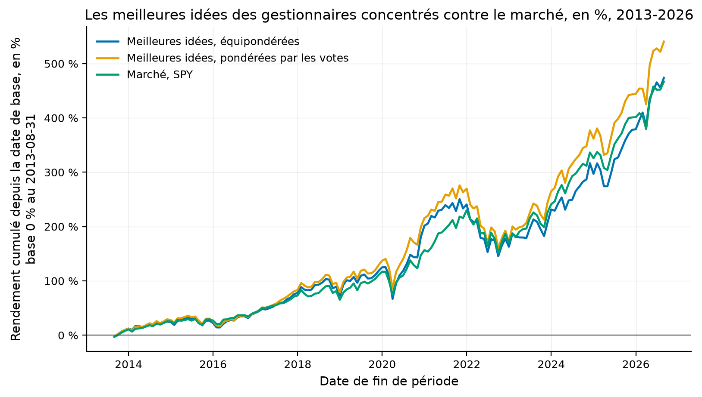

# Étude 020 : les meilleures idées des gestionnaires concentrés, lues dans les jeux 13F à leur date de dépôt

**Verdict : `REJECTED`. La plus grosse position de chaque gestionnaire
concentré, connue le quarante-sixième jour après la fin du trimestre et tenue
jusqu'au dépôt suivant, rapporte 14,29 % par an contre 14,18 % pour le
marché, soit +0,27 % par an, t de 0,26 sur 157 mois**, et -0,05 % par an net
de dix points de base par unité négociée. Pondérée par le nombre de
gestionnaires qui la nomment, elle fait +1,16 % par an, t de 0,87. Son alpha
contre le marché est de -0,69 % par an, t de -0,37, avec un bêta de 1,08 et
un R² de 0,86 : ce portefeuille est le marché, en un peu plus risqué. Et il
n'est que le marché des survivants : 5 485 des 18 954 idées formées, 28,9 %,
n'ont aucun prix chez le fournisseur gratuit, la moitié en 2013 et 12 % en
2026, ce qui borne l'écart que la source libre ne peut pas mesurer.

## La question de recherche

Les études 014 et 016 ont mesuré que les stratégies publiées perdent la
moitié de leur rendement après leur article, sur des données que tout le
monde lit. Les déclarations 13F sont publiques aussi, mais datées : chaque
position porte le jour où la SEC l'a reçue, et un portefeuille formé sur les
dépôts reçus ne connaît rien du futur. Cohen, Polk et Silli (2010)
rapportent que la plus grosse position de chaque gérant, sa « meilleure
idée », bat le marché. Se retrouve-t-elle sur les jeux structurés de la SEC,
formée après le délai de dépôt, tenue un trimestre, contre un fonds indiciel ?

En mots simples : copier la conviction la plus forte de chaque gestionnaire,
le jour où elle devient publique, rapporte-t-il plus que l'indice ?

## L'article

Cohen, R., Polk, C. et Silli, B. (2010), *Best Ideas*, document de travail.
L'article n'a pas été lu ; son résultat est rapporté par la littérature sur
les clones de déclarations 13F, et aucun de ses chiffres n'est repris ici.
Spécification : [006-jeux-13f-de-la-sec](../../docs/specs/006-jeux-13f-de-la-sec.md).
Fiche : [cohen_polk_silli_2010](../../docs/literature/cohen_polk_silli_2010.md).

## L'intuition économique

Un gestionnaire diversifie pour limiter le risque de son fonds, pas parce
qu'il croit à chacune de ses positions. Sa plus grosse position est celle où
sa conviction dépasse son besoin de diversification, donc celle qui porte
son information privée, s'il en a. L'agréger sur des centaines de
gestionnaires devrait isoler cette information du bruit de chacun.

## La définition mathématique

Chaque trimestre, la formation a lieu le quarante-sixième jour après la fin
de période, sur les déclarations 13F-HR non amendées reçues à cette date.
Une déclaration est concentrée si elle porte de dix à cinquante positions en
titres, options exclues, pour au moins cent millions de dollars, et si sa
plus grosse position pèse au moins 5 % du total. Cette position est l'idée du
gestionnaire. Un fonds coté ou fermé n'est pas une idée et s'écarte après la
correspondance CUSIP. Le portefeuille tient les idées distinctes, à poids
égaux, ou pondérées par le nombre de gestionnaires qui les nomment, jusqu'à
la formation suivante. Les rendements sont mensuels, prix ajustés de Yahoo.
Le coût est un demi-écart de dix points de base par unité négociée, à l'achat
et à la vente, sur le renouvellement mesuré des noms, statut modélisé.

## Les données

| Source | Contenu | Mesure |
|---|---|---|
| SEC, jeux de données 13F | 53 fichiers trimestriels, du deuxième trimestre 2013 à 2026, avec la date de dépôt | 29 591 meilleures idées, 2 861 gestionnaires, 3 285 CUSIP distincts, périodes du 2013-03-31 au 2026-03-31 |
| OpenFIGI, sans clé | correspondance CUSIP vers symbole, dix par requête | 2 442 CUSIP trouvés sur 3 285, 74,3 % ; 489 fonds cotés et 11 fonds fermés |
| Yahoo Finance | prix ajustés des survivants, 2013-01-01 au 2026-08-31 | 1 357 symboles avec prix sur 1 877 demandés |

Source : `results/metrics.json`, clés `filings`, `mapping`, `prices` et
`units`. Le gestionnaire médian déclare 27 positions pour 347 millions de
dollars, et son idée pèse 13,5 % de son portefeuille.

**Les unités, mesurées.** La valeur déclarée est en milliers de dollars dans
97 % des déclarations jusqu'en 2021, dans 81 % en 2022, puis dans 19 % en
2023 et 6 % en 2026 : la SEC a changé l'unité en janvier 2023 et une partie
des déclarants ne l'a pas suivie. Le fournisseur lit l'unité déclaration par
déclaration, par la médiane de la valeur par titre, et six déclarations dont
la valeur par titre dépasse cinq mille dollars sont écartées comme suspectes.
Vérifié sur Apple : les déclarations lues en milliers redonnent 225,74 $ au
troisième trimestre 2018 et 250,42 $ au quatrième trimestre 2024.

**Les fonds, écartés.** 8 711 idées sur 29 591, 29,4 %, sont un fonds coté
ou fermé, le plus souvent un fonds indiciel sur le S&P 500 : la plus grosse
position d'un gestionnaire est souvent son exposition au marché, pas une
conviction.

## La méthodologie originale

Non lue. La spécification retient ce que la littérature sur les clones
rapporte : la plus grosse position par gérant, agrégée, contre le marché.

## Notre implémentation

Le fournisseur `quantlab.data.providers.sec13f`, qui lit les trois tables de
chaque fichier, lève si un dépôt précède sa période et ramène la valeur en
dollars ; le correspondant `quantlab.data.providers.openfigi`, avec son cache
local ; la formation, les deux pondérations, le renouvellement mesuré, la
régression sur le marché, la sous-période depuis 2020. Six essais, dont les
deux premières lectures, en dollars puis fonds compris, vues avant d'être
corrigées.

## Nos écarts avec l'article

Un article non lu n'a pas d'écarts mesurables. Ce qui diffère sûrement : les
jeux structurés commencent en 2013, l'article s'arrête avant 2010 ; les prix
sont ceux des survivants ; le marché est SPY et non un modèle à facteurs.

## Les résultats

Source : `results/tables/monthly_returns.csv`, `results/metrics.json`.
Mensuel, 157 mois du 2013-08-31 au 2026-08-31, brut sauf mention, statut
mesuré.

| Portefeuille | Rendement annualisé | Sharpe | t | Écart au marché, par an | t de l'écart |
|---|---:|---:|---:|---:|---:|
| Meilleures idées, équipondérées | 14,29 % | 0,88 | 3,24 | +0,27 % | 0,26 |
| Meilleures idées, pondérées par les votes | 15,25 % | 0,95 | 3,47 | +1,16 % | 0,87 |
| Équipondérées, nettes de 10 pb | 13,93 % | 0,86 | 3,18 | -0,05 % | 0,09 |
| Marché, SPY | 14,18 % | 1,00 | 3,84 | | |

Comment lire ce tableau, en trois constats. Le premier est que les deux
portefeuilles font le rendement du marché avec un Sharpe plus bas, parce
qu'ils sont plus volatils : le bêta est de 1,08 et le R² de 0,86, donc
six septièmes de leurs variations sont celles de l'indice. Le deuxième est
que l'écart au marché, +0,27 % ou +1,16 % par an, a un t sous un : il ne se
distingue pas de zéro sur treize ans. Le troisième est que le coût, 2,6
points de base par mois pour un renouvellement de 39,2 % des noms par
trimestre, suffit à rendre l'écart équipondéré négatif.

| Écart au marché, par an | 2013-2019, 77 mois | 2020-2022, 36 mois | 2023-2026, 44 mois |
|---|---:|---:|---:|
| Équipondérées | +0,71 % | -1,15 % | +1,39 % |
| Pondérées par les votes | +1,55 % | -1,96 % | +3,43 % |

Comment lire ce tableau : le signe change avec la sous-période, et la
meilleure, 2023-2026, est celle où les idées les plus nommées sont Microsoft,
Apple, Nvidia et Alphabet. Sur les 29 591 idées, Microsoft revient 617 fois,
Apple 415, Berkshire Hathaway 319, Alphabet 301 et Amazon 283 : la conviction
la plus forte des gestionnaires concentrés est la capitalisation la plus
grosse, ce qui explique le bêta.

| Année de la période | Idées formées | Sans prix | Part sans prix | CUSIP non trouvés par OpenFIGI |
|---|---:|---:|---:|---:|
| 2013 | 971 | 487 | 50,2 % | 33,9 % |
| 2016 | 1 548 | 664 | 42,9 % | 25,6 % |
| 2019 | 1 592 | 447 | 28,1 % | 10,4 % |
| 2022 | 1 567 | 318 | 20,3 % | 9,5 % |
| 2025 | 1 540 | 195 | 12,7 % | 8,3 % |
| 2026, un trimestre | 469 | 57 | 12,2 % | 9,4 % |

Source : `results/tables/coverage_by_quarter.csv` et
`results/tables/cusip_mapping.csv`. Comment lire ce tableau, en deux
constats. Le premier est que la part des idées sans prix croît avec l'âge de
la période : un titre acquis ou radié depuis n'a plus de CUSIP chez OpenFIGI
ni de prix chez Yahoo, et plus la période est ancienne, plus il a eu le temps
de disparaître. Le second est que cette part, 28,9 % au total, est le biais de
survie de l'étude : les idées qui manquent sont celles dont l'issue a été une
acquisition, souvent avec prime, ou une faillite, et le signe net de ces deux
issues n'est pas connu.

Comment lire cette figure : les trois courbes sont le rendement cumulé depuis
août 2013, en pourcentage, échelle linéaire. Elles se suivent pendant treize
ans, les idées pondérées par les votes se détachant après 2023 ; les creux de
2020 et de 2022 sont plus profonds pour les idées que pour l'indice.

## La robustesse

Les seuils, dix à cinquante positions, cent millions, 5 % de poids, quarante-six
jours, sont écrits dans la configuration avant le premier chiffre et n'ont
pas bougé. Deux pondérations et trois sous-périodes donnent des signes qui
changent. Le ratio de Sharpe dégonflé n'est pas calculé : l'écart au marché a
un t de 0,26 avant toute correction.

## Les coûts

Modélisés, dix points de base par unité négociée, à l'achat et à la vente,
sur le renouvellement mesuré de 39,2 % des noms par trimestre. Le coût
d'un portefeuille de 154 noms en moyenne est faible, 2,6 points de base par
mois, et il suffit.

## Le hors échantillon

Toute la fenêtre, 2013 à 2026, est postérieure à l'article. Deux lectures
antérieures ont été vues : la première lisait la valeur en dollars et ne
retenait que cinq déclarations par trimestre avant 2023, la seconde gardait
les fonds cotés comme idées. Elles comptent parmi les six essais, et leurs
chiffres sont dans `notes.md`.

## Les limites

| Limite | Statut |
|---|---|
| 28,9 % des idées sans prix, 50 % en 2013 | mesuré, c'est le biais de survie de la source gratuite, signe inconnu |
| 25,7 % des CUSIP sans correspondance OpenFIGI | mesuré, croît avec l'âge de la période |
| Article non lu, aucun chiffre de référence | déclaré |
| Un titre radié pendant le trimestre de détention disparaît de la moyenne sans son dernier rendement | déclaré |
| Valeur lue en milliers ou en dollars par une médiane, six déclarations suspectes écartées | mesuré, vérifié sur Apple à trois dates |
| Coûts modélisés, dix points de base | déclaré |
| Le marché est SPY, pas un modèle à facteurs | déclaré |

## Le verdict

`REJECTED` : l'écart au marché est de +0,27 % par an avec un t de 0,26, et
négatif net de coûts. Ce que l'étude établit tient en deux phrases. Sur les
déclarations datées de la SEC, la conviction la plus forte des gestionnaires
concentrés est la capitalisation la plus grosse, et son portefeuille est
l'indice avec un bêta de 1,08. Et la source gratuite ne voit pas les 28,9 %
d'idées qui ont disparu depuis, ce qu'aucun prix de survivant ne remplace.
