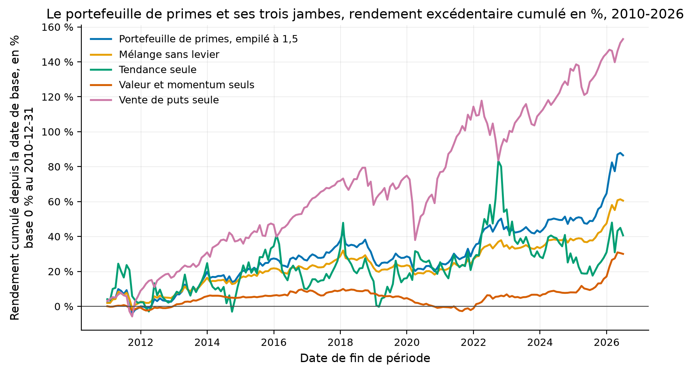

# Étude 021 : le portefeuille de primes pré-inscrit, trois jambes, une règle de poids, un empilement

**Verdict : `REJECTED`, et c'est le rejet le plus serré du laboratoire.** Le
portefeuille déclaré avant tout calcul tient trois jambes, tendance, valeur
et momentum, vente de puts, en inverse de volatilité et empilées à 1,5. **Il
rend un ratio de Sharpe net de 0,629 sur 187 mois de 2010 à 2026, et 0,88
sur les 78 mois du holdout ; ses quatre sous-périodes sont positives.** Il
échoue sur deux des seuils gelés. Il ne bat pas sa meilleure jambe seule, la
vente de puts à 0,696 sur les mêmes mois. Et son t de holdout vaut 2,30
pour un minimum de 3. La
cause est mesurée et n'a pas été corrigée : la jambe de tendance, telle que
l'étude 001 la tient sur des fonds cotés, rend 0,21 de Sharpe net et retire
0,25 au portefeuille. La retirer maintenant serait choisir après avoir vu.

## La question de recherche

Les vingt premières études ont mesuré que les stratégies publiées perdent la
moitié de leur rendement après leur article. Les coûts emportent ce qui tourne
vite, et aucune source gratuite ne voit les titres disparus. La
part reproductible de ce que font les fonds spéculatifs n'est pas un signal,
c'est une construction : des primes lentes, peu corrélées, tenues à
volatilité constante, avec un levier modéré. Cette construction, déclarée
avant tout calcul et jugée aux seuils du laboratoire, tient-elle sur
2010-2026 avec des données gratuites ?

En mots simples : le portefeuille que vendent les fonds à primes de risque
se tient-il, une fois qu'on l'écrit avant de regarder ?

## L'article

Il n'y en a pas un, il y en a quatre, et la sélection des jambes vient
d'eux, pas des résultats du laboratoire. Hurst, Ooi et Pedersen (2017) pour
la tendance, 137 ans et 67 marchés. Asness, Moskowitz et Pedersen (2013) pour
la valeur et le momentum toutes classes. Le Cboe et Wilshire (2019) pour
l'indice PUT depuis 1986. Moreira et Muir (2017) pour la cible de volatilité.
DeMiguel, Garlappi et Uppal (2009) pour la règle de poids sans estimation.
Spécification de l'infrastructure :
[007-indices-cboe-et-empilement](../../docs/specs/007-indices-cboe-et-empilement.md).

## L'intuition économique

Chaque jambe rémunère un risque que d'autres refusent de porter : la
tendance perd dans les retournements, la vente de puts perd dans les krachs,
la valeur perd quand la mode dure. Leurs mauvais mois ne coïncident pas, et
la loi fondamentale de Grinold dit que le ratio de Sharpe d'un mélange de
paris indépendants croît comme la racine de leur nombre. Le levier ne crée
rien ; il met le mélange à l'échelle d'un rendement d'actions.

## La définition mathématique

Les trois jambes sont mensuelles, en excédent du taux sans risque, et nettes
de leurs propres coûts. La tendance est la série nette de l'étude 001 sur
vingt-huit fonds cotés. La valeur et le momentum sont le mélange net de
l'étude 003. La vente de puts est l'indice PUT du Cboe, passé en rendements
mensuels, moins le taux sans risque de Kenneth French, moins quatre points de
base par mois pour le roulement du put. Les poids sont l'inverse de la
volatilité, réestimés chaque année sur les trente-six mois passés au moins,
tenus entre deux estimations, la rotation facturée cinq points de base.
L'exposition est la cible de 10 % divisée par la volatilité des douze
derniers mois du mélange, plafonnée à 1,5, décidée un mois et appliquée le
suivant. La part au-delà d'un dollar coûte cinquante points de base par an,
et chaque unité d'exposition négociée quatre points de base. Statut
modélisé pour ces trois coûts.

## Les données

| Source | Contenu | Mesure |
|---|---|---|
| Études 001 et 003 | séries nettes de tête, mensuelles | 2007-01 à 2026-06 pour la première, 1972-01 à 2026-06 pour la seconde |
| Cboe, indice PUT | niveau quotidien, licence d'usage personnel et non commercial | 4 950 séances du 2007-01-03 au 2026-09-04 ; sept points isolés d'avant 2007 écartés |
| Kenneth French | taux sans risque mensuel | 1986 à 2026 |

Source : `results/metrics.json`, clé `data`. La fenêtre commune compte 234
mois, du 2007-01-31 au 2026-06-30. La première allocation attend trente-six
mois et l'empilement douze de plus. Le portefeuille commence donc au
2010-12-31 et compte 187 mois, dont 78 de holdout à partir du 2020-01-31.

## La méthodologie originale

Celle des fonds à primes de risque et des fonds de tendance, telle que les
quatre articles la décrivent. Des primes en excédent du taux sans risque,
une cible de volatilité, un financement au taux court.

## Notre implémentation

Le fournisseur `quantlab.data.providers.cboe` et le module
`quantlab.execution.leverage`, spécification 007, tous deux testés à la main.
La marche avant de l'étude 009, réemployée telle quelle. Deux règles de
poids fois deux plafonds, trois retraits d'une jambe, cinq multiples de
coûts : douze essais, comptés, plus la lecture faite avant la
correction du fichier du Cboe, treize. Le verdict porte sur la seule configuration
déclarée, inverse de volatilité et plafond 1,5.

## Nos écarts avec l'article

Les quatre articles emploient des contrats à terme et des facteurs
académiques ; ici, des fonds cotés pour la tendance, des facteurs publiés
pour la valeur et le momentum, un indice pour les puts. Le financement est
un écart modélisé, pas un taux de compte sur marge.

## Les résultats

Source : `results/tables/configurations.csv`,
`results/tables/legs_alone_reference_window.csv`, `results/metrics.json`.
Mensuel, 187 mois du 2010-12-31 au 2026-06-30, net, en excédent du taux sans
risque, statut mesuré.

| Portefeuille ou jambe | Rendement excédentaire annualisé | Volatilité | Sharpe | Pire repli | Avant holdout | Holdout, 78 mois |
|---|---:|---:|---:|---:|---:|---:|
| Référence : inverse de volatilité, plafond 1,5 | 4,08 % | 6,73 % | 0,629 | -16,0 % | 0,446 | 0,884 |
| Inverse de volatilité, sans levier | 3,08 % | 4,57 % | 0,688 | -10,5 % | 0,525 | 0,921 |
| Équipondéré, plafond 1,5 | 4,76 % | 9,36 % | 0,545 | -18,5 % | 0,466 | 0,644 |
| Équipondéré, sans levier | 3,56 % | 6,75 % | 0,552 | -14,6 % | 0,478 | 0,645 |
| Tendance seule | 2,21 % | 17,5 % | 0,212 | -35,9 % | | |
| Valeur et momentum seuls | 1,70 % | 2,91 % | 0,594 | -11,6 % | | |
| Vente de puts seule | 6,14 % | 9,19 % | 0,696 | -23,1 % | | |

Comment lire ce tableau, en trois constats. Le premier est que le
portefeuille de référence fait ce que la construction promet. Il rend 0,629
de Sharpe avec un pire repli de 16,0 %, contre 0,696 et 23,1 % pour la vente
de puts, 0,212 et 35,9 % pour la tendance. Ses quatre sous-périodes de
quarante-sept mois sont positives, 0,47, 0,91, 0,24 et 0,98. Le deuxième est
que le levier retire du Sharpe au lieu d'en ajouter. Le même mélange sans
levier rend 0,688, et les 0,06 de différence sont le financement du
demi-dollar emprunté et la rotation de l'exposition. Cette exposition
plafonne à 1,5 pendant 90,4 % des mois, parce que le mélange n'a que 4,6 %
de volatilité. Le
troisième est que la meilleure jambe seule bat le portefeuille, ce qui est
la négation de l'hypothèse, et le tableau suivant dit pourquoi.

| Jambe retirée | Sharpe avec | Sharpe sans | Apport de la jambe |
|---|---:|---:|---:|
| Tendance | 0,629 | 0,878 | -0,249 |
| Valeur et momentum | 0,629 | 0,528 | +0,101 |
| Vente de puts | 0,629 | 0,402 | +0,227 |

Source : `results/tables/marginal_contribution.csv`. Comment lire ce
tableau : la tendance, telle que l'étude 001 la tient sur des fonds cotés,
coûte 0,25 de Sharpe au portefeuille, et sans elle le même portefeuille
rendrait 0,878. Ce n'est pas la tendance qui échoue, c'est sa version à
0,21 de Sharpe net, quatre fois sous les 0,76 de Hurst, Ooi et Pedersen sur
des contrats à terme. Elle a pourtant
fait son travail le mois où il fallait. En mars 2020, la tendance rend
+14,3 % quand la vente de puts perd 13,6 %, et leur corrélation sur toute la
fenêtre est de -0,097.

| Multiple des trois coûts de transaction | 1 | 2 | 5 | 10 | 20 |
|---|---:|---:|---:|---:|---:|
| Sharpe net de la référence | 0,629 | 0,603 | 0,524 | 0,394 | 0,141 |

Source : `results/tables/cost_multiples.csv`. Le portefeuille survit à
vingt fois ses coûts de transaction, parce qu'un portefeuille de trois
séries rééquilibré chaque année ne tourne presque pas ; l'écart de
financement, lui, n'est pas multiplié.

Contre le fonds Style Premia d'AQR, QSPIX, sur 153 mois du 2013-10 au
2026-06 : corrélation 0,206, bêta 0,405, Sharpe 0,674 contre 0,649 pour le
fonds. Pire repli -16,0 % contre -39,6 %, alpha de 6,3 % par an avec un t de
1,84. Source : `results/tables/benchmark_fund.csv`. Les deux font la même
chose avec des ingrédients différents et ne se ressemblent pas mois par mois.

Comment lire cette figure : chaque courbe est le rendement excédentaire
cumulé depuis décembre 2010, en pourcentage, échelle linéaire. La vente de
puts domine, finit à +153 % et chute en 2020 et 2022. La tendance monte en 2022 et rend
ensuite. Le portefeuille empilé finit à +87 %, le mélange sans levier à
+61 %, et les deux ont des creux plus courts que chacune des jambes.

## La robustesse

Tout est gelé dans `config.yaml` avant le premier chiffre : les jambes, la
règle, la cible, le plafond, les coûts, la borne du holdout, les seuils. Le
Sharpe dégonflé du holdout vaut 0,974 pour treize essais, au-dessus du seuil
de 0,95. La probabilité de surapprentissage sur les quatre configurations
vaut 0,371, sous le maximum de 0,50.

## Les coûts

Cinq points de base sur la rotation du mélange, quatre par mois sur le
roulement du put, cinquante par an sur le capital emprunté, quatre par unité
d'exposition négociée. Tous modélisés. Un compte sur marge de particulier
paie le taux court plus un à trois points de pourcentage, pas cinquante
points de base. À ce prix, le demi-dollar emprunté coûterait 0,5 à 1,5 %
par an de plus, et le levier serait perdant.

## Le hors échantillon

Du 2020-01-31 au 2026-06-30, 78 mois, jamais lus avant le verdict : Sharpe
0,884, 5,88 % par an d'excédent, t de 2,30.

## Les limites

| Limite | Statut |
|---|---|
| La tendance sur fonds cotés rend 0,21 de Sharpe net, contre 0,76 sur contrats à terme dans l'article | mesuré, c'est ce qui fait échouer l'hypothèse |
| L'exposition plafonne à 1,5 pendant 90,4 % des mois, la cible de 10 % n'est pas atteinte | mesuré, volatilité réalisée 6,7 % |
| Financement à cinquante points de base au-dessus du taux court | modélisé, optimiste pour un particulier |
| Vente de puts par un indice, sans marge ni appel de marge | déclaré |
| Trois jambes seulement, le portage de change de l'étude 008 écarté d'avance pour son coefficient nul après 2012 | déclaré |
| Fenêtre 2010-2026, une seule grande crise dedans | déclaré |

## Le verdict

`REJECTED` : le portefeuille déclaré rend 0,629 de Sharpe net et 0,88 en
holdout, mais il ne bat pas la vente de puts seule à 0,696. Son t de 2,30
n'atteint pas 3, et rien d'autre ne manque parmi les seuils mesurés. Ce que
l'étude établit tient en deux phrases. La construction des fonds à primes
de risque se tient avec des données gratuites : quatre sous-périodes
positives, un repli maximal de 16,0 %, une survie à vingt fois ses coûts. Et
elle égale presque son fonds de référence. Et elle ne franchit pas la
barre du laboratoire à cause d'une seule jambe, mesurée trop faible, qu'il
serait facile de retirer après coup et que la pré-inscription interdit de
retirer.
